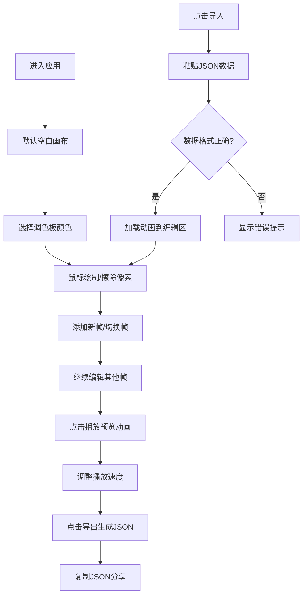

## 1. 产品概述

像素动画工坊是一款基于浏览器的交互式像素艺术动画创作工具，旨在帮助没有动画经验的用户通过简单的逐帧绘制和关键帧插值功能，快速生成流畅的像素循环动画（GIF风格），并支持导出为JSON格式进行分享和二次编辑。

- **核心目标**：降低像素动画创作门槛，提供直观易用的编辑体验
- **目标用户**：像素艺术爱好者、游戏开发者、设计师、创意工作者
- **产品价值**：零配置、即开即用、可分享可复用的像素动画创作方案

## 2. 核心功能

### 2.1 用户角色
| 角色 | 注册方式 | 核心权限 |
|------|----------|----------|
| 普通用户 | 无需注册，直接使用 | 创作、编辑、预览、导出、导入像素动画 |

### 2.2 功能模块
1. **画布编辑模块**：16x16像素网格画布，鼠标绘制/擦除像素
2. **调色板模块**：19色调色板，颜色选择与切换
3. **帧管理模块**：最多6帧的时间轴管理，新建/删除/切换帧
4. **动画预览模块**：3档速度循环预览动画，带模糊背景效果
5. **导出/导入模块**：JSON格式导出动画数据，支持导入解析

### 2.3 页面详情
| 页面名称 | 模块名称 | 功能描述 |
|-----------|-------------|---------------------|
| 主编辑页 | 工具栏 | 播放/暂停、导入、导出功能按钮 |
| 主编辑页 | 主画布 | 16x16像素网格，支持绘制/擦除 |
| 主编辑页 | 调色板 | 19色圆角卡片调色板，选中高亮 |
| 主编辑页 | 时间轴 | 帧缩略图水平排列，新建/删除帧 |
| 主编辑页 | 预览层 | 全屏居中480x480预览，带模糊背景 |
| 主编辑页 | 导出模态框 | 展示JSON数据、复制到剪贴板、关闭 |
| 主编辑页 | 导入模态框 | 粘贴JSON数据、加载解析、错误提示 |

## 3. 核心流程

## 4. 用户界面设计

### 4.1 设计风格
- **主题**：深色系主题，编辑区外背景 `#1e1e2e`，编辑区背景 `#f5f0e8`
- **主色调**：强调色 `#ff6b6b`（导出按钮）、`#4fc3f7`（播放速度选中）、`#ffaa00`（调色板选中发光）
- **按钮样式**：圆角图标按钮，悬停变色，点击缩放动画
- **字体**：sans-serif，14px，文字颜色 `#e0e0e0`
- **布局风格**：顶部工具栏 + 中央画布 + 右侧调色板 + 底部时间轴

### 4.2 页面设计概述
| 页面名称 | 模块名称 | UI元素 |
|-----------|-------------|-------------|
| 主编辑页 | 工具栏 | 圆角图标按钮（#2b2b3b背景），悬停#3b3b4b，点击缩放0.9 |
| 主编辑页 | 画布 | 16x16网格，网格线#444，浅色背景#f5f0e8 |
| 主编辑页 | 调色板 | 5列网格，圆角卡片，选中#ffaa00外发光3px，0.15s缩放弹跳 |
| 主编辑页 | 时间轴 | 80x80缩略图，当前帧#ff6b6b边框3px，0.3s横向滑动动画 |
| 主编辑页 | 预览层 | 480x480居中，blur(8px)背景，帧序号白色半透明1px黑描边 |
| 主编辑页 | 模态框 | rgba(0,0,0,0.6)背景，白色圆角卡片600px宽，0.3s向下消失 |

### 4.3 响应式
- 桌面端优先设计
- 宽度小于768px时：调色板折叠到底部时间轴右侧成为横向色条，工具栏图标缩小为28px
- 触摸操作优化

### 4.4 性能要求
- 动画预览保持60FPS
- 帧切换延迟不超过50ms
