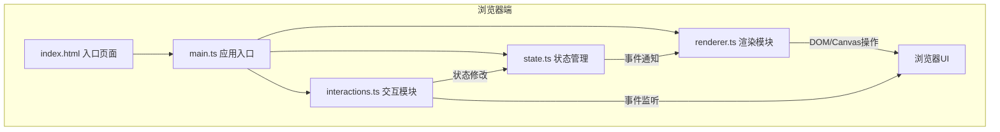

## 1. 架构设计



## 2. 技术描述
- **前端**：原生 TypeScript + Vite，无外部动画库或UI框架
- **构建工具**：Vite（端口5173，开启HMR）
- **语言**：TypeScript（严格模式，target ES2020，module ESNext）
- **状态管理**：原生 TypeScript 模块实现发布订阅模式
- **渲染**：HTML5 Canvas 2D API
- **后端**：无，纯前端应用

## 3. 文件结构

```
├── index.html                 # 入口HTML页面
├── package.json               # 依赖和脚本配置
├── vite.config.js             # Vite构建配置
├── tsconfig.json              # TypeScript配置
└── src/
    ├── main.ts                # 应用入口，初始化并装配各模块
    ├── state.ts               # 状态管理：帧数据、调色板、播放状态等
    ├── renderer.ts            # 渲染：Canvas绘制、UI更新
    └── interactions.ts        # 交互：鼠标、键盘、按钮事件处理
```

## 4. 数据模型

### 4.1 核心类型定义
```typescript
// RGBA颜色
type RGBA = [number, number, number, number];

// 单帧数据：16x16的RGBA二维数组
type Frame = RGBA[][];

// 动画数据（导出/导入格式）
interface AnimationData {
  frames: Frame[];
  speed: number;  // 0.5 | 0.3 | 0.15
}

// 应用状态
interface AppState {
  frames: Frame[];
  currentFrame: number;
  speed: number;
  palette: string[];  // 19个hex颜色
  currentColor: string;
  isPlaying: boolean;
  isPreview: boolean;
}
```

### 4.2 调色板颜色（19色）
```
黑色系: #000000, #2d2b26, #55514b
灰色系: #807b73, #a9a298, #d6cec3
白色系: #ffffff
红色系: #be2633, #e06f8b, #f4b4b9
橙/黄:  #f4a93a, #f7d88a
绿色系: #3a8549, #6abe30, #9bd077
蓝色系: #2776ea, #58b6f7, #9ae3ff
紫色系: #68386c
```

## 5. 模块设计

### 5.1 state.ts 状态管理模块
- 维护帧数组、当前帧索引、播放速度、调色板、当前颜色等状态
- 提供纯函数式状态修改方法（setPixel、addFrame、removeFrame、setSpeed等）
- 实现发布订阅事件系统，状态变更时通知订阅者
- 状态修改不可变数据更新

### 5.2 renderer.ts 渲染模块
- 主Canvas绘制：网格线、像素块
- 时间轴缩略图绘制
- 调色板UI渲染与高亮
- 播放预览动画渲染（requestAnimationFrame循环）
- 模态框显示/隐藏动画
- 订阅state事件触发重绘

### 5.3 interactions.ts 交互模块
- 画布鼠标事件：mousedown/mousemove/mouseup，左键绘制右键擦除
- 调色板点击切换颜色
- 时间轴帧切换、新建、删除
- 播放/暂停按钮、速度切换按钮
- 导出/导入模态框交互
- 复制到剪贴板功能

## 6. 导出/导入数据格式
```json
{
  "frames": [
    [[[r,g,b,a], ...共16列], ...共16行],
    ...更多帧
  ],
  "speed": 0.3
}
```
