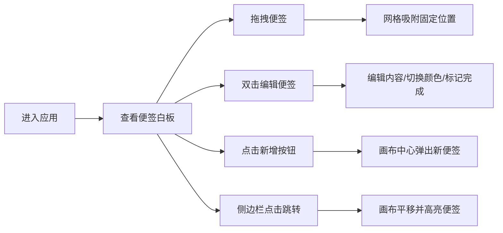

## 1. 产品概述

团队任务协作即时贴墙是一款面向远程团队的虚拟白板协作工具，团队成员可在上面自由发布任务便签，每张便签支持拖拽、编辑和标记完成状态，所有操作实时同步，适用于快速任务同步或每日站会场景。

## 2. 核心功能

### 2.1 功能模块

1. **虚拟白板画布**：无限画布区域，支持便签自由拖拽定位、网格吸附
2. **便签卡片**：彩色卡片形式展示，包含标题、内容、创建时间、负责人标签
3. **便签编辑**：双击进入编辑模式，支持 Markdown 语法（粗体、列表、链接）
4. **便签操作栏**：删除按钮、完成状态切换、颜色选择器（六种柔和配色）
5. **侧边栏列表**：按创建时间倒序排列所有便签，支持点击跳转和高亮
6. **新增便签**：右上角按钮快速创建，画布中心弹出，自动进入编辑模式

### 2.2 页面详情

| 页面名称 | 模块名称 | 功能描述 |
|---------|---------|---------|
| 主页面 | 虚拟白板画布 | 无限区域，支持便签拖拽、网格吸附、平滑动画 |
| 主页面 | 便签卡片 | 彩色毛玻璃卡片，显示标题/内容/时间/负责人，支持编辑/删除/切换颜色/标记完成 |
| 主页面 | 侧边栏 | 按时间倒序显示便签列表，点击跳转并高亮脉动动画 |
| 主页面 | 顶部操作栏 | 右上角"新增便签"按钮，窄屏时汉堡菜单收起侧边栏 |

## 3. 核心流程

用户进入应用 → 查看现有便签分布 → 拖拽便签到目标位置 → 双击便签编辑内容 → 切换颜色/标记完成 → 点击新增按钮创建新便签 → 通过侧边栏快速定位便签

## 4. 用户界面设计

### 4.1 设计风格

- **主色调**：背景浅灰色 #F5F5F5，便签六种柔和配色从 #FFE0B2（暖橙）到 #B2DFDB（薄荷绿）
- **卡片样式**：毛玻璃效果（backdrop-filter）、圆角 8px、轻微阴影
- **字体**：现代无衬线字体，标题粗体，内容常规字重
- **布局风格**：左侧侧边栏 + 中央无限画布 + 右上角操作按钮
- **动画风格**：拖拽实时阴影、轻微弹性形变、松手平滑回正、缩放弹入、脉动放大、颜色渐变过渡

### 4.2 页面设计概览

| 页面名称 | 模块名称 | UI 元素 |
|---------|---------|--------|
| 主页面 | 虚拟画布 | 浅灰背景、网格吸附、可拖拽区域 |
| 主页面 | 便签卡片 | 毛玻璃背景、圆角 8px、标题/内容/时间/负责人标签、编辑操作栏 |
| 主页面 | 侧边栏 | 白色背景、便签列表项（缩略标题/时间/颜色标识）、折叠动画 |
| 主页面 | 新增按钮 | 右上角悬浮按钮、点击缩放反馈 |

### 4.3 响应式设计

- 桌面端优先设计，最小宽度 1024px
- 窄屏时侧边栏自动收起为汉堡菜单
- 画布区域自适应剩余空间
