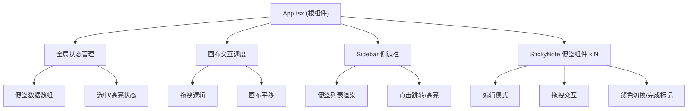

## 1. 架构设计



## 2. 技术选型

- **前端框架**：React 18 + TypeScript
- **构建工具**：Vite
- **样式方案**：Emotion（@emotion/react + @emotion/styled）CSS-in-JS
- **状态管理**：React useState/useReducer（本地组件状态，无需全局状态库）
- **动画方案**：CSS Transitions + Transforms + keyframes（Emotion 样式中定义）
- **拖拽实现**：原生鼠标/触摸事件 + requestAnimationFrame（保证 55fps+）

## 3. 项目文件结构

| 文件路径 | 说明 |
|---------|------|
| `package.json` | 项目依赖与脚本配置 |
| `vite.config.js` | Vite 构建配置，React 插件，@ 别名指向 src |
| `tsconfig.json` | TypeScript 严格模式，jsx react-jsx，target ES2020 |
| `index.html` | 应用入口 HTML |
| `src/App.tsx` | 根组件，全局状态、便签数组、拖拽调度、画布平移 |
| `src/components/StickyNote.tsx` | 单个便签组件，编辑/拖拽/颜色/完成状态 |
| `src/components/Sidebar.tsx` | 侧边栏组件，便签列表、点击跳转、高亮 |
| `src/styles/global.ts` | 全局样式、主题变量、CSS reset |

## 4. 数据模型

### 4.1 便签数据类型定义

```typescript
interface StickyNoteData {
  id: string;
  title: string;
  content: string;
  color: string; // 六种预设颜色之一
  x: number;     // 画布 X 坐标
  y: number;     // 画布 Y 坐标
  createdAt: number;
  assignee: string;
  completed: boolean;
}
```

### 4.2 六种预设配色

```
#FFE0B2 (暖橙)
#FFCCBC (珊瑚粉)
#F8BBD0 (樱花粉)
#D1C4E9 (薰衣草紫)
#C5CAE9 (淡蓝紫)
#B2DFDB (薄荷绿)
```

## 5. 性能优化策略

1. **拖拽性能**：使用 transform 而非 top/left，requestAnimationFrame 节流，避免重排
2. **便签数量优化**：便签组件使用 React.memo 避免不必要重渲染
3. **网格吸附**：拖拽结束时一次性计算吸附位置，拖拽过程中不做吸附计算
4. **CSS 优化**：使用 will-change 提示浏览器对拖拽元素进行 GPU 加速
5. **动画性能**：仅对 transform 和 opacity 属性做动画，避免触发 layout/paint
