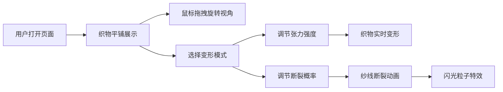

## 1. 产品概述

「空间编织」是一款交互式3D织物纹理模拟可视化应用，让用户在浏览器中通过鼠标拖拽和滑块实时观察虚拟织物在三维空间中的变换过程，从平铺到折叠、拉伸，呈现经纬线交织的细节纹理与纱线断裂的动态视觉效果。

- 目标用户：设计师、教育工作者、3D可视化爱好者
- 产品价值：提供直观的物理变形可视化体验，展示织物在不同受力状态下的形态变化

## 2. 核心功能

### 2.1 功能模块

1. **3D主场景**：全屏Three.js渲染窗口，展示织物三维模型与动态变形
2. **控制面板**：右侧毛玻璃风格控制面板，提供变形模式切换与参数调节
3. **交互系统**：OrbitControls视角控制、滑块实时参数调节
4. **粒子特效**：纱线断裂时的闪光粒子效果
5. **性能监控**：FPS实时计数器

### 2.2 页面详情

| 页面名称 | 模块名称 | 功能描述 |
|----------|----------|----------|
| 主页面 | 3D渲染区 | 全屏深蓝渐变背景，居中展示6x6单位织物网格，支持鼠标拖拽旋转视角、滚轮缩放 |
| 主页面 | 控制面板 | 变形模式切换（平铺/折叠/拉伸）、张力强度滑块、纱线断裂概率滑块 |
| 主页面 | FPS计数器 | 右上角白色小号字体，实时显示当前帧率 |

## 3. 核心流程

用户打开应用 → 默认展示平铺状态的织物 → 通过鼠标拖拽旋转视角观察 → 选择变形模式 → 调节张力强度滑块 → 观察织物平滑变形 → 调节断裂概率 → 触发纱线断裂闪光特效

## 4. 用户界面设计

### 4.1 设计风格

- **主色调**：深蓝渐变背景（#1a1a2e → #16213e）
- **织物颜色**：经线 #d4a373（暖棕色）、纬线 #f1dca7（浅米色）
- **控件颜色**：文字 #e0c9a6、边框 #4a6a8a、滑块手柄金色 #e6b84d
- **视觉风格**：毛玻璃（backdrop-filter: blur(8px)）、圆角12px、半透明叠层

### 4.2 页面设计概览

| 页面名称 | 模块名称 | UI 元素 |
|----------|----------|---------|
| 主页面 | 3D渲染区 | 全屏画布、深蓝渐变背景、经纬线圆柱交织织物、交叉点半透明光晕 |
| 主页面 | 控制面板 | 固定右侧240px宽、毛玻璃背景、单选按钮组、两个带标签滑块、平滑过渡动画 |
| 主页面 | FPS计数器 | 固定右上角、白色小号字体、每帧更新 |

### 4.3 响应式

- 桌面端优先设计
- 控制面板固定右侧，3D区域自适应全屏

### 4.4 3D场景指引

- **环境**：深蓝渐变背景，营造科技感与深邃感
- **光照**：环境光 + 方向光，确保经纬线颜色清晰可见
- **相机**：PerspectiveCamera，默认位置俯瞰织物中心
- **交互**：OrbitControls 支持旋转、缩放，织物保持在视野中央
- **特效**：折叠时sin曲线压缩 + 随机褶皱抖动、拉伸时纱线粗细变化 + 断裂闪光粒子
- **性能**：帧率不低于50FPS，使用BufferGeometry双缓冲优化顶点更新
