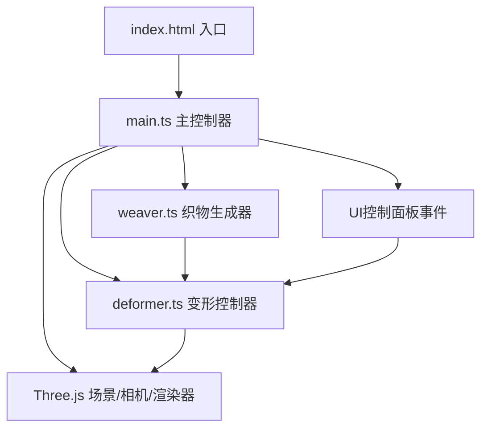

## 1. 架构设计



## 2. 技术描述

- **前端框架**：原生 TypeScript（无UI框架）
- **3D引擎**：Three.js v0.160
- **构建工具**：Vite v5.x
- **类型系统**：TypeScript 严格模式，target ES2020，module ESNext

## 3. 文件结构

```
├── package.json          # 依赖与脚本配置
├── vite.config.js        # Vite构建配置（端口5173，HMR开启）
├── tsconfig.json         # TypeScript配置（严格模式）
├── index.html            # 入口HTML（含控制面板UI）
└── src/
    ├── main.ts           # 主入口：场景初始化、事件绑定、动画循环
    ├── weaver.ts         # 织物网格生成类（经纬线圆柱交织网格）
    └── deformer.ts       # 变形控制器类（平铺/折叠/拉伸算法、断裂特效）
```

## 4. 模块职责

### 4.1 weaver.ts — Weaver 类

- **职责**：创建经纬线交叉的顶点网格，输出可变形的几何体数据
- **核心参数**：
  - `warpColor`：经线颜色（默认 #d4a373）
  - `weftColor`：纬线颜色（默认 #f1dca7）
  - `warpDensity`：经线密度（默认 32）
  - `weftDensity`：纬线密度（默认 32）
  - `threadRadius`：纱线半径（默认 0.02）
  - `fabricSize`：织物尺寸（默认 6x6 单位）
- **输出**：
  - `warpMeshes`：经线 Mesh 数组
  - `weftMeshes`：纬线 Mesh 数组
  - `haloMeshes`：交叉点光晕 Mesh 数组
  - `basePositions`：原始顶点位置数据（供变形使用）

### 4.2 deformer.ts — Deformer 类

- **职责**：接收织物网格，执行三种变形算法，管理断裂粒子
- **变形模式**：
  - `flat`：平铺模式，保持水平，间距0.05单位
  - `fold`：沿X轴中线对折，角度0°→180°，sin曲线间距压缩，随机褶皱抖动
  - `stretch`：沿Z轴拉伸，最大2倍长度，经线变细变亮、纬线变粗，触发断裂动画
- **参数**：
  - `tension`：张力强度（0~1）
  - `breakProbability`：纱线断裂概率（0~0.3）
- **特效**：断裂闪光粒子（半径0.1，alpha 1→0，持续0.3秒）

### 4.3 main.ts — 主控制器

- **职责**：
  - 初始化 Three.js 场景、相机、渲染器、OrbitControls
  - 创建 Weaver 和 Deformer 实例
  - 绑定控制面板 UI 事件（模式切换、滑块拖动）
  - 管理动画循环（requestAnimationFrame），每帧调用 Deformer.update()
  - 显示 FPS 计数器
  - 处理窗口 resize

## 5. 性能优化策略

1. **BufferGeometry 复用**：使用 setAttribute 更新 position，不重建几何体
2. **双缓冲优化**：维护原始位置数组与变形后位置数组
3. **粒子池**：预分配闪光粒子对象池，避免频繁 GC
4. **绘制调用合并**：使用 InstancedMesh 管理同类纱线（如需要）
5. **帧率监控**：确保任何模式下 ≥ 50FPS
