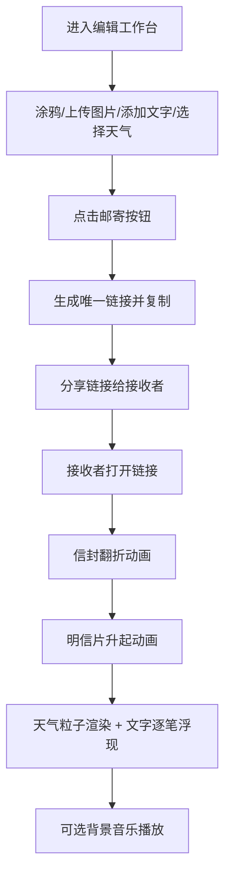

## 1. 产品概述

「时光明信片」是一款在线电子明信片创作与分享应用，用户可以在浏览器中自由设计带有动态天气效果和手绘风格的电子明信片，并通过链接分享给他人。接收者打开链接后，将体验到如真实拆信般的沉浸感动画效果。

- 核心价值：为用户提供富有趣味性和情感温度的电子明信片创作与分享体验
- 目标用户：希望通过独特方式传递祝福、表达心意的互联网用户
- 产品目标：打造视觉精美、交互流畅、富有情感共鸣的明信片创作分享平台

## 2. 核心功能

### 2.1 功能模块
1. **编辑工作台**：明信片预览画布、涂鸦工具、文字编辑、天气选择、图片上传、邮寄分享
2. **接收展示页**：信封打开动画、明信片升起动画、天气粒子系统渲染、手写文字逐笔浮现、背景音乐
3. **我的明信片**：历史作品列表展示、缩略图预览、重新编辑、删除

### 2.2 页面详情

| 页面名称 | 模块名称 | 功能描述 |
|-----------|-------------|---------------------|
| 编辑工作台 | 预览画布 | A5比例(350x500px)画布，米白色背景(#f9f6ee)，支持涂鸦和图片上传 |
| 编辑工作台 | 涂鸦工具 | 12色调色板，笔触粗细5-20px可调节，模拟手绘笔触效果 |
| 编辑工作台 | 图片上传 | 支持本地图片上传作为背景，圆形扩展开窗动画 |
| 编辑工作台 | 天气选择 | 晴空、小雨、大雪、晚霞四种天气模式，对应CSS滤镜和粒子参数 |
| 编辑工作台 | 手写文字 | 仿手写字体渲染文字，支持拖拽任意位置摆放 |
| 编辑工作台 | 邮寄分享 | 生成唯一分享链接(/postcard/xxx)，自动复制到剪贴板 |
| 编辑工作台 | 我的明信片 | 网格卡片展示历史作品(160x220px，圆角12px)，支持重新编辑和删除 |
| 接收展示页 | 信封动画 | 信封沿中心线翻折(rotateY, 1.2s)，明信片升起(translateY, ease-out) |
| 接收展示页 | 粒子系统 | 晴空闪烁光点/小雨128线段/大雪200椭圆/晚霞256圆点，60FPS |
| 接收展示页 | 文字浮现 | 涂鸦和手写文字按笔画逐笔浮现，每笔间隔80ms，canvas clip动画 |
| 接收展示页 | 背景音乐 | Web Audio API合成20秒循环钢琴旋律，音量可调 |

## 3. 核心流程

### 3.1 创作分享流程
用户进入编辑工作台 → 在预览画布上涂鸦/上传背景图片/添加手写文字/选择天气效果 → 点击邮寄按钮生成分享链接 → 链接自动复制到剪贴板 → 用户将链接分享给接收者

### 3.2 接收查看流程
接收者打开分享链接 → 信封翻折动画播放 → 明信片从信封中升起 → 天气粒子系统开始渲染 → 涂鸦和文字逐笔浮现 → 背景音乐可选播放

### 3.3 流程图

## 4. 用户界面设计

### 4.1 设计风格
- 主色调：暖色系，米白色背景(#f9f6ee)，主按钮渐变色(#ff8a65 → #ff7060)
- 字体：标题使用衬线体，手写文字使用仿手写字体
- 按钮风格：圆角按钮，按压时渐变反馈
- 整体风格：文艺、温暖、手绘质感，富有情感温度
- 卡片：圆角12px，箱体阴影，160x220px缩略图

### 4.2 页面设计概述

| 页面名称 | 模块名称 | UI元素 |
|-----------|-------------|-------------|
| 编辑工作台 | 布局 | 左右两栏(左60%画布，右40%控制面板)，平板(768px以下)上下排列 |
| 编辑工作台 | 预览画布 | A5比例350x500px，米白色背景，圆形上传动画 |
| 编辑工作台 | 控制面板 | 调色板(12色)、粗细滑块、天气选择器、文字输入框、邮寄按钮 |
| 编辑工作台 | 我的明信片 | 网格卡片列表，160x220px，圆角12px，阴影 |
| 接收展示页 | 信封动画 | CSS transform rotateY翻折，translateY升起，ease-out缓动 |
| 接收展示页 | 粒子背景 | Canvas实时渲染，60FPS，天气对应粒子形态 |
| 接收展示页 | 文字浮现 | Canvas clip遮罩动画，每笔80ms间隔 |

### 4.3 响应式设计
- 桌面端：左右两栏布局，左栏60%画布，右栏40%控制面板
- 平板端(768px以下)：上下排列，预览画布自适应宽度
- 触控优化：支持触屏拖拽、滑动手势

## 5. 性能要求
- 编辑界面绘图延迟：≤ 50ms
- 粒子系统帧率：≥ 55FPS（任何天气模式下）
- 缩略图列表滚动：60FPS流畅度
