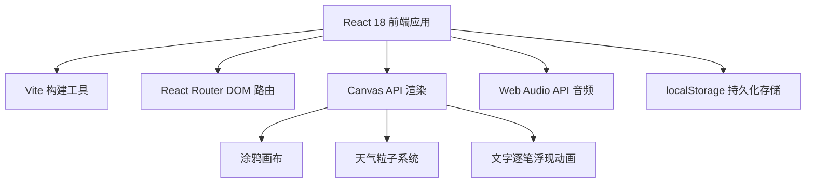

## 1. 架构设计



## 2. 技术选型

- **前端框架**：React 18 + TypeScript
- **构建工具**：Vite 5.x
- **路由管理**：React Router DOM 6.x
- **图形渲染**：Canvas 2D API
- **音频处理**：Web Audio API (OscillatorNode)
- **数据持久化**：localStorage
- **样式方案**：原生CSS（CSS变量 + CSS Modules风格）

## 3. 路由定义

| 路由 | 页面组件 | 用途 |
|-------|---------|---------|
| / | PostcardEditor | 编辑工作台首页 |
| /postcard/:id | PostcardViewer | 接收端展示页面 |

## 4. 数据模型

### 4.1 明信片数据结构

```typescript
interface TextItem {
  id: string;
  content: string;
  x: number;
  y: number;
  fontSize: number;
}

interface DrawPath {
  points: { x: number; y: number }[];
  color: string;
  thickness: number;
}

interface Postcard {
  id: string;
  shareCode: string;
  backgroundImage: string | null; // base64
  backgroundColor: string;
  textItems: TextItem[];
  drawPaths: DrawPath[];
  weatherType: 'sunny' | 'rain' | 'snow' | 'sunset';
  createdAt: number;
  thumbnail: string; // base64 缩略图
}
```

### 4.2 粒子系统参数

```typescript
interface WeatherConfig {
  particleCount: number;
  colors: string[];
  sizeRange: [number, number];
  speedRange: [number, number];
  opacityRange: [number, number];
}
```

## 5. 文件结构

```
├── package.json
├── vite.config.js
├── tsconfig.json
├── index.html
└── src/
    ├── App.tsx              # 主路由组件
    ├── PostcardEditor.tsx   # 编辑工作台
    ├── PostcardViewer.tsx   # 接收展示页
    └── utils.ts             # 工具函数 + 粒子系统类
```

## 6. 核心模块说明

### 6.1 WeatherParticleSystem (粒子系统类)
- 初始化粒子池
- update() 方法：60FPS 更新粒子位置、状态
- render(ctx) 方法：根据天气类型渲染粒子形态
- 支持四种天气模式：sunny（闪烁光点）、rain（下落线段）、snow（飘落椭圆）、sunset（渐变圆点）

### 6.2 涂鸦画布实现
- Canvas 2D 绑定鼠标/触摸事件
- 路径记录：记录每一笔的坐标点、颜色、粗细
- 笔触模拟：使用lineCap和lineJoin实现平滑手绘效果

### 6.3 信封动画实现
- CSS 3D Transform: rotateY 实现信封翻折
- CSS Transition: translateY 实现明信片升起
- ease-out 缓动函数，1.2秒时长

### 6.4 文字逐笔浮现
- Canvas clip 遮罩动画
- 按笔画顺序分段绘制
- 每笔间隔 80ms 延时
