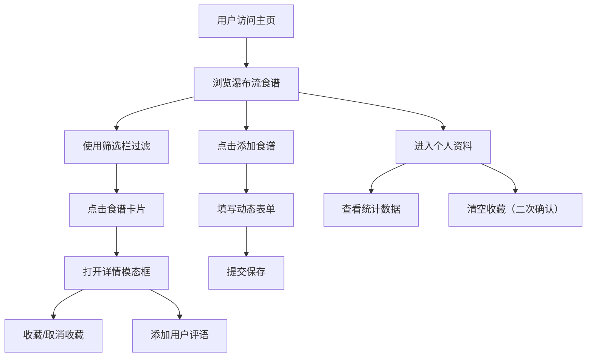

## 1. 产品概述

「风味日记」是一款社交食谱整理应用，让美食爱好者能够浏览、创建和分享个人食谱卡片，管理收藏集，并通过筛选发现心仪菜谱。

- 目标用户：家庭主妇、美食爱好者、烹饪新手
- 核心价值：轻量级食谱记录与管理，美观的视觉呈现，便捷的筛选发现

## 2. 核心功能

### 2.1 用户角色

| 角色 | 注册方式 | 核心权限 |
|------|----------|----------|
| 普通用户 | 无需注册，本地使用 | 浏览食谱、创建食谱、收藏食谱、管理个人资料 |

### 2.2 功能模块

1. **主页（瀑布流）**：食谱卡片网格展示、顶部筛选栏
2. **食谱详情**：模态框展示完整食谱信息
3. **添加食谱**：动态表单创建新食谱
4. **收藏页面**：展示已收藏的食谱集合
5. **个人资料**：用户统计信息、清空收藏

### 2.3 页面详情

| 页面名称 | 模块名称 | 功能描述 |
|----------|----------|----------|
| 主页 | 瀑布流卡片 | 三列/两列/单列响应式布局，展示缩略图、名称、评分、烹饪时间 |
| 主页 | 筛选栏 | 标签多选（最多3个）、评分滑块、名称搜索（300ms防抖） |
| 食谱详情 | 模态框 | 缩放+透明度过渡，展示食材、步骤、标签、评语 |
| 添加食谱 | 动态表单 | 名称、标签多选、食材动态增删、步骤动态增删、烹饪时间、星级评分 |
| 收藏页 | 收藏列表 | 展示所有已收藏食谱，支持取消收藏 |
| 个人资料 | 用户信息 | 头像（首字母渐变色）、统计数据、清空收藏二次确认 |

## 3. 核心流程

用户打开应用 → 浏览瀑布流食谱 → 使用筛选栏过滤 → 点击卡片查看详情 → 收藏心仪食谱 → 创建个人食谱 → 在个人资料查看统计

## 4. 用户界面设计

### 4.1 设计风格

- **主色调**：米白色背景 #faf8f5，强调色 #ff6b8a（粉色），辅助色 #e8e0d4 → #d4cbb8
- **卡片样式**：白色 #ffffff，圆角 12px，阴影 0 4px 12px rgba(0,0,0,0.08)
- **按钮交互**：悬停时向上位移 2px，背景色加亮，transition 0.2s ease
- **字体**：系统优雅字体，中文优化显示
- **布局**：卡片式瀑布流，顶部固定毛玻璃筛选栏

### 4.2 页面设计概览

| 页面名称 | 模块名称 | UI 元素 |
|----------|----------|---------|
| 主页 | 筛选栏 | 固定顶部 z-index 100，毛玻璃 backdrop-filter:blur(10px)，标签高亮 #ff6b8a |
| 主页 | 瀑布流卡片 | CSS渐变圆角缩略图，星级评分，烹饪时间标签，心形收藏按钮，淡入动画 300ms |
| 详情模态框 | 内容区 | 缩放 0.95→1 过渡，透明度 0→1，250ms，食材列表，分步步骤 |
| 添加食谱 | 表单 | 输入框焦点时边框 #ccc→#ff6b8a，动态增删行，星级点击选择 |
| 个人资料 | 头像 | 圆形，用户名称首字母，渐变色背景 |
| 清空确认 | 对话框 | 背景变暗 #00000080，底部圆角卡片样式 |

### 4.3 响应式设计

- **桌面端（>1024px）**：三列瀑布流，卡片间距 16px
- **平板端（768-1024px）**：两列瀑布流，卡片间距 16px
- **移动端（<768px）**：单列瀑布流，卡片间距 16px
- 所有交互元素适配触摸操作

## 4.4 性能指标

- 瀑布流首次渲染 < 500ms（桌面端 i5 + Chrome）
- 组合筛选响应 < 200ms
- 所有动画 60fps 运行
