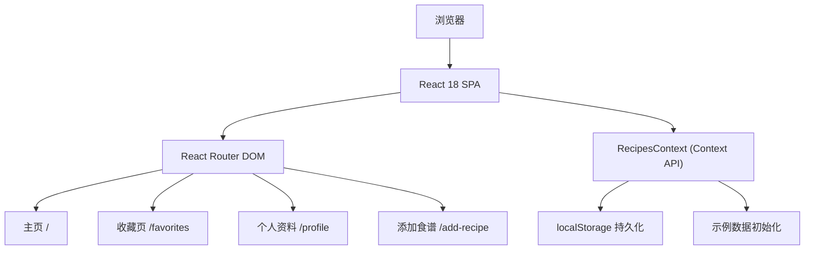
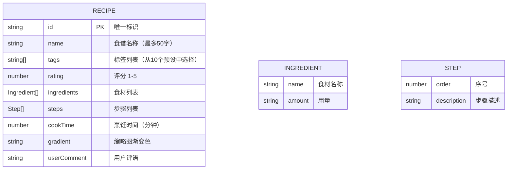

## 1. 架构设计



## 2. 技术说明

- **前端框架**：React 18 + TypeScript
- **构建工具**：Vite（端口 3000，启用 HMR）
- **路由管理**：react-router-dom v6
- **状态管理**：React Context API（RecipesContext）
- **数据持久化**：localStorage
- **样式方案**：原生 CSS（CSS Variables + Media Queries）

## 3. 路由定义

| 路由 | 页面 | 用途 |
|------|------|------|
| `/` | HomePage | 瀑布流展示所有食谱，含筛选栏 |
| `/favorites` | FavoritesPage | 展示收藏的食谱 |
| `/profile` | ProfilePage | 用户资料页，统计信息，清空收藏 |
| `/add-recipe` | AddRecipePage | 添加新食谱表单 |

## 4. 数据模型

### 4.1 数据模型定义



### 4.2 TypeScript 类型定义

```typescript
interface Ingredient {
  name: string;
  amount: string;
}

interface Step {
  order: number;
  description: string;
}

interface Recipe {
  id: string;
  name: string;
  tags: string[];
  rating: number;
  ingredients: Ingredient[];
  steps: Step[];
  cookTime: number;
  gradient: string;
  userComment: string;
}

interface RecipeContextType {
  recipes: Recipe[];
  favorites: string[];
  addRecipe: (recipe: Omit<Recipe, 'id'>) => void;
  deleteRecipe: (id: string) => void;
  updateRecipe: (id: string, updates: Partial<Recipe>) => void;
  toggleFavorite: (id: string) => void;
  clearFavorites: () => void;
  updateComment: (id: string, comment: string) => void;
}
```

### 4.3 预设标签

```
"甜点" | "素食" | "快手菜" | "家常菜" | "汤品" | "烘焙" | "海鲜" | "早餐" | "减脂" | "下饭菜"
```

### 4.4 localStorage 存储键

- `flavor_diary_recipes`：食谱列表
- `flavor_diary_favorites`：收藏 ID 列表

## 5. 目录结构

```
.
├── package.json
├── vite.config.js
├── tsconfig.json
├── index.html
└── src/
    ├── App.tsx
    ├── main.tsx
    ├── index.css
    ├── components/
    │   ├── RecipeCard.tsx
    │   ├── FilterBar.tsx
    │   ├── RecipeModal.tsx
    │   ├── Navbar.tsx
    │   └── ConfirmDialog.tsx
    ├── context/
    │   └── RecipesContext.tsx
    ├── data/
    │   └── sampleRecipes.ts
    ├── pages/
    │   ├── HomePage.tsx
    │   ├── FavoritesPage.tsx
    │   ├── ProfilePage.tsx
    │   └── AddRecipePage.tsx
    └── types/
        └── index.ts
```

## 6. 性能优化策略

1. **筛选防抖**：搜索输入使用 300ms 防抖减少不必要计算
2. **Memo 优化**：RecipeCard 使用 React.memo 避免不必要重渲染
3. **CSS 动画**：使用 transform 和 opacity 属性确保 GPU 加速
4. **懒加载**：模态框内容按需渲染
5. **localStorage 读写优化**：批量更新，避免频繁读写
