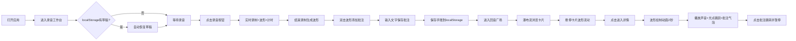

## 1. 产品概述

「回音手账」是一款基于浏览器的声音记录与分享应用，让用户录制日常声音片段（雨声、杯碟碰撞声、翻书声等），自动生成视觉波形封面，并支持在波形上添加文字批注，与他人分享声音记忆。

- 目标用户：热爱生活、喜欢记录声音回忆的普通用户
- 产品价值：通过声音+波形可视化+文字批注的方式，创造独特的记忆保存和分享体验

## 2. 核心功能

### 2.1 用户角色
| 角色 | 注册方式 | 核心权限 |
|------|----------|----------|
| 普通用户 | 无需注册（本地存储） | 录制声音、添加批注、浏览广场、查看详情 |

### 2.2 功能模块
1. **录音工作台页面**：录音按钮、实时音量波形、录音时长、波形图生成、批注点添加、草稿保存
2. **回音广场页面**：瀑布流卡片展示、卡片悬停动效、筛选功能、点击进入详情
3. **详情弹窗**：波形绘制动画、播放光点动画、批注气泡上浮、批注列表、跳转暂停功能

### 2.3 页面详情
| 页面名称 | 模块名称 | 功能描述 |
|----------|----------|----------|
| 录音工作台 | 录音按钮 | 圆形80px，默认深灰，录音时红色呼吸动画，控制录制开始/结束 |
| 录音工作台 | 实时波形Canvas | 2px线宽#4fc3f7，振幅随音量实时变化，保持55fps以上 |
| 录音工作台 | 录音时长 | 按钮下方显示，600字重14px |
| 录音工作台 | 波形图生成 | 64个柱形，颜色#7c4dff→#4fc3f7→#ff7eb3渐变 |
| 录音工作台 | 批注交互 | 双击波形添加红色6px圆点，底部滑出输入框，保存后变蓝 |
| 回音广场 | 瀑布流网格 | 300px宽卡片，16px间距，自动高度 |
| 回音广场 | 卡片悬停 | 上浮4px，阴影加深，波形流动动画3秒循环 |
| 详情弹窗 | 波形动画 | 2秒绘制动画，播放时光点#ff7eb3跳跃，批注气泡上浮消失 |
| 详情弹窗 | 批注列表 | 右侧滚动区域，12px圆角卡片#e0ddd8边框 |
| 详情弹窗 | 跳转功能 | 点击批注跳转到对应波形位置并暂停播放 |

## 3. 核心流程

用户打开应用进入录音工作台 → 点击录音按钮开始录制（实时波形+时长显示）→ 结束录制生成64柱波形图 → 双击波形添加批注点 → 输入批注文字保存 → 保存手账到localStorage → 进入回音广场浏览所有手账 → 点击卡片查看详情（波形动画+播放+批注气泡）→ 点击批注列表跳转对应位置

## 4. 用户界面设计

### 4.1 设计风格
- **主色调**：暖米色 #f5f0e8
- **强调色**：紫蓝渐变 #7c4dff → #4fc3f7
- **点缀色**：粉色 #ff7eb3、红色 #ff3b3b
- **卡片渐变**：#f9f0e7 → #f3e7db
- **按钮样式**：圆角、hover缩放1.02（0.2s ease过渡）
- **字体**：系统无衬线字体，600字重用于强调
- **布局**：桌面端居中卡片，移动端自适应单列
- **动效**：呼吸动画、绘制动画、流动动画、上浮动画、滑入动画

### 4.2 页面设计概述
| 页面名称 | 模块名称 | UI元素 |
|----------|----------|----------|
| 录音工作台 | 居中卡片 | 700px宽，#f9f0e7→#f3e7db渐变，24px圆角，4px rgba(0,0,0,0.08)阴影，顶部留白80px |
| 录音工作台 | 录音按钮 | 圆形80px，默认#3d3d3d，录音时#ff3b3b+1.1-1.0缩放呼吸动画1.2s周期 |
| 录音工作台 | 实时波形 | Canvas 2D绘制，2px线宽#4fc3f7 |
| 录音工作台 | 批注输入 | 底部滑入0.3s ease-out，红色6px标记点，保存后#4fc3f7 |
| 回音广场 | 卡片 | 300px宽，悬停上浮4px+8px阴影，transition 0.2s ease |
| 回音广场 | 缩略图 | 静态波形图，悬停时3秒流动动画循环 |
| 详情弹窗 | 蒙层 | 透明度0.6全屏覆盖 |
| 详情弹窗 | 光点 | #ff7eb3跳跃，批注气泡弹出上浮消失 |
| 详情弹窗 | 批注卡片 | 12px圆角，#e0ddd8浅灰边框 |

### 4.3 响应式
- 桌面端（≥768px）：录音卡片700px居中，广场瀑布流多列
- 移动端（<768px）：单列布局，卡片宽度96%居中，所有组件自适应
- 触控优化：按钮最小44px可点击区域

### 4.4 性能要求
- 录音时帧率 ≥ 55fps
- Canvas波形绘制无卡顿
- 动画使用CSS transition/transform，避免layout thrash
- localStorage读写异步处理，不阻塞主线程
