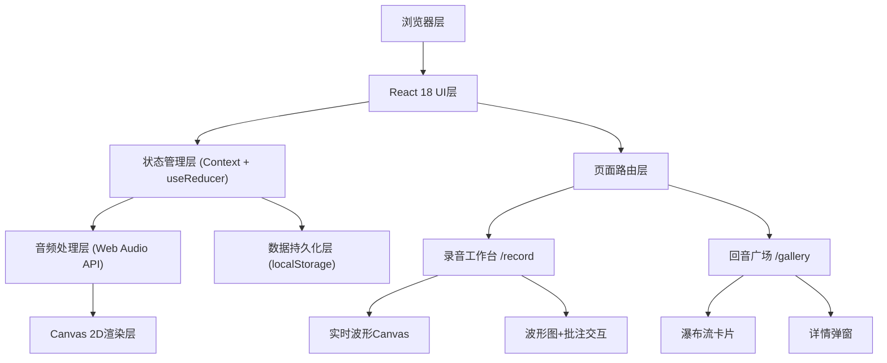
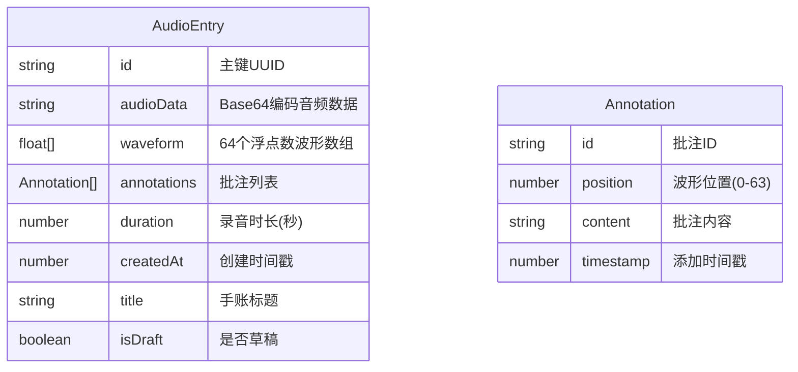

## 1. 架构设计



## 2. 技术描述

- **前端框架**：React 18 + TypeScript
- **构建工具**：Vite（端口5173，开启HMR）
- **状态管理**：React Context + useReducer
- **路由**：React Router DOM
- **音频处理**：原生 Web Audio API（MediaRecorder + AudioContext + AnalyserNode）
- **可视化**：Canvas 2D API
- **数据持久化**：localStorage（存储Base64音频、波形数据、批注）
- **样式方案**：原生CSS + CSS Modules（无需额外UI库）

## 3. 路由定义

| 路由 | 用途 |
|------|------|
| / | 重定向到录音工作台 |
| /record | 录音工作台页面（首页） |
| /gallery | 回音广场页面 |

## 4. 文件结构

```
e:\solo\VersionFast\tasks\auto218/
├── package.json
├── index.html
├── tsconfig.json
├── vite.config.js
└── src/
    ├── main.tsx              # React入口
    ├── App.tsx               # 应用主入口（路由+Provider）
    ├── index.css             # 全局样式
    ├── types.ts              # TypeScript类型定义
    ├── context/
    │   └── AudioContext.tsx  # 音频状态管理（Context+useReducer）
    ├── pages/
    │   ├── RecordPage.tsx    # 录音工作台
    │   └── GalleryPage.tsx   # 回音广场
    └── components/
        ├── WaveformDisplay.tsx  # 波形展示组件
        └── DetailModal.tsx      # 详情弹窗
```

## 5. 数据模型

### 5.1 数据模型定义



### 5.2 TypeScript类型定义

```typescript
// 批注
interface Annotation {
  id: string;
  position: number;
  content: string;
  timestamp: number;
}

// 音频手账条目
interface AudioEntry {
  id: string;
  audioData: string;
  waveform: number[];
  annotations: Annotation[];
  duration: number;
  createdAt: number;
  title: string;
  isDraft: boolean;
}

// 音频状态
interface AudioState {
  isRecording: boolean;
  isPlaying: boolean;
  currentTime: number;
  duration: number;
  audioData: string | null;
  waveform: number[];
  annotations: Annotation[];
  currentDraft: AudioEntry | null;
  entries: AudioEntry[];
  volumeLevels: number[];
}

// 状态Action
type AudioAction =
  | { type: 'START_RECORDING' }
  | { type: 'STOP_RECORDING'; payload: { audioData: string; waveform: number[]; duration: number } }
  | { type: 'UPDATE_VOLUME'; payload: number[] }
  | { type: 'START_PLAYING' }
  | { type: 'STOP_PLAYING' }
  | { type: 'SET_CURRENT_TIME'; payload: number }
  | { type: 'ADD_ANNOTATION'; payload: Annotation }
  | { type: 'SAVE_DRAFT'; payload: AudioEntry }
  | { type: 'SAVE_ENTRY'; payload: AudioEntry }
  | { type: 'LOAD_DRAFT'; payload: AudioEntry | null }
  | { type: 'LOAD_ENTRIES'; payload: AudioEntry[] }
  | { type: 'CLEAR_CURRENT' };
```

### 5.3 localStorage键名

- `echo_journal_entries`: 所有已保存手账列表
- `echo_journal_draft`: 当前草稿

## 6. 性能优化策略

1. **Canvas绘制优化**：使用requestAnimationFrame，每帧批量绘制，避免频繁重绘
2. **音频分析节流**：AnalyserNode使用smoothingTimeConstant=0.8，getByteFrequencyData降采样
3. **动画性能**：所有动画使用transform/opacity，触发GPU合成，避免layout
4. **localStorage异步化**：读写操作封装在Promise中，使用setTimeout延迟写入
5. **组件拆分**：将Canvas、批注列表等独立为纯组件，配合React.memo减少重渲染
6. **内存管理**：录音结束后及时释放AudioContext和MediaRecorder资源
