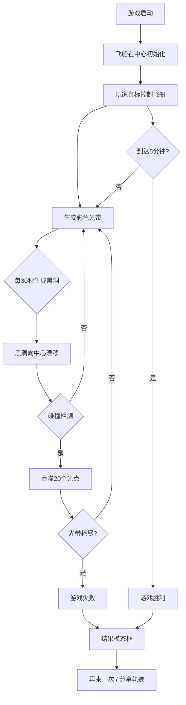

## 1. 产品概述

星绘轨迹是一款在浏览器中运行的交互式太空画笔游戏。玩家通过鼠标拖拽控制一艘发光飞船在深空中航行，飞船飞过的路径会留下由彩色星点组成的动态渐变光带，同时需要躲避随机出现的黑洞障碍。

- 核心玩法：控制飞船绘制光带，躲避黑洞吞噬，坚持5分钟赢得胜利
- 目标用户：喜欢休闲创意游戏的玩家

## 2. 核心特性

### 2.1 功能模块

1. **主游戏场景**：全屏Canvas画布，深空渐变背景，闪烁恒星，飞船与光带
2. **飞船控制模块**：鼠标位置控制方向，移动加速，松开减速
3. **光带系统**：光点生成、颜色渐变、宽度变化、荧光模式、淡出动画
4. **黑洞障碍模块**：黑洞生成、漂移、呼吸动画、碰撞吞噬
5. **信息展示模块**：光带长度、航行时间、速度条
6. **结果模态框**：胜利/失败展示、统计数据、重新开始、分享轨迹

### 2.2 功能详情

| 模块名称 | 功能描述 |
|-----------|-------------|
| 主游戏场景 | 全屏Canvas，#0a0e1a到#12172e渐变背景，200颗闪烁白点恒星 |
| 飞船控制 | 三角形飞船带青蓝光晕，尾部火焰动画，鼠标控制方向与速度(1-6px/帧) |
| 光带系统 | 每帧生成光点，颜色随飞行方向渐变，宽度随速度变化(4/8/12px)，3秒淡出，点击切换荧光模式 |
| 黑洞障碍 | 每30秒生成2个，向中心漂移，呼吸缩放，吞噬光点20个，穿过时光点生成减半 |
| 信息面板 | 右下角半透明面板，显示光带长度、计时器(MM:SS)、速度条 |
| 结果模态框 | 游戏结束弹出，显示胜负结果、航行时间、最长光带、吞噬次数，重新开始/分享按钮 |

## 3. 核心流程

游戏启动 → 飞船出现在画布中心 → 玩家移动鼠标控制飞船 → 生成光带 → 黑洞随机出现并漂移 → 碰撞检测吞噬光带 → 达到5分钟胜利 / 光带耗尽失败 → 显示结果 → 重新开始或分享

## 4. 用户界面设计

### 4.1 设计风格
- 主色调：深蓝#0a0e1a，青蓝#4fc3f7
- 辅助色：紫色#7c4dff，橙黄#ff9800，红色#ff6b6b，金色#ffd700
- 按钮风格：圆角12-20px，悬停放大1.05倍，透明度降低10%
- 字体：'Segoe UI', 'Arial', sans-serif，14px(信息面板)，18px(按钮)
- 面板风格：半透明背景，圆角，细边框

### 4.2 页面设计

| 模块 | UI元素 |
|-----------|-------------|
| 游戏画布 | 全屏Canvas，深空渐变，闪烁恒星 |
| 信息面板 | 右下角浮动，半透明#1a1a30，圆角12px，边框#4a4a6a |
| 结果模态框 | 居中400x250px，圆角20px，渐变背景，边框阴影 |
| 按钮 | 圆角设计，悬停缩放+颜色加深，从下滑入动画 |

### 4.3 响应式
- Canvas始终占满窗口
- 窗口宽度<500px时信息面板隐藏为右上角小图标，点击展开
- 触控设备适配

### 4.4 动画效果
- 信息面板/按钮：下方滑入(0.3秒ease-out)
- 结果模态框：中心放大弹出(0.4秒ease-out + 背景虚化)
- 恒星：alpha正弦波动(0.5-2秒周期)
- 黑洞：呼吸式缩放(2秒周期)
- 速度条：4px动态波浪效果
