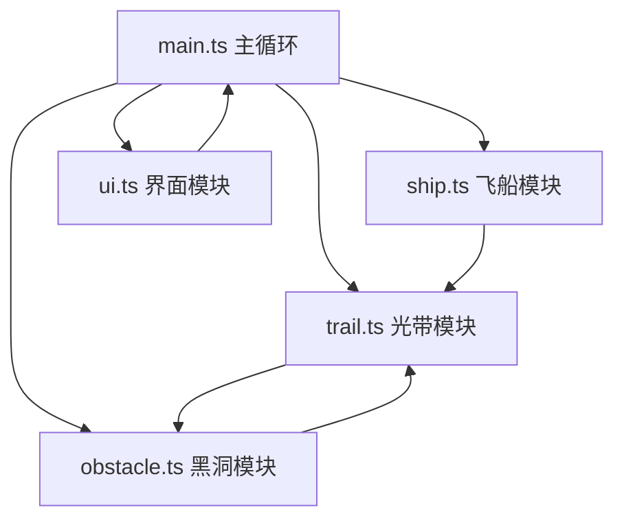

## 1. 架构设计



## 2. 技术说明

- 前端框架：纯 TypeScript + Vite
- 渲染引擎：Canvas 2D API（无第三方依赖）
- 构建工具：Vite 4.x
- 语言标准：TypeScript 严格模式，target ES2020，module ESNext
- 开发服务器端口：5173，开启HMR

## 3. 项目结构

```
/
├── package.json          # 项目依赖与脚本
├── tsconfig.json         # TypeScript配置
├── vite.config.js        # Vite配置
├── index.html            # 入口页面
└── src/
    ├── main.ts           # 游戏主循环、Canvas初始化、事件绑定
    ├── ship.ts           # 飞船类：位置、速度、方向、绘制、火焰动画
    ├── trail.ts          # 光带类：光点数据结构、生成、淡出、颜色、宽度、吞噬
    ├── obstacle.ts       # 黑洞类：生成、漂移、呼吸、碰撞检测、吞噬效果
    └── ui.ts             # UI类：信息面板、模态框、按钮、响应式
```

## 4. 核心数据结构

### 4.1 飞船 Ship
```typescript
interface Ship {
  x: number;
  y: number;
  vx: number;
  vy: number;
  speed: number;        // 1-6 px/帧
  angle: number;
  targetX: number;
  targetY: number;
  isAccelerating: boolean;
  flameLength: number;  // 4-12px
}
```

### 4.2 光带光点 TrailPoint
```typescript
interface TrailPoint {
  x: number;
  y: number;
  color: string;
  width: number;        // 4/8/12px
  alpha: number;        // 1→0
  life: number;         // 剩余存活时间(ms)
  glow: boolean;        // 荧光模式
}
```

### 4.3 黑洞 BlackHole
```typescript
interface BlackHole {
  x: number;
  y: number;
  baseRadius: number;
  currentRadius: number;
  vx: number;
  vy: number;
  breathPhase: number;
  flashFrames: number;  // 闪烁帧计数
  absorbed: number;     // 已吞噬光点量
}
```

### 4.4 游戏状态 GameState
```typescript
interface GameState {
  isRunning: boolean;
  isGameOver: boolean;
  isVictory: boolean;
  elapsedTime: number;      // 累计时间(ms)
  trailLength: number;      // 当前光点数量
  maxTrailLength: number;   // 历史峰值
  absorbCount: number;      // 被吞噬次数
  glowMode: boolean;        // 荧光模式
  slowGenerate: boolean;    // 光点生成减半
  slowGenerateTimer: number;
}
```

## 5. 性能约束

- 帧率目标：≥ 50 FPS
- 光点上限：3000个，超出时丢弃最早的
- 渲染频率：通过 requestAnimationFrame 控制在60Hz以内
- 碰撞检测：每帧检测黑洞与光带光点的距离

## 6. 事件绑定

- `mousemove`：更新鼠标目标位置，标记加速状态
- `mousedown` (左键)：切换荧光模式
- `mouseup`：标记减速状态
- `resize`：调整Canvas尺寸，UI响应式适配
- `touchstart/touchmove/touchend`：触控设备适配
