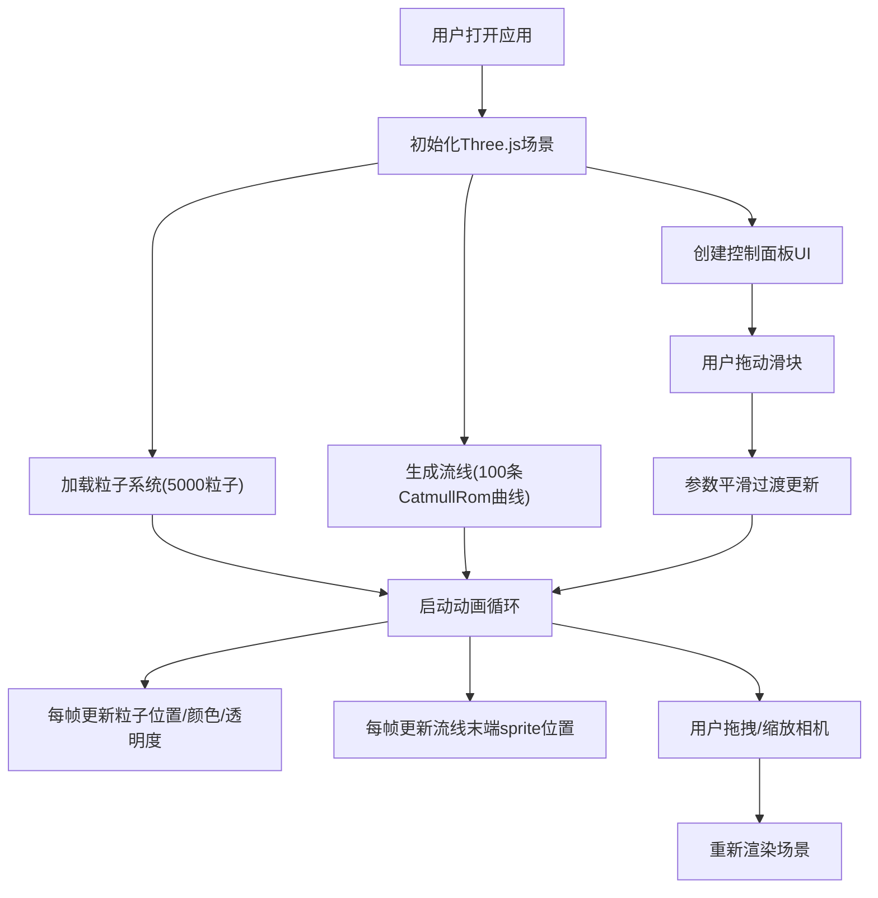

## 1. 产品概述

「深洋环流」是一款面向气候科普场景的交互式3D海洋温盐环流可视化工具，通过粒子系统与彩色流线直观展示全球海洋表层与深层水团因温度和盐度差异产生的缓慢流动过程，帮助观众理解海洋在调节地球气候中的关键作用。

- 目标用户：气候科普博主、学生、海洋爱好者
- 核心价值：将抽象的温盐环流概念转化为可交互、可观察的3D动态可视化，降低理解门槛

## 2. 核心功能

### 2.1 用户角色
本产品为单用户工具，无角色区分。

### 2.2 功能模块
1. **主场景页**：3D海洋环流可视化视图、粒子系统、动态流线、辅助网格、光照系统
2. **控制面板**：温度影响因子滑块、盐度影响因子滑块、环流速度倍率滑块
3. **视角交互**：OrbitControls 拖拽旋转、滚轮缩放

### 2.3 功能详情

| 页面名称 | 模块名称 | 功能描述 |
|-----------|-------------|---------------------|
| 主场景 | 粒子环流系统 | 5000个半透明粒子，分布于海洋表层和深层；表层向北（0.05单位/秒）、深层向南（0.02单位/秒）；颜色随温度（蓝#0077ff→红#ff4400）渐变，透明度随盐度（0.3-0.8）变化；到达边界后循环重置 |
| 主场景 | 动态流线可视化 | 100条CatmullRom曲线流线，每条50个点；颜色根据路径平均温度渐变；流线宽度0.1-0.4动态变化，透明度0.3；末端带发光sprite沿流线以0.1单位/秒移动 |
| 主场景 | 辅助元素 | 场景背景#0a1020→#152040渐变；圆形海洋盆地网格（半径8，高度-2到2，颜色#2a4a7a，透明度0.2）；右上角点光源（强度0.5，颜色#88ccff） |
| 控制面板 | 参数调节 | 温度影响因子（0.0-2.0，默认1.0）控制粒子颜色偏移；盐度影响因子（0.0-2.0，默认1.0）控制粒子透明度偏移；环流速度倍率（0.5-3.0，默认1.0）控制粒子运动速度；数值平滑过渡（0.5秒） |
| 视角交互 | 相机控制 | 鼠标拖拽旋转视角，滚轮缩放（范围2-15），粒子始终面向相机 |

## 3. 核心流程

用户打开应用后，全屏展示3D海洋环流场景。用户可通过鼠标拖拽旋转视角、滚轮缩放观察细节，通过右下角控制面板的三个滑块实时调节温度、盐度、速度参数，观察粒子颜色、透明度和流动速度的动态变化。

## 4. 用户界面设计

### 4.1 设计风格
- 主色调：深蓝海洋主题（#0a1020 → #152040 背景渐变，#5fc3f7 交互强调色）
- 粒子色阶：冷蓝#0077ff（低温）→ 暖红#ff4400（高温）
- 面板风格：毛玻璃质感半透明卡片（backdrop-filter: blur(4px)，圆角12px）
- 滑块：圆角轨道#2a3a5a，发光圆形滑块柄#5fc3f7（box-shadow: 0 0 6px #5fc3f7）
- 字体：无衬线系统字体，标签#b0c8f0、12px
- 整体氛围：静谧、科学、深海观察感

### 4.2 页面设计

| 页面名称 | 模块名称 | UI元素 |
|-----------|-------------|-------------|
| 主场景 | 3D视图 | 全屏canvas，背景渐变，粒子流动画，流线条纹，辅助网格，点光源 |
| 右下角 | 控制面板 | 固定定位（距右下20px），毛玻璃卡片，3组滑块（标签+数值+滑块） |

### 4.3 响应式
- Canvas自适应填满浏览器视口
- 窗口resize时自动重建相机纵横比和渲染器尺寸
- 控制面板固定定位，不受视口尺寸影响

### 4.4 3D场景指导
- **环境与氛围**：深海静谧氛围，深蓝渐变背景，柔和点光源
- **光照设置**：右上角单一点光源（强度0.5，颜色#88ccff），营造粒子立体感
- **相机设置**：PerspectiveCamera，初始距离适中，OrbitControls 缩放范围2-15
- **构图与焦点**：圆形海洋盆地居中，粒子流动为视觉焦点
- **交互与动画**：粒子缓慢流动（表层0.05、深层0.02单位/秒），流线sprite匀速移动（0.1单位/秒），参数变化平滑过渡0.5秒
- **性能预算**：粒子≤6000，流线≤120，目标FPS≥40（8GB内存/集成显卡）
