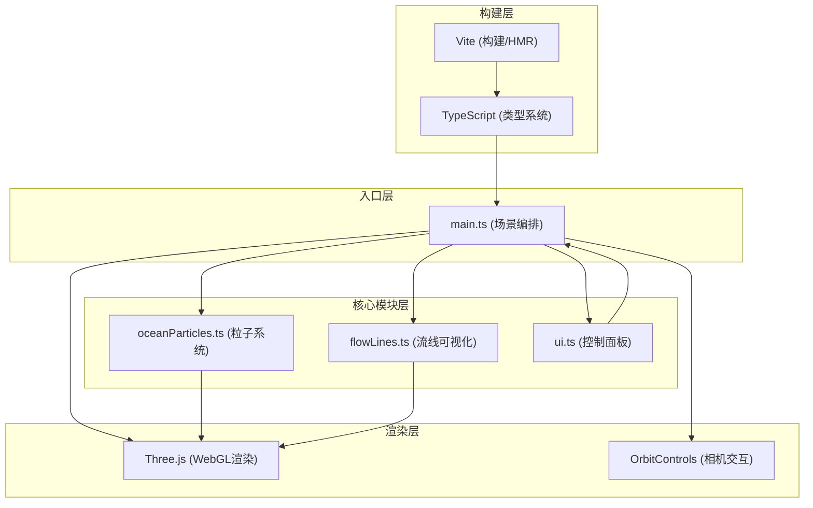

## 1. 架构设计

本项目为纯前端3D可视化应用，采用模块化分层架构。



**数据流向：**
1. `main.ts` 初始化渲染器、场景、相机，实例化 `OceanParticles`、`FlowLines`、`UIControls`
2. `UIControls` → 产生参数变更事件 → `main.ts` 接收并平滑插值到目标值 → 传递给 `OceanParticles`
3. 动画循环（requestAnimationFrame）: `main.ts` 调用 `OceanParticles.update(delta)` → `FlowLines.update(delta)` → 渲染场景
4. `FlowLines` 从 `OceanParticles` 采样粒子位置生成 CatmullRom 路径

**模块调用关系：**
- `main.ts` → `oceanParticles.ts`: 创建实例、调用 update(delta)、读取粒子数据供流线采样
- `main.ts` → `flowLines.ts`: 创建实例、调用 update(delta)、传入粒子引用
- `main.ts` → `ui.ts`: 创建实例、注册参数变更回调
- 模块间无循环依赖，所有模块不直接依赖 main.ts

## 2. 技术描述

- **前端框架**: 无UI框架，原生 TypeScript + Three.js 直接操作 DOM / WebGL
- **3D引擎**: Three.js 0.160.0
- **构建工具**: Vite 5.x (开发服务器端口 5173，开启 HMR)
- **语言**: TypeScript 5.x（严格模式 strict: true，target ES2020，module ESNext）
- **依赖包**: three@0.160.0、@types/three、vite、typescript
- **动画方案**: 不依赖外部动画库，使用 requestAnimationFrame + deltaTime 手动驱动
- **相机控制**: Three.js 内置 OrbitControls

## 3. 项目文件结构

```
.
├── index.html                # 入口HTML，引入 main.ts，全屏 canvas
├── package.json              # 依赖与脚本（npm run dev）
├── vite.config.js            # Vite 基础配置（端口5173，HMR开启）
├── tsconfig.json             # TypeScript 配置（strict、ES2020、ESNext）
└── src/
    ├── main.ts               # 场景入口：渲染器/场景/相机/动画循环/模块编排
    ├── oceanParticles.ts     # 5000粒子系统：生成/更新/位置/颜色/透明度
    ├── flowLines.ts          # 100条CatmullRom流线 + 末端发光sprite
    └── ui.ts                 # 右下角控制面板：3滑块 + 平滑过渡逻辑
```

## 4. 核心类型定义

```typescript
// oceanParticles.ts
interface ParticleData {
  position: Float32Array;    // [x,y,z, x,y,z, ...]
  velocity: Float32Array;    // [vx,vy,vz, ...]
  temperature: Float32Array; // [0-1, ...]
  salinity: Float32Array;    // [0-1, ...]
  isSurface: Uint8Array;     // 1=表层 0=深层
  baseSize: Float32Array;    // 0.08-0.15
}

interface OceanParticlesParams {
  tempFactor: number;     // 温度影响因子 0.0-2.0
  salinityFactor: number; // 盐度影响因子 0.0-2.0
  speedMultiplier: number;// 环流速度倍率 0.5-3.0
}

// flowLines.ts
interface FlowLineData {
  curve: CatmullRomCurve3;
  line: Line;
  sprite: Sprite;
  progress: number; // 0-1 沿曲线位置
  avgTemperature: number;
}

// ui.ts
interface UIParams {
  tempFactor: number;
  salinityFactor: number;
  speedMultiplier: number;
}
type UICallback = (params: UIParams) => void;
```

## 5. 关键实现方案

### 5.1 粒子环流路径
- 圆形盆地：半径8，高度范围-2（深层）~ 2（表层）
- 表层粒子（y=0~2）：螺旋向北（+Z方向）运动，速度基准0.05
- 深层粒子（y=-2~0）：螺旋向南（-Z方向）运动，速度基准0.02
- 到达盆地边界（距离中心>8 或 Z超出范围）后，重置到对侧起点，形成闭环

### 5.2 粒子渲染性能
- 使用 `THREE.Points` + `BufferGeometry`，一次性提交5000个点
- 颜色通过 `vertexColors` 传递，透明度通过 `material.opacity` + 自定义 `alpha` attribute 实现
- 每帧在 JavaScript 侧更新 position / color / alpha 缓冲区，`needsUpdate = true`

### 5.3 流线生成与采样
- 从 `OceanParticles` 的粒子中按区域采样100组种子粒子，每组50个相邻位置作为路径点
- 使用 `CatmullRomCurve3` 生成平滑曲线
- 颜色：计算路径上所有采样点的平均温度 → lerp(#0077ff, #ff4400, t)
- 宽度：随机在0.1-0.4之间，使用 `LineBasicMaterial` 的 `linewidth`（注：WebGL linewidth 在多数平台固定为1，用 `TubeGeometry` 或多个叠加线模拟宽度）

### 5.4 参数平滑过渡
- UI滑块产生目标值 `targetValue`
- 在 `main.ts` 动画循环中以 `current += (target - current) * delta * 2`（约0.5秒达到95%）进行指数平滑
- 将平滑后的参数传入各模块

### 5.5 响应式处理
- 监听 `window.resize` 事件
- 更新 `camera.aspect = window.innerWidth / window.innerHeight`
- `camera.updateProjectionMatrix()`
- `renderer.setSize(window.innerWidth, window.innerHeight)`
- `renderer.setPixelRatio(Math.min(window.devicePixelRatio, 2))`

## 6. 性能优化策略

1. **粒子系统**: 使用单 `BufferGeometry` + 单 `PointsMaterial`，避免5000个独立Mesh
2. **顶点着色**: `vertexColors = true` 减少 draw call
3. **像素比上限**: `setPixelRatio(min(devicePixelRatio, 2))` 避免高DPI设备性能损耗
4. **流线优化**: 100条流线共享材质实例，仅 geometry 不同
5. **避免GC**: 动画循环内不创建新对象，所有临时向量复用外部声明的变量
6. **Sprite 优化**: 所有末端sprite共享同一张 CanvasTexture（白色径向渐变圆）
