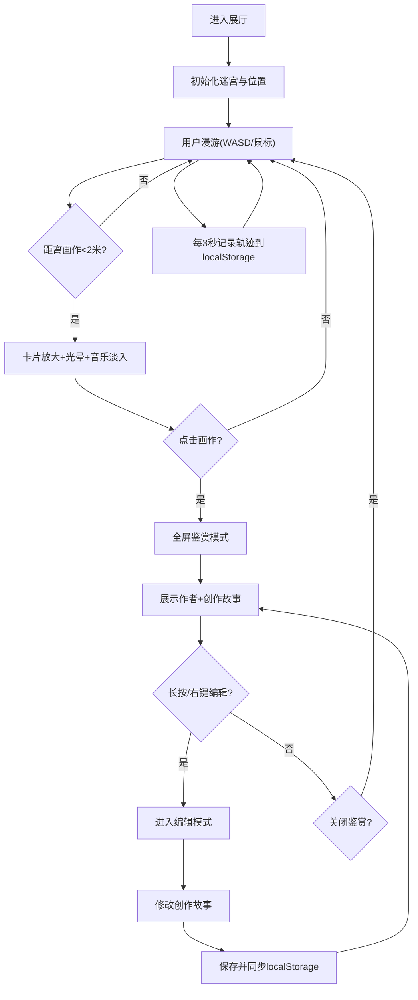

## 1. 产品概述

「几何回廊」是一个沉浸式的线上虚拟展厅Web应用，为独立策展人和数字艺术爱好者打造。观众可在3D几何迷宫画廊中自由漫游，欣赏悬挂于墙面的数字画作，聆听随距离渐变的氛围音乐，并与作品进行深度互动。

- 目标用户：独立策展人、数字艺术爱好者、线上艺术节观众
- 产品价值：突破物理空间限制，打造沉浸式线上艺术浏览体验，支持画作故事编辑与个性化收藏

## 2. 核心功能

### 2.1 用户角色
| 角色 | 注册方式 | 核心权限 |
|------|----------|----------|
| 访客观众 | 无需注册 | 漫游迷宫、鉴赏画作、编辑画作故事、记录行走轨迹 |

### 2.2 功能模块
1. **3D迷宫漫游**：4x4网格走廊、鼠标拖拽视角、WASD键盘控制、动态灯光渐变
2. **画作展示系统**：墙面画作挂载、距离感应放大、金色光晕效果、标题淡入动画
3. **全屏鉴赏模式**：点击放大、作者信息展示、创作故事阅读、关闭动画
4. **氛围音乐系统**：距离感应淡入淡出、crossfade平滑过渡、最多同时播放两首
5. **行走轨迹记录**：localStorage存储最近20条轨迹、页面刷新恢复位置、重置按钮
6. **画作故事编辑**：长按/右键进入编辑模式、文本输入框、localStorage持久化

### 2.3 页面详情
| 页面名称 | 模块名称 | 功能描述 |
|----------|----------|----------|
| 迷宫主场景 | 3D走廊渲染 | CSS 3D变换构建4x4网格迷宫，木纹质感地面天花板，亚光墙体 |
| 迷宫主场景 | 用户控制 | 鼠标拖拽旋转视角，WASD移动，移动端触摸滑动 |
| 迷宫主场景 | 动态灯光 | 根据距离计算墙体灯光强度，亮暗渐变效果 |
| 迷宫主场景 | 方向标识 | 走廊转角处箭头指示牌 |
| 画作卡片 | 悬停交互 | 2米范围内自动放大1.2倍，金色光晕(#ffd700)，标题淡入 |
| 画作卡片 | 点击鉴赏 | 全屏弹出画作详情，作者、创作故事展示 |
| 画作卡片 | 故事编辑 | 长按/右键进入编辑模式，文本框修改创作故事 |
| 音乐系统 | 距离感应 | 接近画作时音乐淡入(2秒，音量0.3)，离开时淡出(1.5秒) |
| 音乐系统 | 平滑过渡 | crossfade切换，最多同时播放两首，缓存3首音频 |
| 轨迹系统 | 位置记录 | 每3秒记录坐标和朝向，滚动数组保存最近20条 |
| 轨迹系统 | 位置恢复 | 页面刷新自动恢复至最后记录位置，右上角重置按钮 |

## 3. 核心流程

观众进入展厅 → 位于迷宫入口(0,0,0) → 通过WASD/鼠标在迷宫中漫游 → 接近画作时卡片放大并播放音乐 → 点击画作进入全屏鉴赏模式 → 阅读作者信息与创作故事 → 长按/右键编辑创作故事 → 保存后返回迷宫继续探索 → 页面刷新后自动恢复上次位置

## 4. 用户界面设计

### 4.1 设计风格
- **主色调**：暗色调主题，背景#1a1a2e，墙体#2a2a3a，地面#3e3e4e
- **强调色**：金色光晕#ffd700，画作背板#f5f0e8
- **字体**：使用优雅的衬线字体展示艺术信息，无衬线字体用于UI控制
- **视觉效果**：CSS 3D perspective(800-1400px动态变化)、ease-out平滑过渡、cubic-bezier放大动画
- **光效**：距离感应灯光渐变、金色光晕流动、微光流动keyframes动画

### 4.2 页面设计概述
| 页面名称 | 模块名称 | UI元素 |
|----------|----------|--------|
| 迷宫主场景 | 3D场景 | 视口perspective:1200px，CSS 3D变换，深木色地面/天花板，亚光墙体 |
| 迷宫主场景 | 控制提示 | 屏幕底部半透明提示条：WASD移动·鼠标拖拽视角 |
| 迷宫主场景 | 重置按钮 | 右上角半透明按钮，点击重置位置到(0,0,0) |
| 画作卡片 | 展示形态 | 150x200px细黑框矩形，墙面1.5米高度，#f5f0e8背板 |
| 画作卡片 | 悬停效果 | 放大1.2倍，金色光晕，标题淡入，微光流动动画 |
| 鉴赏模式 | 全屏遮罩 | #000 0.8透明度遮罩，画作居中填满屏幕宽度 |
| 鉴赏模式 | 信息展示 | 画作下方显示作者名、创作故事文本、关闭按钮 |
| 编辑模式 | 浮动输入框 | 半透明浮动文本框，保存按钮，取消按钮 |

### 4.3 响应式设计
- 桌面端：鼠标拖拽视角 + WASD键盘控制
- 移动端(<768px)：touchmove监听触摸滑动控制行走方向
- 画作卡片在移动端自适应缩小，鉴赏模式优化竖屏展示

### 4.4 3D场景指导
- **环境氛围**：暗色调画廊空间，营造神秘沉浸感
- **灯光设置**：走廊两侧距离感应灯光，强度随距离由亮到暗渐变
- **相机设置**：CSS perspective 800-1400px，根据移动速度动态变化
- **动画过渡**：镜头移动ease-out 0.3s平滑插值，画作放大0.4s cubic-bezier
- **交互反馈**：hover微光流动、距离感应放大、点击推近动画
- **性能预算**：60Hz刷新率下保持50fps+，JSON<50KB，音频缓存3首
