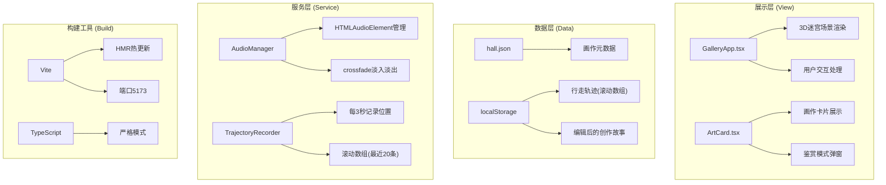
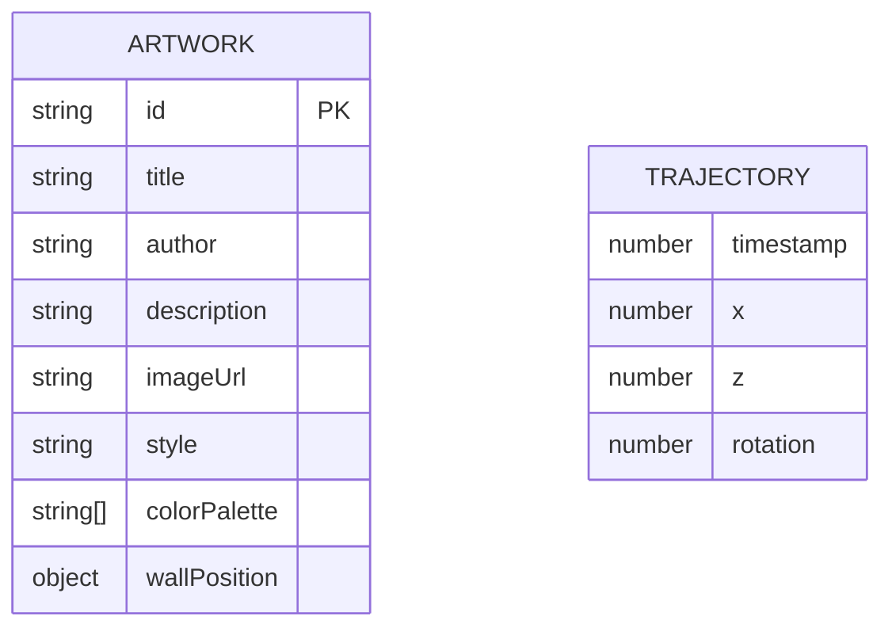

## 1. 架构设计



## 2. 技术描述

- **前端框架**：React 18 + TypeScript
- **构建工具**：Vite 5.x (端口5173，HMR开启，@别名指向src)
- **3D实现**：CSS 3D Transform + perspective(800-1400px动态)
- **样式方案**：原生CSS (全局styles.css，CSS变量主题)
- **数据存储**：localStorage (轨迹记录、故事编辑)
- **模拟数据**：hall.json (本地JSON模拟API)
- **音频处理**：HTMLAudioElement + setInterval音量线性增益

## 3. 路由定义
| 路由 | 用途 |
|------|------|
| / | 单页应用，3D迷宫展厅主场景 |

## 4. 数据模型

### 4.1 数据模型定义


### 4.2 画作数据结构 (hall.json)
```typescript
interface WallPosition {
  wallId: number;      // 墙面编号
  x: number;           // 墙面x坐标
  y: number;           // 墙面y坐标(固定1.5米高度)
  z: number;           // 墙面z坐标
  orientation: 'north' | 'south' | 'east' | 'west';
}

interface Artwork {
  id: string;
  title: string;
  author: string;
  description: string;      // 创作故事
  imageUrl: string;         // 画作图片URL
  wallPosition: WallPosition;
  style: string;            // 风格标签，关联氛围音乐
  colorPalette: string[];   // 颜色调色板
  audioUrl?: string;        // 关联音频URL(模拟)
}
```

### 4.3 行走轨迹结构
```typescript
interface TrajectoryPoint {
  timestamp: number;
  x: number;
  z: number;
  rotation: number;  // 朝向角度(弧度)
}

type Trajectory = TrajectoryPoint[];  // 滚动数组，最多20条
```

## 5. 文件结构与调用关系

```
e:\solo\VersionFast\tasks\auto225\
├── package.json              # 项目依赖与脚本
├── vite.config.js            # Vite配置(端口5173, @别名)
├── tsconfig.json             # TS配置(严格模式, ES2020, ESNext)
├── index.html                # 入口HTML
└── src/
    ├── main.tsx              # React入口 → 渲染GalleryApp
    ├── GalleryApp.tsx        # 主组件: 迷宫逻辑、位置管理、交互处理
    │   ├── 加载hall.json画作数据
    │   ├── 构建CSS 3D墙体网格
    │   ├── 监听鼠标/键盘事件更新位置
    │   ├── 计算画作距离触发放大/音乐
    │   ├── 管理鉴赏模式状态
    │   └── 调用ArtCard组件渲染画作
    ├── ArtCard.tsx           # 画作卡片组件
    │   ├── 接收artwork数据和onClick回调
    │   ├── 渲染缩略图+悬停动画
    │   ├── 点击触发鉴赏模式
    │   └── 支持长按编辑创作故事
    ├── hall.json             # 画作元数据(模拟API数据源)
    └── styles.css            # 全局样式: 3D场景、卡片动画、鉴赏模式、响应式
```

## 6. 数据流向

```
hall.json → GalleryApp.tsx加载 → 解析wallPosition → 计算3D变换坐标
                                              ↓
用户输入(鼠标/键盘/WASD) → GalleryApp更新position/rotation
                                              ↓
                    计算与各画作的距离
                          ↓
            ┌─────────────────────────────┐
            ↓                             ↓
    距离<2米? → ArtCard放大+光晕     距离<3米? → AudioManager淡入音乐
            ↓                             ↓
    标题淡入显示                   crossfade平滑过渡(最多2首)
    
点击画作 → GalleryApp设置selectedArtwork → ArtCard渲染鉴赏模式
                                                          ↓
                                                长按/右键编辑 → 文本框修改description
                                                          ↓
                                                    保存 → 更新localStorage
                                                          ↓
                                              下次加载时覆盖hall.json默认值

每3秒 → TrajectoryRecorder记录{x,z,rotation} → localStorage滚动数组(20条)
                                                          ↓
                                              页面刷新 → 读取最后一条恢复位置
```

## 7. 性能优化策略

- **渲染帧率**：CSS transform/GPU加速，避免重排，目标50fps+@60Hz
- **音频缓存**：最多缓存3首HTMLAudioElement实例，LRU淘汰
- **localStorage节流**：写入频率≤每2秒一次，使用防抖/节流
- **JSON数据**：hall.json控制在50KB以内，画作使用合适尺寸缩略图
- **动画优化**：CSS transition/keyframes优先，避免JS高频动画
- **3D性能**：控制同时渲染的墙面数量，合理使用perspective
