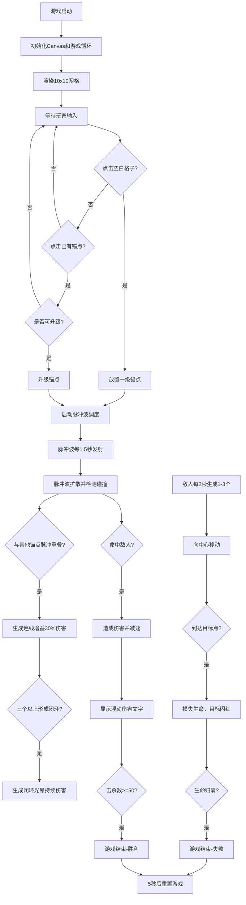

## 1. 产品概述

「脉冲锚点」是一款交互式节奏塔防游戏，玩家在10x10的2D网格上策略性地放置不同颜色的能量锚点，通过发射脉冲波形成覆盖网络，阻止从屏幕边缘生成的敌人到达中心目标点。游戏融合了塔防策略与节奏协同机制，锚点之间通过脉冲波重叠产生连线增益，闭环网络更能触发范围伤害光晕。

- 核心玩法：网格布局、脉冲扩散、协同增益、敌人拦截
- 目标用户：休闲策略游戏玩家
- 产品价值：提供轻量、有深度策略性的塔防游戏体验

## 2. 核心功能

### 2.1 功能模块
1. **锚点系统**：放置、升级锚点，三级颜色与属性递增
2. **脉冲波系统**：周期性发射、扩散衰减、伤害减速、粒子拖尾
3. **敌人系统**：四边随机生成、向中心移动、生命值波次递增、轨迹尾迹
4. **连线协同系统**：脉冲重叠触发连线、伤害增益、闭环光晕伤害
5. **胜负判定系统**：生命值管理、击杀计数、游戏结束展示
6. **UI系统**：生命心形、击杀数、波次数、响应式适配

### 2.2 页面详情
| 页面名称 | 模块名称 | 功能描述 |
|-----------|-------------|---------------------|
| 游戏主界面 | 网格背景 | 10x10深灰渐变网格，鼠标悬停高亮，网格线蓝色微光 |
| 游戏主界面 | 锚点渲染 | 圆形锚点，三级颜色渐变，缩放弹跳动画，等级数字 |
| 游戏主界面 | 脉冲波渲染 | 渐变圆环扩散，alpha衰减，粒子拖尾效果 |
| 游戏主界面 | 敌人渲染 | 红色三角形，轨迹尾迹，受伤闪烁 |
| 游戏主界面 | 连线渲染 | 半透明混合色线段，闭环光晕旋转粒子 |
| 游戏主界面 | 目标点 | 中心发光光圈，受击闪红 |
| 游戏主界面 | 浮动文字 | 黄色伤害数字，2秒淡出 |
| 游戏主界面 | UI层 | 左上生命心形、右上击杀数、底部波次数、中央结束文字 |

## 3. 核心流程

## 4. 用户界面设计

### 4.1 设计风格
- **主色调**：深色科技风，背景从 `#1a1a2e` 到 `#16213e` 渐变
- **锚点颜色**：一级 `#4fc3f7`（青色）、二级 `#ff6b8a`（粉色）、三级 `#ffd54f`（金色）
- **敌人颜色**：`#e57373`（红色系）
- **目标点颜色**：`#e57373` 发光光圈
- **UI文字**：白色/灰色
- **按钮/交互**：无传统按钮，纯Canvas交互
- **字体**：系统默认无衬线字体，白色为主
- **布局**：全屏Canvas，响应式缩放

### 4.2 页面设计概述
| 页面名称 | 模块名称 | UI元素 |
|-----------|-------------|-------------|
| 游戏主界面 | 网格背景 | 深灰渐变，`#444`网格线带蓝色alpha0.2光晕，悬停格子半透明白色alpha0.2高亮 |
| 游戏主界面 | 锚点 | 圆形半径12px，颜色按等级变化，放置/升级0.2秒ease-out缩放弹跳（0.8→1.0倍），白色12px等级数字 |
| 游戏主界面 | 脉冲波 | 渐变圆环，颜色与锚点相同，alpha从0.8线性衰减到0，5个2px粒子拖尾 |
| 游戏主界面 | 敌人 | 红色三角形，半透明像素轨迹尾迹，受伤闪红0.1秒 |
| 游戏主界面 | 连线 | 2px宽，锚点颜色混合，alpha0.6，闭环处20px旋转粒子环光晕 |
| 游戏主界面 | 目标点 | 中心30px半径发光光圈，受击闪红0.3秒 |
| 游戏主界面 | 浮动文字 | 黄色+伤害数字，2秒淡出消失 |
| 游戏主界面 | UI层 | 左上：3个心形（实心`#e57373`/空心半透明），右上：击杀数白色18px，底部中央：波次数灰色14px，中央：游戏结束文字持续5秒 |

### 4.3 响应式适配
- Canvas尺寸跟随窗口大小变化
- 网格和锚点等所有元素按比例缩放
- 最大画布不超过1920x1080
- 保持10x10网格的正方形比例

### 4.4 动画与特效
- 锚点放置/升级：0.2秒缩放弹跳（0.8→1.0，ease-out）
- 脉冲波：3px/帧扩散，alpha线性衰减，粒子跟随
- 敌人受伤：0.1秒闪红
- 目标受击：0.3秒闪红
- 浮动文字：2秒淡出上升
- 闭环光晕：旋转粒子环
