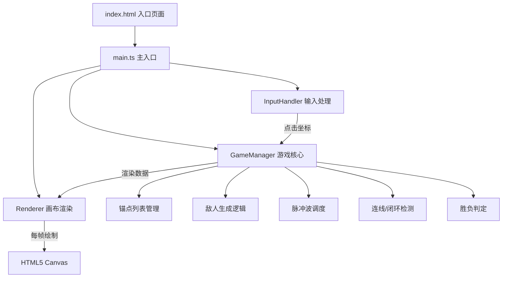

## 1. 架构设计



## 2. 技术描述

- **前端框架**：无外部游戏引擎，纯 TypeScript + HTML5 Canvas API
- **构建工具**：Vite 5.x
- **语言**：TypeScript（严格模式，target ES2020，module ESNext）
- **初始化方式**：手动创建项目结构，不使用 Vite 官方模板

## 3. 项目文件结构

```
├── package.json              # 依赖: typescript, vite; 启动脚本 npm run dev
├── vite.config.js            # Vite基础配置: 端口5173, HMR开启
├── tsconfig.json             # TS配置: 严格模式, ES2020, ESNext
├── index.html                # 入口页面: 全屏无滚动, 引入main.ts
└── src/
    ├── main.ts               # 主入口: 初始化Canvas, 游戏循环, 调用GameManager
    ├── gameManager.ts        # 游戏核心: 锚点/敌人/脉冲/连线/胜负
    ├── inputHandler.ts       # 鼠标输入: 坐标转换, 放置/升级判定, 事件发射器
    ├── renderer.ts           # Canvas渲染: 网格/锚点/脉冲/敌人/连线/UI
    └── types.ts              # (可选) 类型定义
```

## 4. 核心数据模型

### 4.1 锚点 (Anchor)
| 字段 | 类型 | 说明 |
|------|------|------|
| id | number | 唯一标识 |
| gridX | number | 网格坐标X (0-9) |
| gridY | number | 网格坐标Y (0-9) |
| level | 1\|2\|3 | 锚点等级 |
| color | string | 颜色值 |
| pulseInterval | number | 脉冲间隔(ms), 固定1500 |
| lastPulseTime | number | 上次脉冲时间戳 |
| scale | number | 当前缩放比例(动画用) |
| scaleStartTime | number | 缩放动画开始时间 |
| hasLinkBonus | boolean | 是否处于连线增益状态 |

### 4.2 脉冲波 (PulseWave)
| 字段 | 类型 | 说明 |
|------|------|------|
| id | number | 唯一标识 |
| anchorId | number | 所属锚点ID |
| x | number | 中心像素X |
| y | number | 中心像素Y |
| radius | number | 当前半径 |
| maxRadius | number | 最大半径(60/90/120) |
| color | string | 颜色 |
| alpha | number | 当前透明度 |
| hitEnemies | Set\<number\> | 已命中的敌人ID集合 |
| particles | Particle[] | 拖尾粒子 |

### 4.3 敌人 (Enemy)
| 字段 | 类型 | 说明 |
|------|------|------|
| id | number | 唯一标识 |
| x | number | 像素坐标X |
| y | number | 像素坐标Y |
| hp | number | 当前生命值 |
| maxHp | number | 最大生命值 |
| baseSpeed | number | 基础速度 1px/frame |
| slowEndTime | number | 减速结束时间戳 |
| trail | {x,y,alpha}[] | 轨迹点数组 |
| flashEndTime | number | 受伤闪烁结束时间 |
| isDead | boolean | 是否已死亡 |

### 4.4 连线 (AnchorLink)
| 字段 | 类型 | 说明 |
|------|------|------|
| anchorA | number | 锚点A ID |
| anchorB | number | 锚点B ID |
| active | boolean | 是否激活 |

### 4.5 闭环光晕 (AuraZone)
| 字段 | 类型 | 说明 |
|------|------|------|
| centerX | number | 中心X |
| centerY | number | 中心Y |
| radius | number | 半径20 |
| rotation | number | 旋转角度 |
| anchorIds | number[] | 构成闭环的锚点ID |

### 4.6 浮动文字 (FloatingText)
| 字段 | 类型 | 说明 |
|------|------|------|
| x | number | 坐标X |
| y | number | 坐标Y |
| text | string | 文字内容 |
| alpha | number | 透明度 |
| createdAt | number | 创建时间戳 |

## 5. 核心常量配置

| 常量 | 值 | 说明 |
|------|----|------|
| GRID_SIZE | 10 | 网格10x10 |
| CELL_SIZE | 60 | 格子基础尺寸60px |
| ANCHOR_RADIUS | 12 | 锚点半径12px |
| PULSE_SPEED | 3 | 脉冲波扩展速度3px/frame |
| PULSE_INITIAL_RADIUS | 10 | 脉冲初始半径10px |
| PULSE_INTERVAL | 1500 | 脉冲间隔1.5秒 |
| ENEMY_SPAWN_INTERVAL | 2000 | 敌人生成间隔2秒 |
| ENEMY_BASE_SPEED | 1 | 敌人速度1px/frame |
| TARGET_RADIUS | 30 | 目标点半径30px |
| INITIAL_LIVES | 3 | 初始生命3条 |
| KILLS_TO_WIN | 50 | 胜利击杀数50 |
| SLOW_DURATION | 500 | 减速持续0.5秒 |
| SLOW_FACTOR | 0.5 | 减速比例50% |
| LINK_BONUS | 1.3 | 连线伤害增益30% |
| AURA_DPS | 15 | 光晕每秒伤害15 |

### 锚点等级属性
| 等级 | 颜色 | 最大半径 | 伤害 |
|------|------|---------|------|
| 1 | #4fc3f7 | 60px | 10 |
| 2 | #ff6b8a | 90px | 18 |
| 3 | #ffd54f | 120px | 28 |

## 6. 性能约束

- **目标帧率**：稳定60FPS
- **粒子上限**：≤1000个
- **连线上限**：≤20条
- **内存占用**：<100MB
- **画布最大尺寸**：≤1920x1080
- **每帧清空重绘**：使用Canvas clearRect

## 7. 数据流

1. **用户输入流**：InputHandler 监听 mousemove/click → 转换网格坐标 → 触发事件 → GameManager 处理放置/升级
2. **游戏逻辑流**：GameManager 每帧 update → 更新脉冲波 → 检测敌人碰撞 → 检测连线闭环 → 更新敌人位置 → 判定胜负
3. **渲染流**：GameManager 维护状态 → Renderer 每帧读取状态 → Canvas 绘制所有元素
