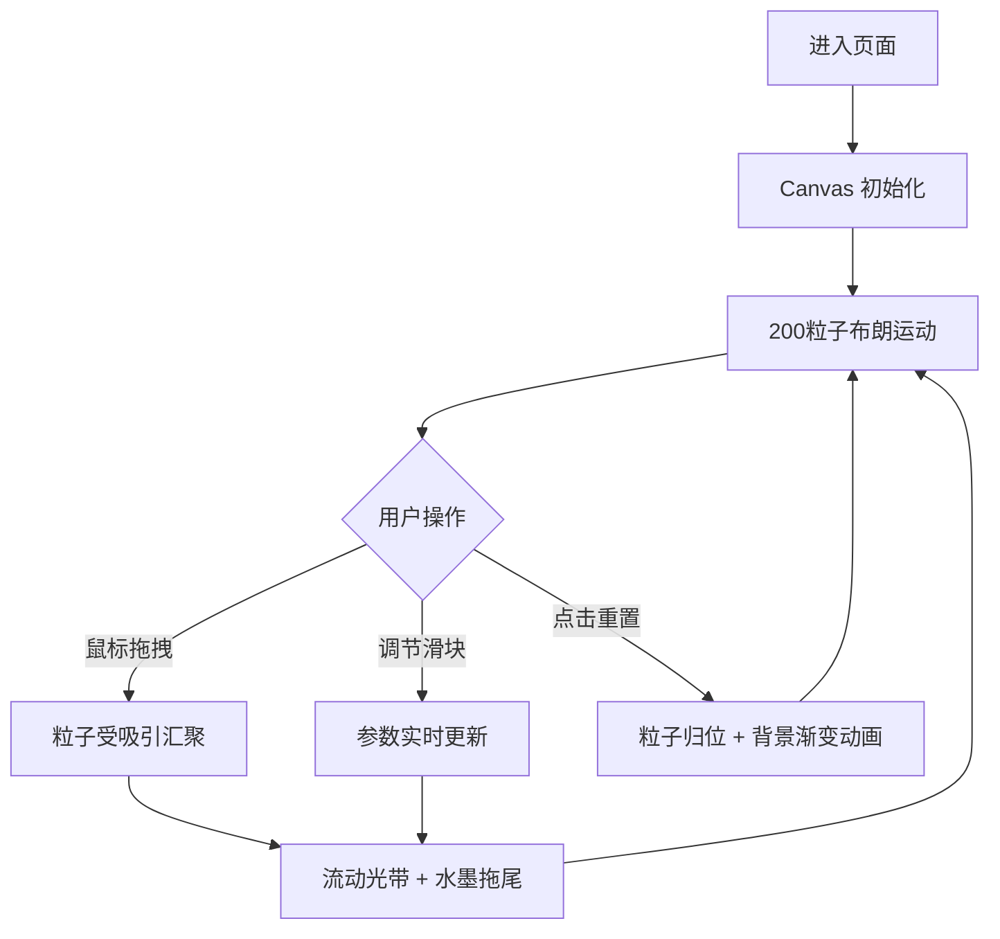

## 1. 产品概述

「墨韵流速」是一款基于浏览器的交互式水墨风格粒子流动画应用。用户通过鼠标拖拽和点击，实时控制抽象水墨粒子在画布上流动，创造出类似中国传统水墨书法的动态艺术效果。

- 核心目标：为用户提供沉浸式的东方水墨艺术创作体验，让每个人都能用"无形的毛笔"在数字宣纸上书写
- 目标用户：艺术爱好者、设计师、普通用户，适用于创意休闲、视觉展示、互动艺术装置等场景

## 2. 核心功能

### 2.1 用户角色

| 角色 | 注册方式 | 核心权限 |
|------|---------|---------|
| 普通用户 | 无需注册，直接使用 | 实时操控粒子流、调节参数、重置画布 |

### 2.2 功能模块

1. **主画布场景**：全屏 Canvas 画布，宣纸背景，200个粒子组成的粒子系统
2. **鼠标交互**：拖拽吸引粒子形成流动光带，布朗运动自主漂移
3. **控制面板**：三个调节滑块（流速、墨色、笔触）+ 重置按钮
4. **视觉效果**：水墨晕染拖尾、边缘渐隐、重置动画

### 2.3 页面详情

| 页面名称 | 模块名称 | 功能描述 |
|---------|---------|---------|
| 主画布 | Canvas 渲染层 | 宣纸渐变背景（#f5efe6 → #e8ddce），200个半透明灰色粒子布朗运动，鼠标拖拽吸引粒子形成流动光带，拖尾痕迹持续2秒后渐消 |
| 主画布 | 拖尾效果层 | 粒子路径留下 #2c2c2c → #8b7355 渐变痕迹，带扩散模糊模拟墨汁洇开 |
| 控制面板 | 流速滑块 | 1-10 档位，默认值 5，控制粒子整体移动速度 |
| 控制面板 | 墨色滑块 | 1-10 档位，默认值 5，控制粒子透明度范围（淡墨 ↔ 焦墨） |
| 控制面板 | 笔触滑块 | 1-10 档位，默认值 5，控制粒子半径缩放（小楷 ↔ 大楷） |
| 控制面板 | 重置按钮 | 粒子归位 + 画布从中心向外渐变恢复初始背景（0.8s ease-out） |

## 3. 核心流程

用户进入页面后，200个粒子以布朗运动方式缓慢漂移。用户拖拽鼠标时，粒子被吸引汇聚形成流动光带，路径留下水墨拖尾。用户可通过三个滑块实时调节视觉风格，点击重置按钮可瞬间恢复初始状态。

## 4. 用户界面设计

### 4.1 设计风格

- **主色调**：宣纸色系（#f5efe6、#e8ddce），墨色系（#2c2c2c、#8b7355）
- **面板样式**：圆角 12px，白色半透明背景（#ffffff alpha 0.85），阴影 2px
- **字体**：衬线体（serif），体现东方人文气息
- **按钮过渡**：悬停时背景从 #ffffff 平滑过渡到 #e8ddce，transition 0.3s
- **边缘效果**：画布四周向中心径向渐变 alpha 0.1 → 0，模拟宣纸边缘质感

### 4.2 页面设计概览

| 页面名称 | 模块名称 | UI 元素 |
|---------|---------|---------|
| 主画布 | 全屏 Canvas | 宣纸渐变背景、水墨粒子、拖尾痕迹、边缘渐隐 |
| 左下角控制面板 | 浮动面板 | 三个滑块带标签、重置按钮、圆角半透明样式、悬停过渡 |

### 4.3 响应式适配

- **桌面端**（宽度 ≥ 600px）：面板固定左下角，完整显示三个滑块和按钮
- **移动端**（宽度 < 600px）：面板缩小为半透明圆角胶囊条，贴底部显示
- **全局**：Canvas 始终填满视口，无滚动条，支持触摸操作

## 5. 性能指标

- 操作响应时间：< 50ms
- 稳定帧率：200 粒子时稳定 60fps
- 无卡顿、掉帧现象
