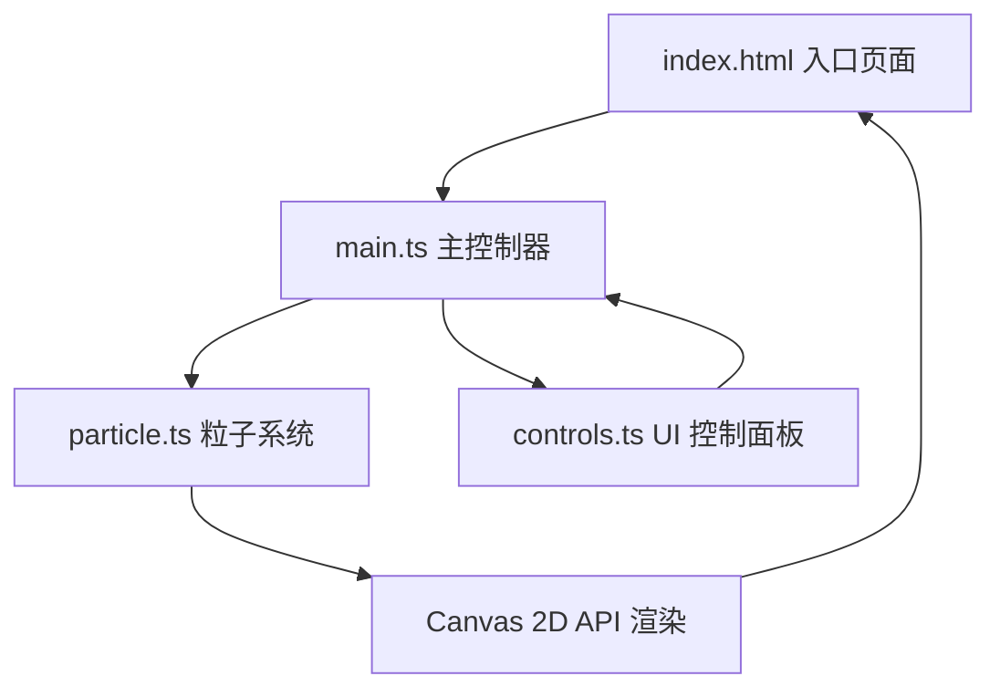

## 1. 架构设计



## 2. 技术说明

- **前端框架**：原生 TypeScript + Vite 构建，不依赖外部动画库
- **渲染技术**：纯 Canvas 2D API 绘制，requestAnimationFrame 动画循环
- **项目初始化工具**：Vite
- **后端**：无（纯前端应用）
- **数据库**：无

## 3. 文件结构

| 文件路径 | 用途 |
|---------|------|
| `package.json` | 项目依赖配置（typescript、vite），启动脚本 |
| `vite.config.js` | Vite 基础配置（端口 5173、开启 HMR） |
| `tsconfig.json` | TypeScript 配置（严格模式、target ES2020、module ESNext） |
| `index.html` | 入口页面，全屏布局，引入 main.ts |
| `src/main.ts` | 主入口，Canvas 初始化、事件监听、动画循环 |
| `src/particle.ts` | 粒子类，包含位置/速度/半径/alpha，更新与绘制方法 |
| `src/controls.ts` | 控制面板 UI，三个滑块 + 重置按钮，回调传参 |

## 4. 核心模块设计

### 4.1 Particle 粒子类

```typescript
interface ParticleConfig {
  flowSpeed: number;   // 流速 1-10
  inkDensity: number;  // 墨色 1-10
  brushSize: number;   // 笔触 1-10
}

class Particle {
  x: number;
  y: number;
  vx: number;
  vy: number;
  baseRadius: number;
  baseAlpha: number;
  trail: Array<{ x: number; y: number; alpha: number }>;
  
  update(mouse: { x: number; y: number; active: boolean }, config: ParticleConfig): void;
  draw(ctx: CanvasRenderingContext2D, config: ParticleConfig): void;
  reset(width: number, height: number): void;
}
```

### 4.2 控制面板模块

```typescript
interface ControlCallbacks {
  onFlowSpeedChange: (value: number) => void;
  onInkDensityChange: (value: number) => void;
  onBrushSizeChange: (value: number) => void;
  onReset: () => void;
}

function createControls(container: HTMLElement, callbacks: ControlCallbacks): void;
```

### 4.3 主循环流程

1. `requestAnimationFrame` 驱动渲染循环
2. 每帧更新所有粒子位置（布朗运动 + 鼠标吸引力）
3. 绘制拖尾痕迹 + 粒子本体
4. 应用边缘渐隐效果

## 5. 性能优化策略

- 使用 Canvas 2D 原生 API，避免 DOM 操作
- 拖尾数据结构限制长度，防止内存增长
- 粒子更新计算使用简单数学运算，避免复杂物理引擎
- 使用半透明叠加实现水墨扩散，无需额外模糊滤镜开销
