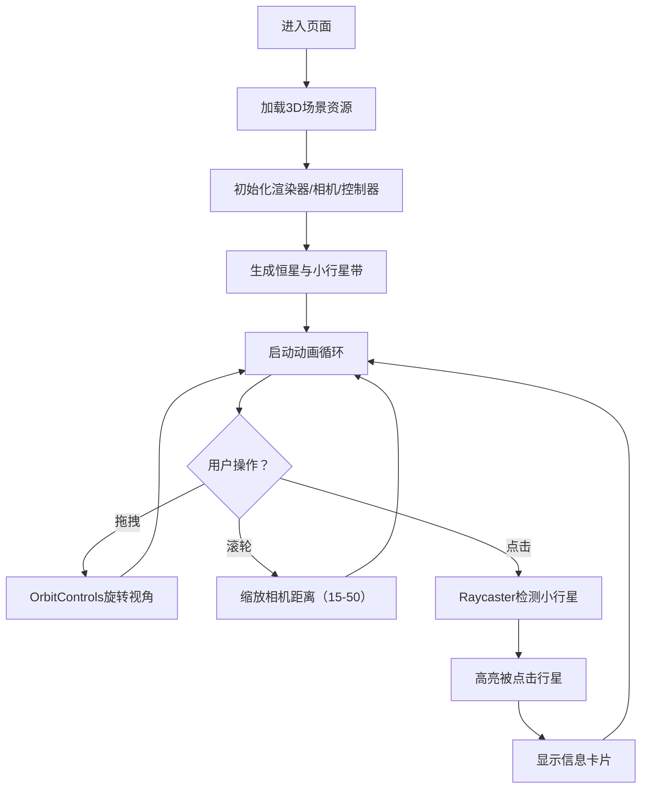

## 1. 产品概述

「碎星带」是一款基于WebGL的交互式3D小行星轨道模拟应用，为行星科学爱好者和太空科普受众提供沉浸式的小行星带可视化体验。用户可以通过浏览器实时观察数千颗岩体在微弱引力场中的轨道运动，感受太空望远镜般的宇宙视野。

- 目标用户：行星科学爱好者、学生、科普教育工作者、太空主题爱好者
- 核心价值：以高性能实时渲染技术呈现壮观的小行星带动态景象，兼具科学性与视觉美感

## 2. 核心功能

### 2.1 用户角色

| 角色 | 注册方式 | 核心权限 |
|------|----------|----------|
| 普通用户 | 无需注册，直接访问 | 浏览3D场景、交互控制、查看小行星信息 |

### 2.2 功能模块

1. **3D主场景**：中央恒星 + 1500+颗小行星公转带 + 5000颗粉尘粒子
2. **视角控制**：鼠标拖拽轨道旋转、滚轮平滑缩放
3. **行星信息查询**：点击小行星显示详细参数（编号、半径、公转周期、质量）
4. **动态光照系统**：恒星点光源照明 + 恒星脉动发光效果

### 2.3 页面详情

| 页面名称 | 模块名称 | 功能描述 |
|----------|----------|----------|
| 主场景页 | 中央恒星模块 | 发光球体 + 半透明光晕 + 脉动光效 |
| 主场景页 | 小行星带模块 | 1500颗独立小行星公转 + 自转 + 大小颜色质量映射 |
| 主场景页 | 粉尘粒子模块 | 5000个微粒子增强空间层次感 |
| 主场景页 | 信息卡片模块 | 左上角半透明信息面板展示小行星参数 |
| 主场景页 | 交互提示模块 | 底部中央操作提示文字 |

## 3. 核心流程

用户进入页面后自动加载3D场景，小行星带开始环绕恒星运行。用户可通过鼠标拖拽旋转视角，滚轮缩放观察局部区域，点击任意小行星触发高亮效果并显示信息卡片。

## 4. 用户界面设计

### 4.1 设计风格

- **主色调**：深空黑（#0a0a0f）背景，冷色调为主
- **渐变色**：小行星颜色从橙黄（#ff9966）到蓝紫（#6699ff）按质量渐变
- **恒星色**：暖黄色（#ffddaa）发光球体
- **信息卡片**：半透明暗色背景（#1a1a2e alpha 0.85）+ 圆角 + 白色文字
- **提示文字**：白色半透明（#ffffff alpha 0.4）+ monospace字体
- **整体观感**：模拟真实太空望远镜的深空摄影风格

### 4.2 页面设计概览

| 页面名称 | 模块名称 | UI元素 |
|----------|----------|--------|
| 主场景页 | 中央恒星 | 发光球体、半透明光晕、脉动发光动画 |
| 主场景页 | 小行星群 | 1500颗大小不一、颜色渐变的球体、公转+自转运动 |
| 主场景页 | 粉尘层 | 5000个半透明微粒子、分布于轨道区域 |
| 主场景页 | 信息卡片 | 左上角、圆角、半透明深色背景、白色monospace文字 |
| 主场景页 | 提示文字 | 底部中央、14px、monospace、半透明白色 |

### 4.3 响应式

- 全屏自适应（100vh / 100vw），无滚动条
- 桌面端优先，鼠标交互为主
- 移动端支持触摸拖拽和双指缩放

### 4.4 3D场景指引

- **环境**：纯黑色背景，模拟深空环境，无HDRI
- **光照设置**：中心点光源（恒星）+ 微弱环境光；恒星使用MeshStandardMaterial高emissive强度
- **相机设置**：PerspectiveCamera，初始距离约30，缩放范围15-50，透视投影自然衰减
- **构图**：中心恒星为焦点，小行星带形成扁平圆环围绕其周围，相机从侧上方45°俯瞰
- **交互动画**：鼠标拖拽平滑轨道旋转；滚轮阻尼缩放；点击高亮emissive发光0.5秒
- **后处理**：不使用后期处理，通过AdditiveBlending实现光晕效果
- **性能预算**：1500颗小行星使用InstancedMesh共享几何体；5000粒子使用Points；目标帧率≥55 FPS
