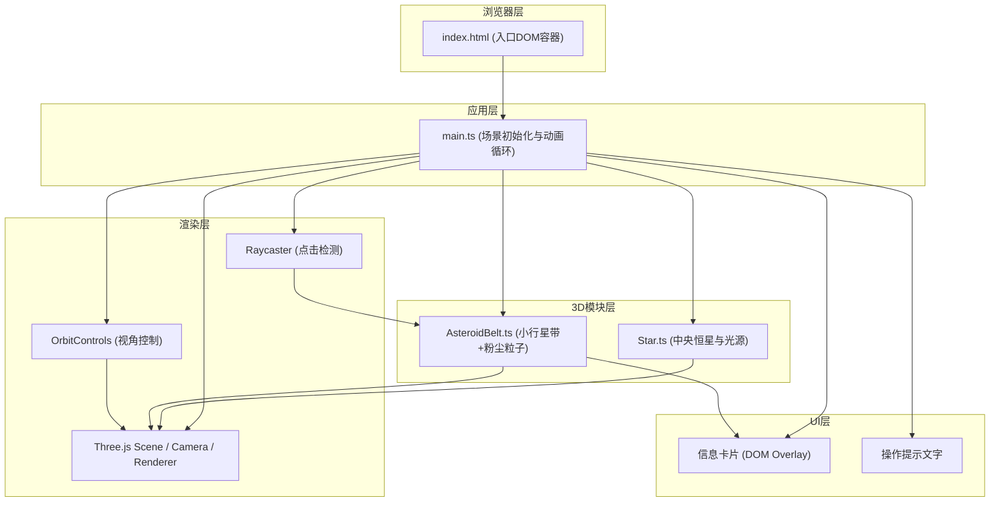
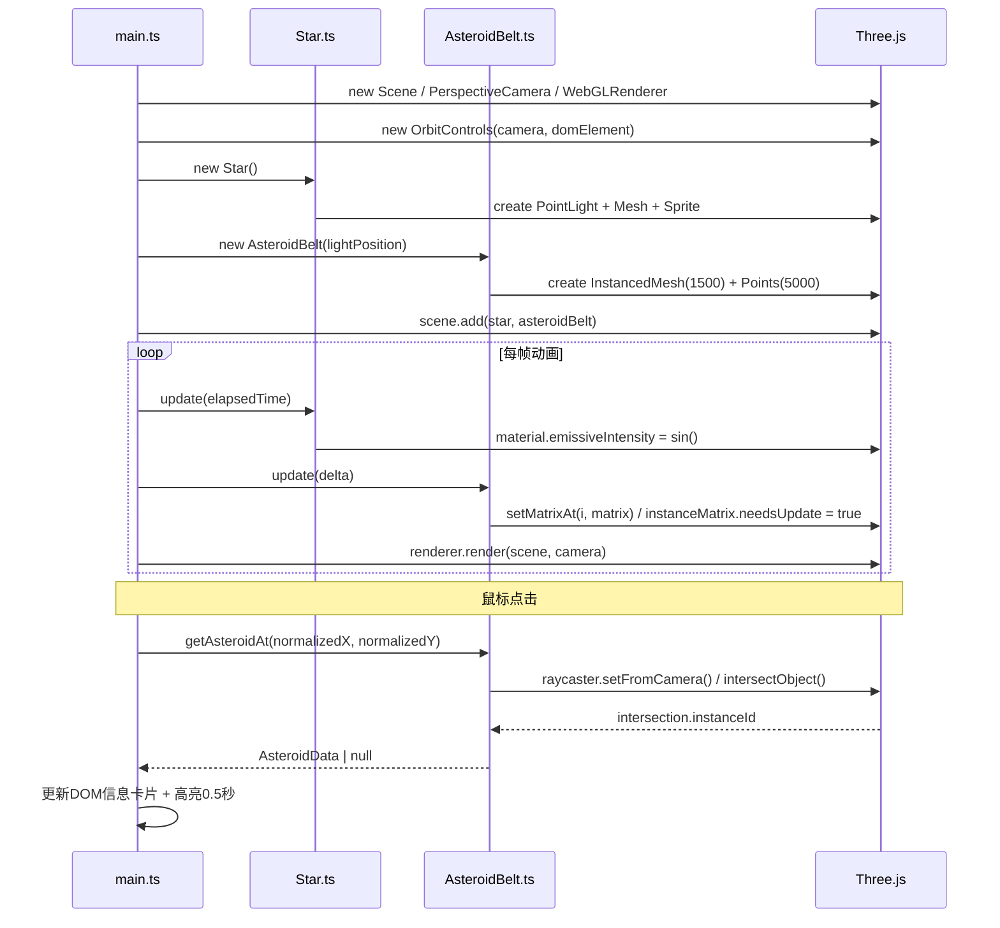

## 1. 架构设计



**数据流说明：**
1. `main.ts` 初始化Three.js核心组件，创建 `Star` 和 `AsteroidBelt` 实例并加入场景
2. `Star` 暴露 `getLightPosition()` 提供光源坐标给小行星材质计算
3. `AsteroidBelt` 内部维护1500颗小行星数据数组（轨道半径、速度、角度、大小、颜色、质量、自转）
4. 每帧 `main.ts` 调用 `Star.update(time)` 和 `AsteroidBelt.update(delta)` 更新动画状态
5. 鼠标点击事件由 `main.ts` 捕获，调用 `AsteroidBelt.getAsteroidAt(x,y)` 通过Raycaster获取命中小行星索引
6. 小行星信息数据流向UI层 `信息卡片` 进行DOM渲染展示

## 2. 技术描述

- **前端框架**: 原生TypeScript（无React/Vue），面向对象模块化设计
- **构建工具**: Vite@5 (ESM HMR，端口5173)
- **3D引擎**: three@0.160.0 + @types/three
- **语言目标**: TypeScript严格模式，target ES2020，module ESNext
- **性能优化**: THREE.InstancedMesh 复用单一SphereGeometry实现1500个实例；THREE.Points 实现5000粉尘粒子
- **DOM交互**: 原生事件监听 + Raycaster射线检测

## 3. 文件结构与职责

| 文件路径 | 职责描述 | 依赖 |
|----------|----------|------|
| `package.json` | 项目依赖与npm脚本定义 | - |
| `vite.config.js` | Vite开发服务器配置（端口5173，HMR开启） | - |
| `tsconfig.json` | TypeScript编译配置（严格模式，ES2020） | - |
| `index.html` | 入口页面，全屏容器，CSS样式，加载main.ts | - |
| `src/main.ts` | 总入口：场景/相机/渲染器/控制器初始化；加载Star和AsteroidBelt；动画循环；鼠标事件处理；UI更新 | three, Star, AsteroidBelt |
| `src/Star.ts` | 中央恒星类：发光球体Mesh、点光源、半透明光晕Sprite、脉动光效动画 | three |
| `src/AsteroidBelt.ts` | 小行星带类：1500颗小行星InstancedMesh、5000粉尘Points、数据数组、update方法、射线检测方法 | three |

## 4. 模块调用关系



## 5. 核心数据模型

### 5.1 小行星数据结构

```typescript
interface AsteroidData {
  id: number;              // 行星编号
  mass: number;            // 模拟质量 [0, 1]
  orbitRadius: number;     // 轨道半径 [6, 20]
  orbitSpeed: number;      // 公转角速度 rad/frame [0.005, 0.025]
  orbitAngle: number;      // 当前公转角度 [0, 2π)
  orbitY: number;          // Y轴偏移（厚度±0.75）
  size: number;            // 缩放尺寸 [0.15, 0.6]
  color: THREE.Color;      // 颜色（质量映射：#ff9966 → #6699ff）
  rotationAxis: THREE.Vector3;  // 自转轴（单位向量）
  rotationSpeed: number;   // 自转角速度 rad/frame
  currentRotation: number; // 当前自转角度
}
```

### 5.2 颜色映射函数

```
color(mass) = lerpColor(#ff9966, #6699ff, mass)
mass ∈ [0, 1]，低值橙黄（小质量），高值蓝紫（大质量）
```

### 5.3 公转周期计算

```
T(frames) = 2π / orbitSpeed
T(seconds) = T(frames) / 60  (假设60fps)
```

## 6. 性能优化方案

| 优化点 | 实现方式 | 预期收益 |
|--------|----------|----------|
| 几何体复用 | 所有1500颗小行星共享同一个 `SphereGeometry(1, 16, 12)` | 减少内存占用和DrawCall |
| 实例化渲染 | 使用 `THREE.InstancedMesh` 替代1500个独立Mesh | 单DrawCall渲染全部小行星 |
| 矩阵更新 | 每帧仅更新 `instanceMatrix`，标记 `needsUpdate=true` | 最小化GPU数据传输 |
| 粒子系统 | 5000粉尘使用 `THREE.Points` + `BufferGeometry` | 高效渲染大量微粒子 |
| 材质共享 | 所有小行星实例共享 `MeshStandardMaterial`（通过 per-instance color） | 减少材质切换开销 |
| 帧率控制 | `requestAnimationFrame` 原生循环 + deltaTime | 适应不同刷新率 |
