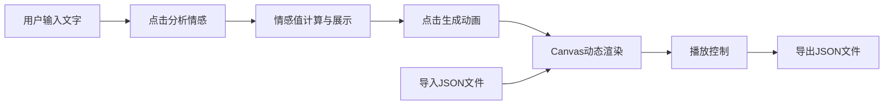

## 1. 产品概述

「回声编织」是一款交互式文字可视化应用，让用户将文字或短诗转换为动态视觉动画。通过情感分析技术，系统根据文字内容的情感倾向生成独特的抽象视觉效果，用户可导出并回放这些动态视觉作品。

- 主要用途：文字艺术可视化、诗歌动态展示、创意情感表达
- 目标用户：文字爱好者、艺术家、创意工作者
- 产品价值：将抽象的文字情感转化为具象的视觉艺术体验

## 2. 核心功能

### 2.1 用户角色
| 角色 | 注册方式 | 核心权限 |
|------|----------|----------|
| 访客用户 | 无需注册 | 输入文字、分析情感、生成动画、导出/导入作品 |

### 2.2 功能模块
1. **输入面板**：文字输入、情感分析、生成触发、文件导入
2. **可视化画布**：Canvas 2D 动态渲染、线段与圆点网络动画、情感色彩映射
3. **播放控制栏**：播放/暂停、进度展示、JSON导出

### 2.3 页面详情
| 页面名称 | 模块名称 | 功能描述 |
|----------|----------|----------|
| 主应用 | 输入面板 | 多行文本输入、情感值显示条、分析与生成按钮、导入按钮 |
| 主应用 | 可视化画布 | 全屏Canvas渲染、情感驱动动画、节奏同步效果 |
| 主应用 | 播放控制栏 | 播放控制、进度条、导出功能 |

## 3. 核心流程

用户在左侧面板输入文字，点击「分析情感」获取情感分析结果，再点击「生成动画」在右侧画布播放动态视觉效果。底部控制栏可暂停/继续播放，或导出JSON文件保存作品。用户也可导入之前导出的JSON文件进行回放。

## 4. 用户界面设计

### 4.1 设计风格
- **主色调**：深色主题（#111827背景，#1e1b2e画布背景，#374151分隔线）
- **强调色**：紫色（#8b5cf6）用于主操作按钮和进度条，青色（#06b6d4）用于次按钮
- **情感色**：积极（#7effb3 → #facc15暖绿色系），消极（#a78bfa → #ef4444冷紫红色系）
- **按钮风格**：圆角柔和，悬停平滑过渡0.3s，轻微上移阴影效果
- **字体**：现代无衬线字体，清晰可读
- **布局风格**：左右分栏桌面布局，移动端上下堆叠

### 4.2 页面设计概览
| 页面名称 | 模块名称 | UI元素 |
|----------|----------|--------|
| 主应用 | 输入面板 | 圆角文本域（#f0ebe3背景）、渐变情感条、紫色/青色按钮 |
| 主应用 | 可视化画布 | 深紫黑背景、动态线段与圆点网络、呼吸透明度效果 |
| 主应用 | 播放控制栏 | 深色背景栏、播放/暂停图标、渐变进度条、导出图标 |

### 4.3 响应式
- 桌面端（≥768px）：左侧350px固定宽度输入面板，右侧自适应Canvas画布，底部固定控制栏
- 移动端（<768px）：输入面板顶部全宽，Canvas占据剩余垂直空间，控制栏固定底部

### 4.4 动画性能
- Canvas帧率30-60FPS
- 元素总数≤80个（线段≤40条）
- 使用requestAnimationFrame优化渲染
