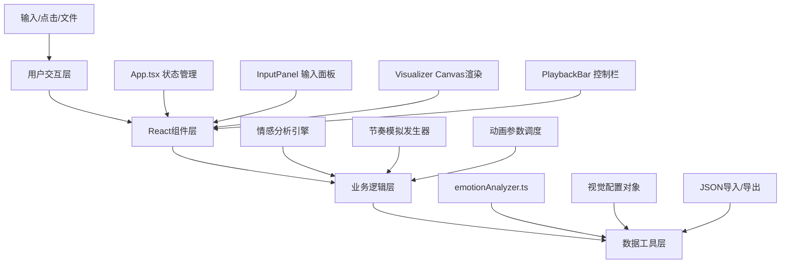

## 1. 架构设计



## 2. 技术描述
- 前端：React@18 + TypeScript + Vite
- 渲染：Canvas 2D API
- 状态管理：React useState/useEffect Hooks
- 样式：内联样式（React style属性）
- 构建工具：Vite（端口5173，HMR）

## 3. 目录结构
```
├── package.json
├── vite.config.js
├── tsconfig.json
├── index.html
└── src/
    ├── main.tsx
    ├── App.tsx
    ├── components/
    │   ├── InputPanel.tsx
    │   ├── Visualizer.tsx
    │   └── PlaybackBar.tsx
    └── data/
        └── emotionAnalyzer.ts
```

## 4. 类型定义
```typescript
// 情感分析结果
interface EmotionResult {
  value: number; // 0-1，0消极，1积极，0.5中性
  keywords: string[];
}

// 视觉配置
interface VisualConfig {
  lineCount: number;      // 线段数量 20-40
  rhythmPeriod: number;   // 节奏周期 ms
  baseEmotion: number;    // 基础情感值
  colors: {
    start: string;
    end: string;
  };
}

// 导出数据结构
interface ExportData {
  text: string;
  emotionValues: number[];  // 每200ms采样
  timestamps: number[];
  visualConfig: VisualConfig;
}
```

## 5. 数据模型

### 5.1 情感关键词库
- 积极关键词（20个）：开心、快乐、希望、温暖、光明、爱、美好、成功、自由、和平、喜悦、梦想、勇气、阳光、微笑、幸福、花朵、春天、飞翔、歌唱
- 消极关键词（20个）：悲伤、痛苦、绝望、寒冷、黑暗、恨、丑陋、失败、束缚、战争、忧愁、噩梦、恐惧、阴影、哭泣、孤独、凋零、冬天、坠落、沉默

### 5.2 动画元素
- 线段：20-40条，长度30-120px，位置/旋转/缩放随情感和节奏变化
- 圆点：半径5-15px，透明度0.3-0.7，线段两端连接圆点
- 运动周期：0.5-2秒变换位置，透明度0.3-0.9呼吸效果

### 5.3 节奏模拟
- 通过setInterval模拟音频节奏，周期200-600ms
- 进度条时长约10秒，平滑从0%到100%
