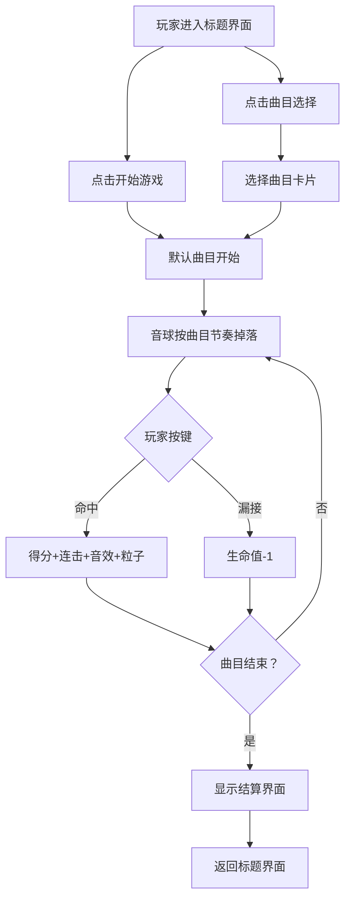

## 1. 产品概述

音律坠球是一款基于浏览器的交互式节奏落球游戏，通过听觉与视觉的同步反应为玩家提供沉浸式打击体验。玩家需要在彩色音球到达底部判定线时按下对应按键，以模拟演奏一段旋律。

- 目标用户：休闲游戏玩家、音乐爱好者
- 核心价值：将视觉反应、音乐节奏和键盘操作融为一体，创造"演奏感"

## 2. 核心功能

### 2.1 功能模块

1. **标题界面**：游戏艺术字标题、开始游戏按钮、曲目选择按钮
2. **曲目选择界面**：3首曲目的卡片式选择列表
3. **游戏主界面**：全屏Canvas画布、得分/连击/生命值HUD、掉落音球、判定线、虚拟键位、曲目进度条
4. **结算界面**：总分、最高连击、评价等级展示

### 2.2 页面详情

| 页面名称 | 模块名称 | 功能描述 |
|---------|---------|---------|
| 标题界面 | 标题艺术字 | 渐变填充#feca57到#ff6b6b，字号48px |
| 标题界面 | 开始游戏按钮 | 圆角12px，背景#2a2a4a，悬停放大1.05倍 |
| 标题界面 | 曲目选择按钮 | 同上，点击跳转曲目选择界面 |
| 曲目选择界面 | 曲目卡片 | 宽200px高120px，圆角16px，悬停上浮8px |
| 游戏主界面 | HUD | 得分（白色24px）、连击（#feca57金色）、5颗心形生命 |
| 游戏主界面 | 音球系统 | 7色对应C-D-E-F-G-A-B音阶，重力加速度下落，带发光光晕和残影 |
| 游戏主界面 | 判定系统 | 判定线±15px范围内按键命中，播放音效和粒子爆散 |
| 游戏主界面 | 虚拟键位 | A-G共7键，对应7种颜色，激活时高亮 |
| 游戏主界面 | 曲目进度 | 顶部全宽进度条（#4fc3f7，高4px） |
| 结算界面 | 成绩展示 | 总分、最高连击、S/A/B/C评价等级 |

## 3. 核心流程

## 4. 用户界面设计

### 4.1 设计风格

- **主色调**：#1a1a2e（深蓝底色）→ #16213e（渐变背景）
- **辅助色**：#2a2a4a（面板底色）
- **强调色**：#feca57（金色）、#ff6b6b（珊瑚红）
- **7音阶色彩**：红C(#ff6b6b)、橙D(#ff9f43)、黄E(#feca57)、绿F(#1dd1a1)、蓝G(#48dbfb)、靛A(#5f27cd)、紫B(#c44dff)
- **按钮风格**：圆角、半透明底色、发光边框、8px模糊阴影（#000 alpha0.5）
- **字体**：无衬线现代字体，标题48px，正文14-24px
- **动效**：悬停放大1.05倍（0.2s ease-out）、得分弹跳缩放、连击里程碑金色大字闪烁

### 4.2 页面设计概览

| 页面名称 | 模块名称 | UI元素 |
|---------|---------|---------|
| 标题界面 | 整体 | 深色渐变背景、居中垂直布局、艺术字标题+双按钮 |
| 曲目选择界面 | 卡片网格 | 3张卡片水平排列、悬停上浮+阴影加深动画 |
| 游戏主界面 | Canvas | 全屏自适应、音球从顶下落、底部判定线+7个虚拟键 |
| 游戏主界面 | HUD层 | 左上得分、中上连击、右上生命心形、顶部进度条 |
| 结算界面 | 成绩面板 | 半透明深色卡片、大号分数、评价等级大字 |

### 4.3 响应式设计

- 桌面端优先，Canvas全屏自适应
- 视口宽度 < 500px：虚拟键位缩小为45px×24px，音球半径减小至15px
- 触屏设备：虚拟键位支持触摸点击
