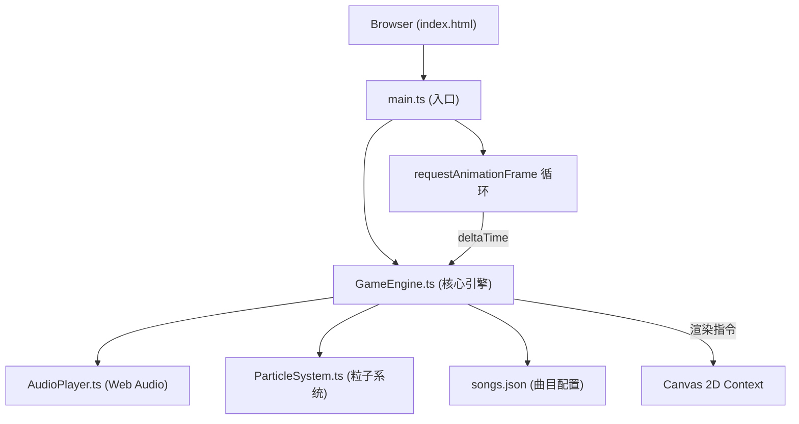

## 1. 架构设计



## 2. 技术描述

- **前端框架**：原生 TypeScript + HTML5 Canvas
- **构建工具**：Vite 5.x（端口5173，开启HMR）
- **音频**：Web Audio API（OscillatorNode + GainNode）
- **后端**：无（纯前端项目）
- **数据库**：无（曲目配置使用本地JSON）

## 3. 文件结构

```
e:\solo\VersionFast\tasks\auto233\
├── package.json          # 依赖：typescript, vite；脚本：npm run dev
├── vite.config.js        # Vite基础配置
├── tsconfig.json         # 严格模式，target ES2020，module ESNext
├── index.html            # 入口页面，viewport适配
└── src/
    ├── main.ts           # 游戏循环入口，Canvas初始化，键盘事件
    ├── GameEngine.ts     # 核心游戏逻辑类
    ├── AudioPlayer.ts    # Web Audio API封装
    ├── ParticleSystem.ts # 粒子系统
    └── songs.json        # 3首曲目配置（每首≥100音符）
```

## 4. 核心类定义

### 4.1 AudioPlayer

```typescript
class AudioPlayer {
  private audioContext: AudioContext;
  private gainNode: GainNode;
  playTone(frequency: number, duration: number): void; // 0.3s线性衰减包络
  dispose(): void;
}
```

### 4.2 ParticleSystem

```typescript
interface Particle {
  x: number; y: number; vx: number; vy: number;
  radius: number; color: string; life: number; maxLife: number;
}

class ParticleSystem {
  private particles: Particle[];
  emit(x: number, y: number, count: number, color: string): void; // 8个粒子，life=0.5s
  update(deltaTime: number): void;
  render(ctx: CanvasRenderingContext2D): void;
  // 总数≤200自动限制
}
```

### 4.3 GameEngine

```typescript
interface Ball {
  x: number; y: number; vx: number; vy: number;
  color: string; frequency: number; radius: number;
  trail: { x: number; y: number; alpha: number }[];
  hit: boolean;
}

interface SongNote {
  color: string;
  timeMs: number;
}

interface Song {
  name: string;
  durationMs: number;
  notes: SongNote[];
}

type GameState = 'title' | 'songSelect' | 'playing' | 'gameover';

class GameEngine {
  private balls: Ball[];
  private score: number;
  private combo: number;
  private maxCombo: number;
  private lives: number;
  private state: GameState;
  private currentSong: Song | null;
  private songStartTime: number;
  private audioPlayer: AudioPlayer;
  private particleSystem: ParticleSystem;
  private activeKeys: Set<string>;
  // 判定线Y、虚拟键位配置、颜色-音阶映射
  update(deltaTime: number): void;
  render(ctx: CanvasRenderingContext2D): void;
  handleKeyDown(key: string): void;
  handleKeyUp(key: string): void;
  handleVirtualKeyPress(index: number): void;
  selectSong(index: number): void;
  startGame(): void;
  resetToTitle(): void;
}
```

## 5. 数据流向

1. `main.ts` → `requestAnimationFrame` 计算 deltaTime
2. deltaTime → `GameEngine.update()` 更新：
   - 按曲目时间戳生成新音球
   - 更新音球位置（vy += a * dt）、残影
   - 检测按键与判定线碰撞
   - 命中时调用 `AudioPlayer.playTone()` 和 `ParticleSystem.emit()`
   - 漏接扣生命
3. `GameEngine.render(ctx)` 绘制：
   - 背景渐变
   - HUD（得分、连击、生命、进度条）
   - 音球+光晕+残影
   - 判定线
   - 虚拟键位
   - 粒子效果
   - 连击里程碑提示
4. 键盘/触摸事件 → `GameEngine.handleKeyDown/Up`

## 6. 性能要求

- 帧率：稳定60fps
- 单帧粒子数≤200
- Web Audio延迟<50ms
- Canvas全屏自适应，避免布局抖动
