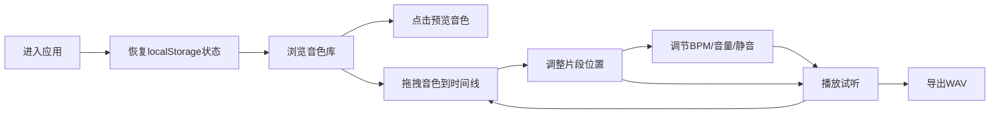

## 1. 产品概述

「律动工坊」是一个面向独立音乐人和音乐爱好者的在线节拍创作实验室，用户可以通过拖拽预置的鼓点、贝斯和旋律循环来自由组合创作伴奏音乐，并支持导出和分享。

- 核心价值：降低音乐创作门槛，提供直观的多轨混音体验
- 目标用户：独立音乐人、音乐爱好者、内容创作者

## 2. 核心功能

### 2.1 功能模块

1. **音色库面板**：按类别展示音色卡片，支持预览播放和拖拽
2. **多轨时间线**：4条音轨的可视化编辑区域，支持片段拖拽定位
3. **播放控制**：播放、暂停、停止，带播放头实时进度显示
4. **BPM调节**：60-180范围的速度调节，实时更新网格刻度
5. **轨道控制**：每条轨道独立的音量滑块和静音按钮
6. **WAV导出**：将所有非静音轨道混音导出为WAV文件
7. **状态持久化**：创作状态自动保存到localStorage

### 2.2 页面详情

| 页面名称 | 模块名称 | 功能描述 |
|-----------|-------------|---------------------|
| 主创作页面 | 顶部导航栏 | Logo、导出按钮、BPM滑块、播放控制 |
| 主创作页面 | 音色库面板 | 按类别展示音色卡片，支持预览和拖拽 |
| 主创作页面 | 多轨时间线 | 4条音轨网格，片段拖拽定位，播放头显示 |
| 主创作页面 | 轨道控制面板 | 音量滑块、静音按钮 |

## 3. 核心流程

用户进入应用后，从左侧音色库浏览和预览音频片段，将喜欢的片段拖拽到右侧时间线的任意轨道上，通过拖拽调整片段位置，使用播放控制试听效果，调节BPM和各轨道音量，满意后点击导出按钮生成WAV文件下载。所有创作数据自动保存，刷新页面后自动恢复。

## 4. 用户界面设计

### 4.1 设计风格

- **主色调**：深色主题，背景 #1a1a2e，卡片背景 #16213e
- **强调色**：#e94560（鼓点/播放头）、#0f3460（贝斯）、#533483（旋律）
- **文字颜色**：#e0e0e0
- **圆角风格**：卡片8px圆角，片段块4px圆角
- **字体**：现代无衬线字体，标题加粗，正文常规
- **动效**：悬停缩放(1.05倍, 0.2s)、按钮按压缩放(0.95倍, 0.1s)、边框闪烁高亮

### 4.2 页面设计概览

| 页面名称 | 模块名称 | UI元素 |
|-----------|-------------|-------------|
| 主创作页面 | 顶部导航栏 | 固定高度60px，Logo左对齐，控制按钮右对齐 |
| 主创作页面 | 音色库面板 | 30%宽度，两列网格卡片布局，悬停效果 |
| 主创作页面 | 多轨时间线 | 70%宽度，4条轨道交替背景，彩色片段块，红色播放头 |
| 主创作页面 | 播放控制 | ▶ ⏸ ⏹ 图标按钮，点击按压缩放 |

### 4.3 响应式设计

- 桌面端（>=768px）：左右分栏布局，音色库30%，时间线70%
- 移动端（<768px）：上下堆叠布局，时间线最小高度400px
- 触控优化：拖拽区域增加触控热区
