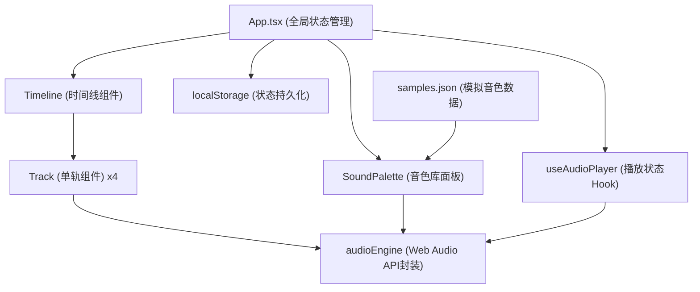

## 1. 架构设计



## 2. 技术栈说明

- **前端框架**：React@18 + TypeScript
- **构建工具**：Vite
- **音频处理**：Web Audio API（AudioContext、OfflineAudioContext）
- **状态管理**：React useState/useReducer + localStorage持久化
- **数据来源**：本地JSON模拟数据

## 3. 文件结构

```
.
├── package.json
├── vite.config.js
├── tsconfig.json
├── index.html
└── src/
    ├── main.tsx              # 应用入口
    ├── App.tsx               # 主布局组件，全局状态管理
    ├── components/
    │   ├── SoundPalette.tsx  # 音色库面板
    │   ├── Timeline.tsx      # 多轨时间线
    │   └── Track.tsx         # 单轨组件
    ├── data/
    │   └── samples.json      # 模拟音色库数据
    ├── hooks/
    │   └── useAudioPlayer.ts # 音频播放状态管理Hook
    └── utils/
        └── audioEngine.ts    # Web Audio API封装
```

## 4. 数据流向

### 4.1 数据模型

```typescript
interface Sample {
  id: string;
  name: string;
  category: 'drum' | 'bass' | 'melody';
  duration: number; // 秒
  color: string;
}

interface Clip {
  id: string;
  sampleId: string;
  trackId: number;
  startTime: number; // 秒
  duration: number;  // 秒
}

interface TrackState {
  id: number;
  volume: number;    // 0-100
  muted: boolean;
  clips: Clip[];
}

interface ProjectState {
  bpm: number;       // 60-180
  tracks: TrackState[];
  isPlaying: boolean;
  currentTime: number;
}
```

### 4.2 调用关系

1. **main.tsx** → 渲染 `<App />`，从localStorage恢复状态
2. **App.tsx**
   - 持有 `projectState`（tracks、bpm、clips等）
   - 处理拖拽事件：音色卡片 → 时间线 → 创建新Clip
   - 向下传递：`tracks` → Timeline/Track，`samples` → SoundPalette
   - 向上接收：音量/静音变更、片段位置更新、播放控制
3. **SoundPalette.tsx**
   - 从 `samples.json` 加载音色列表
   - 点击预览：调用 `audioEngine.playPreview()`
   - 拖拽开始：设置 `dataTransfer` 携带sampleId
4. **Timeline.tsx**
   - 根据BPM计算网格刻度（每拍像素 = 基础值 × (120/BPM)）
   - 渲染4条Track组件
   - 接收Clip拖拽事件，更新startTime
5. **Track.tsx**
   - 渲染轨道背景、Clip块、音量滑块、静音按钮
   - 播放时调用 `audioEngine` 调度各Clip播放
6. **useAudioPlayer.ts**
   - 管理播放状态、当前进度
   - 调用 `audioEngine` 实现播放/暂停/停止/seek
7. **audioEngine.ts**
   - 单例AudioContext
   - 合成简单音频（鼓点/贝斯/旋律的模拟波形）
   - `playPreview(sampleId)`: 单次播放
   - `startPlayback(tracks, bpm, startTime)`: 多轨同步播放
   - `stopPlayback()`: 停止所有音频
   - `exportWAV(tracks, bpm)`: OfflineAudioContext渲染并导出

## 5. 性能优化方案

- **音频调度**：使用 Web Audio API 的精确时间调度（AudioContext.currentTime），而非 setTimeout，确保同步延迟 <50ms
- **波形预计算**：音频波形数据在加载时一次性计算并缓存
- **拖拽优化**：使用 requestAnimationFrame 刷新UI，拖拽帧率 >30fps
- **状态更新**：使用 React 批量更新，避免高频状态变更导致的重复渲染
- **音频缓存**：已解码的AudioBuffer缓存到Map中，避免重复解码
