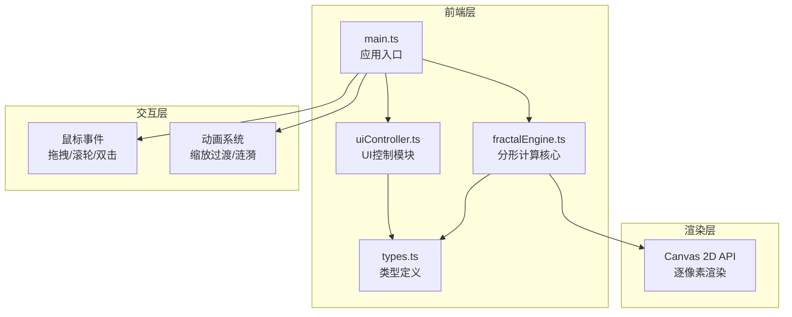

## 1. 架构设计



## 2. 技术说明

- **前端框架**：原生 TypeScript（无框架）
- **构建工具**：Vite 5.x
- **渲染技术**：Canvas 2D API，逐像素计算分形颜色
- **类型系统**：TypeScript 严格模式，target ES2020

## 3. 文件结构

| 文件路径 | 用途 |
|---------|------|
| `package.json` | 项目依赖配置（typescript, vite） |
| `vite.config.js` | Vite配置（端口5173，开启HMR） |
| `tsconfig.json` | TypeScript配置（严格模式，ES2020） |
| `index.html` | 入口HTML页面 |
| `src/types.ts` | 类型定义（FractalParams、ColorScheme、Viewport等） |
| `src/fractalEngine.ts` | 分形计算核心引擎，导出renderFractal函数 |
| `src/uiController.ts` | UI控制模块，管理控制面板和工具栏事件 |
| `src/main.ts` | 应用入口，初始化Canvas、事件绑定、协调各模块 |

## 4. 核心数据模型

### 4.1 类型定义

```typescript
// 分形类型
type FractalType = 'mandelbrot' | 'julia' | 'burningship';

// 视口参数
interface Viewport {
    centerX: number;      // 视口中心X（复平面坐标）
    centerY: number;      // 视口中心Y（复平面坐标）
    zoom: number;         // 缩放倍率
}

// 颜色渐变停止点
interface ColorStop {
    position: number;     // 0-1
    color: string;        // #RRGGBB
}

// 颜色方案
interface ColorScheme {
    id: string;
    name: string;
    stops: ColorStop[];
}

// 分形参数
interface FractalParams {
    fractalType: FractalType;
    maxIterations: number;    // 迭代深度 10-200
    colorScheme: ColorScheme;
    juliaConstant?: { re: number; im: number };
}

// 完整应用状态
interface AppState {
    viewport: Viewport;
    params: FractalParams;
}
```

### 4.2 分形算法

1. **Mandelbrot集**：zₙ₊₁ = zₙ² + c，z₀=0，c为像素坐标
2. **Julia集**：zₙ₊₁ = zₙ² + c，z₀为像素坐标，c为常数
3. **BurningShip集**：zₙ₊₁ = (|Re(zₙ)| + |Im(zₙ)|·i)² + c

### 4.3 性能优化策略

- 使用ImageData批量写入像素，避免逐像素setPixel调用
- 根据缩放级别自适应分辨率渲染（低配设备降采样）
- requestAnimationFrame调度渲染，避免过度重绘
- 动画期间插值视口参数，帧与帧之间平滑过渡

## 5. 交互系统

### 5.1 鼠标事件

| 事件 | 行为 |
|-----|------|
| mousedown + mousemove | 拖拽平移视口（dx, dy → ΔcenterX, ΔcenterY） |
| wheel | 以鼠标位置为中心缩放，范围0.1x-100x |
| dblclick | 以点击位置为中心放大2倍，播放涟漪动画 |

### 5.2 动画系统

- **缩放过渡动画**：0.3秒，ease-out缓出，从中心向外扩张
- **涟漪扩散动画**：0.5秒，20个同心圆，线宽2px，颜色#ffaa44，透明度0.8→0
