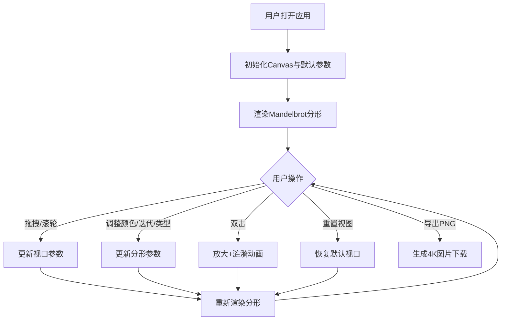

## 1. 产品概述

交互式分形图案生成器是一款面向数字艺术爱好者和设计师的Web应用，让用户无需专业软件即可在浏览器中实时探索、生成和交互控制抽象分形艺术。

- 核心目标：提供高性能、直观易用的分形图案探索工具，支持实时参数调整、无限缩放浏览
- 目标用户：数字艺术爱好者、设计师、数学可视化爱好者
- 市场价值：降低分形艺术创作门槛，提供即开即用的高质量分形生成体验

## 2. 核心功能

### 2.1 功能模块

1. **分形画布**：全屏Canvas渲染，支持三种分形类型（Mandelbrot集、Julia集、BurningShip集）
2. **视口控制**：鼠标拖拽平移、滚轮缩放、双击放大
3. **参数控制面板**：颜色方案选择、迭代深度调整、分形公式切换
4. **工具栏**：重置视图、导出高清PNG
5. **动画反馈**：缩放过渡动画、涟漪提示动画

### 2.2 功能详情

| 页面名称 | 模块名称 | 功能描述 |
|---------|---------|---------|
| 主页面 | 分形画布 | 全屏Canvas逐像素渲染分形，黑色背景，帧率≥30fps@1920x1080 |
| 主页面 | 右侧控制面板 | 半透明叠加面板，含颜色方案选择器（6种预设）、迭代深度滑块（10-200）、分形类型切换按钮 |
| 主页面 | 右上角工具栏 | 浮动工具栏，重置视图按钮+导出PNG按钮（4倍分辨率3840x2160） |
| 主页面 | 视口交互 | 拖拽平移、滚轮缩放（0.1x-100x）、双击中心放大2倍+涟漪动画 |

## 3. 核心流程

## 4. 用户界面设计

### 4.1 设计风格
- **主色调**：#0b0e1a（背景深色）、#6c63ff（强调色紫）、#ffaa44（高亮色橙）、#e0e0ff（文字色）
- **按钮风格**：圆角8px/12px，悬停0.2s亮色过渡
- **字体**：无衬线现代字体
- **布局**：全屏画布 + 浮动叠加面板 + 浮动工具栏
- **动效**：缩放缓出(ease-out)过渡0.3s，涟漪扩散0.5s

### 4.2 页面设计概览

| 页面名称 | 模块名称 | UI元素 |
|---------|---------|--------|
| 主页面 | 分形画布 | 全屏黑色Canvas，占满视口 |
| 主页面 | 右侧控制面板 | rgba(30,30,50,0.85)背景，圆角12px，内边距16px，可拖拽移动，包含6种颜色方案预览、滑块控件、3个分形切换按钮（选中#6c63ff，非选中#2a2a3e） |
| 主页面 | 右上角工具栏 | rgba(20,20,40,0.9)背景，圆角8px，靶心重置图标+导出按钮，悬停#6c63ff |

### 4.3 响应性
- 桌面端优先设计
- Canvas自适应窗口大小
- 控制面板支持鼠标拖拽调整位置

### 4.4 颜色方案预设

| 方案名称 | 渐变停止点（5个） |
|---------|----------------|
| 火焰红橙 | #000000 → #330000 → #990000 → #ff3300 → #ffaa00 |
| 海洋蓝绿 | #000022 → #003366 → #0088aa → #00cccc → #aaffee |
| 极光紫青 | #000033 → #330066 → #9900cc → #00ccff → #99ffcc |
| 熔岩红黑 | #000000 → #1a0000 → #660000 → #cc0000 → #ff4400 |
| 星空蓝紫 | #000011 → #110033 → #333399 → #6666ff → #9999ff |
| 霓虹彩虹 | #000000 → #ff00ff → #00ffff → #ffff00 → #ffffff |
