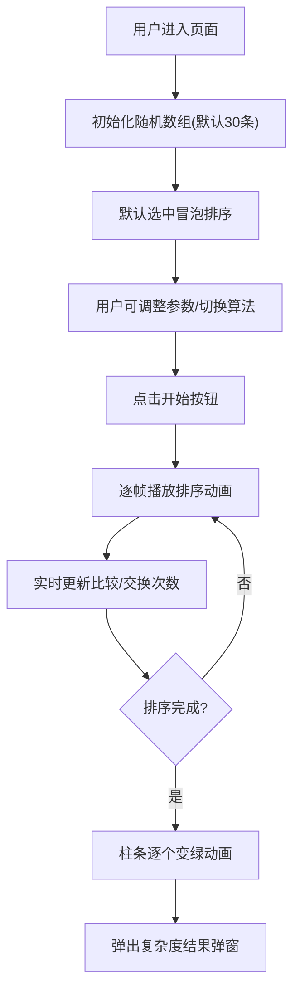

## 1. 产品概述
「算法花园」是一个排序算法可视化学习平台，通过动态柱状图直观展示经典排序算法的执行过程。
- 面向学生和编程初学者，帮助理解排序算法原理、时间复杂度和空间复杂度
- 通过交互式可视化降低算法学习门槛，提升学习体验和效率

## 2. 核心功能

### 2.1 用户角色
无需注册，所有访客均可使用全部功能。

### 2.2 功能模块
1. **算法选择区**：冒泡排序、插入排序、选择排序、快速排序、归并排序五种算法切换
2. **可视化主画布**：800x500像素柱状图区域，动态展示排序过程
3. **控制面板**：数据规模、排序速度、初始顺序调节，以及开始/暂停/重置操作
4. **实时统计面板**：比较次数、交换次数、已用时间实时显示
5. **结果弹窗**：排序完成后展示算法复杂度对比信息

### 2.3 页面详情
| 页面名称 | 模块名称 | 功能描述 |
|-----------|-------------|---------------------|
| 主页面 | 算法选择按钮组 | 五种排序算法切换，选中态紫色高亮，0.3秒渐变过渡 |
| 主页面 | 柱状图画布 | 动态展示排序步骤，不同状态（比较/交换/已排序）用不同颜色和动画区分 |
| 主页面 | 控制面板 | 三个滑块（数据规模、速度、初始顺序）+ 三个操作按钮（开始/暂停/重置），按钮带涟漪效果 |
| 主页面 | 信息面板 | 实时显示算法名称、比较次数、交换次数、已用时间，数字翻转动画 |
| 主页面 | 结果弹窗 | 排序完成后弹出，展示时间/空间复杂度，居中显示带半透明遮罩 |

## 3. 核心流程
用户进入页面后，默认展示30条随机数据的冒泡排序初始状态。用户可选择不同算法、调整数据参数，点击开始后动画逐步展示排序过程，实时显示统计数据。排序完成后所有柱条变绿并弹出复杂度对比弹窗。

## 4. 用户界面设计

### 4.1 设计风格
- **主色调**：#6c63ff（紫色强调）
- **辅助色**：#4fc3f7（蓝色，默认柱条）、#ff6b6b（红色，比较中）、#feca57（黄色，交换中）、#6fcf97（绿色，已排序）
- **按钮风格**：圆角矩形（border-radius: 8px），hover加深阴影，点击涟漪效果
- **字体**：系统无衬线字体（-apple-system, BlinkMacSystemFont）
- **布局风格**：卡片式布局，box-shadow: 0 2px 8px rgba(0,0,0,0.1)，border-radius: 12px
- **页面最大宽度**：1200px，居中布局，两侧留白20px

### 4.2 页面设计概述
| 页面名称 | 模块名称 | UI元素 |
|-----------|-------------|-------------|
| 主页面 | 算法选择区 | 5个按钮横向排列，选中紫色填充白色文字，未选中浅灰背景，0.3s过渡动画 |
| 主页面 | 柱状图画布 | 800x500像素，柱条宽度自适应（最小4px），比较时上浮红色，交换时左右平移黄色，已排序绿色渐变 |
| 主页面 | 控制面板 | 三个滑块+三个按钮，卡片样式，禁用时灰色0.6透明度 |
| 主页面 | 信息面板 | 右侧卡片，背景#f0f4f8，文字#2d3748，数字滚动动画 |
| 主页面 | 结果弹窗 | 半透明遮罩rgba(0,0,0,0.4)，居中弹窗，右上角关闭按钮 |

### 4.3 响应式设计
- 桌面端：左右布局，柱状图+控制面板在左，信息面板在右
- 移动端（宽度<768px）：flex-wrap换行，信息面板折叠到柱状图下方

### 4.4 动画效果
- 按钮切换：0.3秒背景色渐变
- 柱条比较：translateY(-4px) 持续0.2秒
- 柱条交换：translateX±12px 持续0.3秒
- 排序完成：中心向两侧逐个变绿，每个延迟50ms
- 数字变化：翻转动画，从旧值滚动到新值，持续0.5秒
- 按钮点击：涟漪效果持续0.4秒
