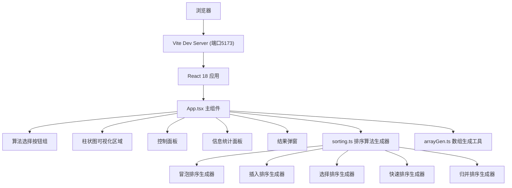

## 1. 架构设计



## 2. 技术描述

- **前端框架**: React@18 + TypeScript
- **构建工具**: Vite@5 + @vitejs/plugin-react
- **动画方案**: requestAnimationFrame驱动 + CSS Transitions/Animations
- **状态管理**: React Hooks (useState, useEffect, useRef, useCallback)
- **样式方案**: 内联CSS样式 + CSS变量

### 项目文件结构
```
auto237/
├── package.json
├── vite.config.js
├── tsconfig.json
├── index.html
└── src/
    ├── main.tsx
    ├── components/
    │   └── App.tsx
    └── utils/
        ├── sorting.ts
        └── arrayGen.ts
```

## 3. 核心类型定义

```typescript
// 排序步骤类型
interface SortStep {
  array: number[];
  comparing: number[];  // 正在比较的索引
  swapping: number[];   // 正在交换的索引
  sorted: number[];     // 已排序的索引
  comparisons: number;  // 累计比较次数
  swaps: number;        // 累计交换次数
}

// 排序算法生成器类型
type SortGenerator = Generator<SortStep, void, unknown>;

// 算法名称类型
type AlgorithmName = 'bubble' | 'insertion' | 'selection' | 'quick' | 'merge';

// 初始顺序类型
type OrderType = 'random' | 'ascending' | 'descending';

// 算法复杂度信息
interface AlgorithmComplexity {
  name: string;
  avgTimeComplexity: string;
  spaceComplexity: string;
}
```

## 4. 核心模块设计

### 4.1 排序算法生成器 (sorting.ts)
每个排序算法实现为Generator函数，使用yield关键字逐步输出每一步的排序状态：
- `bubbleSort(arr: number[]): SortGenerator`
- `insertionSort(arr: number[]): SortGenerator`
- `selectionSort(arr: number[]): SortGenerator`
- `quickSort(arr: number[]): SortGenerator`
- `mergeSort(arr: number[]): SortGenerator`

### 4.2 数组生成工具 (arrayGen.ts)
- `generateArray(size: number, min: number, max: number): number[]` 生成指定范围的随机数组
- `generateOrderedArray(size: number, order: OrderType): number[]` 生成指定顺序的数组

### 4.3 App主组件 (App.tsx)
**状态管理**:
- 当前选中的算法
- 当前数组数据
- 当前排序步骤状态（比较中/交换中/已排序索引）
- 统计数据（比较次数、交换次数、耗时）
- 排序运行状态（运行中/暂停/已完成）
- 控制面板参数（数据规模、速度、初始顺序）

**动画驱动**:
- 使用 requestAnimationFrame 驱动帧更新
- 根据速度参数控制每步延迟时间
- 使用 useRef 存储动画帧ID和生成器引用

## 5. 性能优化策略

1. **requestAnimationFrame驱动**: 替代setInterval/setTimeout，避免累积误差，确保60fps
2. **最小化重渲染**: 使用useMemo/useCallback优化，仅必要的组件重新渲染
3. **CSS硬件加速**: 对动画元素使用transform属性，触发GPU加速
4. **批量状态更新**: 合理使用React 18自动批处理特性
5. **生成器惰性求值**: 排序步骤按需计算，不预先生成所有步骤

## 6. 算法复杂度信息

| 算法 | 平均时间复杂度 | 空间复杂度 |
|------|----------------|------------|
| 冒泡排序 | O(n²) | O(1) |
| 插入排序 | O(n²) | O(1) |
| 选择排序 | O(n²) | O(1) |
| 快速排序 | O(n log n) | O(log n) |
| 归并排序 | O(n log n) | O(n) |
