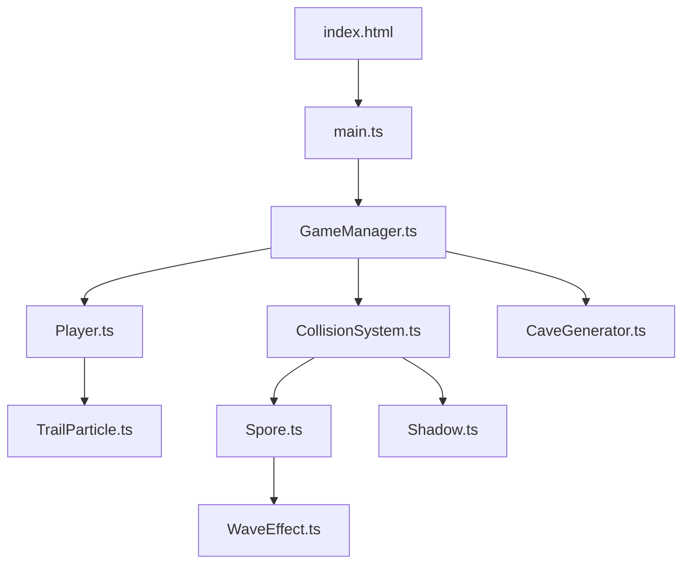
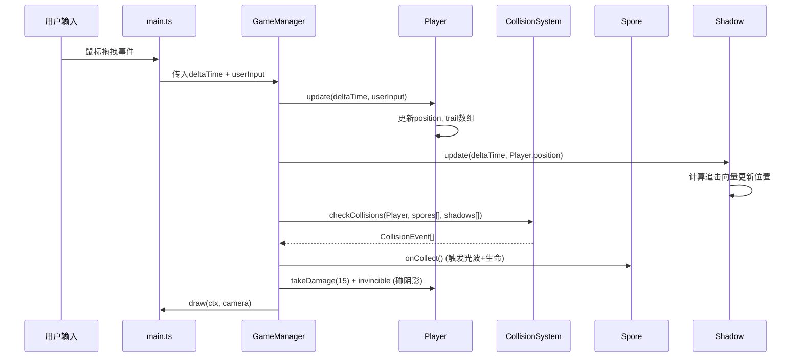

## 1. 架构设计

## 2. 技术描述
- 前端：TypeScript + Vite，纯Canvas 2D渲染，不依赖外部游戏引擎
- 构建工具：Vite 5.x
- 语言：TypeScript 5.x (严格模式, target ES2020, module ESNext)
- 无后端，纯前端实现

## 3. 文件结构与职责

### 3.1 配置文件
| 文件 | 职责 |
|-----|------|
| package.json | 项目依赖(typescript, vite)与启动脚本(npm run dev) |
| vite.config.js | Vite基础配置，端口5173，开启HMR |
| tsconfig.json | TypeScript严格模式配置 |
| index.html | 入口页面，引入main.ts，全屏Canvas容器 |

### 3.2 源代码模块 (src/)
| 文件 | 职责 | 调用关系 |
|-----|------|---------|
| main.ts | 应用入口，初始化Canvas和游戏循环，调用GameManager | main.ts → GameManager |
| GameManager.ts | 游戏主控制器，管理实体创建、碰撞检测、状态更新 | GameManager → Player, CollisionSystem, Spore, Shadow, CaveGenerator |
| Player.ts | 蜉蝣实体类，管理粒子尾迹生成和位置更新 | Player → TrailParticle |
| CollisionSystem.ts | 碰撞检测模块，空间哈希优化，检测与孢子/阴影碰撞 | CollisionSystem → Spore[], Shadow[] |
| Spore.ts | 荧光孢子类，收集动画和光波扩散逻辑 | Spore → WaveEffect |
| Shadow.ts | 蠕动阴影类，追击玩家的AI逻辑 | Shadow读取Player.position |
| CaveGenerator.ts | 细胞自动机算法生成洞穴迷宫 | 被GameManager调用 |
| TrailParticle.ts | 尾迹粒子类，生命周期与渲染 | 被Player创建和管理 |
| WaveEffect.ts | 光波扩散动画特效 | 被Spore收集时触发 |

### 3.3 数据流向

## 4. 核心算法

### 4.1 细胞自动机洞穴生成
- 网格初始化：随机填充约45%墙壁
- 迭代4-5次：每个格子根据8邻居墙壁数量决定存活
- 最终确保通道宽度约80px

### 4.2 空间哈希碰撞检测
- 网格大小：80px
- 将实体按位置映射到哈希网格
- 仅检测同一网格及相邻网格的实体碰撞

### 4.3 粒子系统
- 尾迹粒子上限：200个
- 超过上限丢弃最旧粒子(FIFO)
- 粒子存活1.5秒，透明度线性衰减

### 4.4 阴影AI
- 速度：玩家平均速度 × 0.4
- 追击向量归一化后按速度移动
- 椭圆形态，随时间正弦波动模拟蠕动

## 5. 性能约束
- 目标帧率：稳定60fps
- 尾迹粒子上限：200
- 同时存在孢子上限：8
- 同时存在阴影上限：3
- 碰撞检测：空间哈希优化(80px网格)
