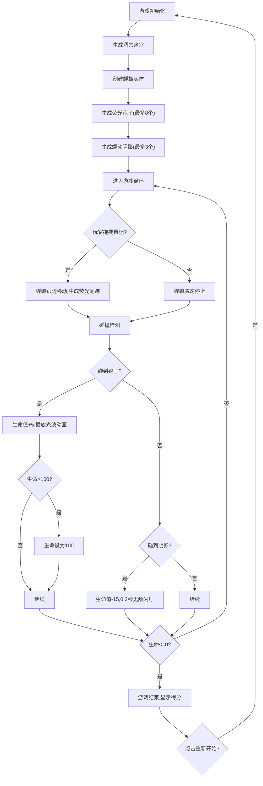

## 1. 产品概述
「荧光蜉蝣」是一款休闲探索类浏览器2D游戏，玩家通过鼠标拖拽控制发光蜉蝣生物在黑暗洞穴迷宫中飞行。
- 目标用户：独立游戏爱好者、休闲玩家
- 核心价值：沉浸式荧光视觉体验，简单上手的探索玩法

## 2. 核心特性

### 2.1 功能模块
1. **游戏主界面**：全屏Canvas渲染洞穴场景，蜉蝣实时控制
2. **HUD系统**：顶部半透明栏显示生命值和当前得分
3. **实体系统**：蜉蝣玩家、荧光孢子、蠕动阴影三种核心实体
4. **碰撞系统**：玩家与孢子、阴影的碰撞检测与响应
5. **迷宫生成**：基于细胞自动机的随机洞穴通道生成
6. **游戏结束**：生命值归零后显示最终得分和重新开始按钮

### 2.2 页面详情
| 页面名称 | 模块名称 | 功能描述 |
|---------|---------|---------|
| 游戏主页面 | Canvas渲染层 | 洞穴背景、蜉蝣、孢子、阴影、尾迹粒子的实时绘制 |
| 游戏主页面 | HUD信息栏 | 顶部50px高度半透明栏，左侧显示生命值爱心+数字，右侧显示得分 |
| 游戏主页面 | 游戏结束面板 | 居中显示最终得分和"重新开始"按钮 |

## 3. 核心流程

## 4. 用户界面设计

### 4.1 设计风格
- 主色调：深绿色(#0d1b0d)底色，荧光绿(#8ffeb3, #00e676)生物光效
- 孢子光效：黄色(#ffeb3b)到橙色(#ffb300)渐变光波
- 视觉风格：洞穴幽暗氛围，荧光生物发光对比强烈
- 字体：无衬线等宽字体，保持游戏风格统一

### 4.2 页面设计概述
| 页面名称 | 模块名称 | UI元素 |
|---------|---------|---------|
| 游戏主页面 | 洞穴背景 | 细胞自动机生成迷宫，墙壁#1a2a1a + 苔藓#2d4a2d随机光斑，路径#0d1b0d |
| 游戏主页面 | 蜉蝣实体 | 头部20px白色发光光晕(alpha 0.3)，身体带动粒子尾迹 |
| 游戏主页面 | 尾迹粒子 | 半径4-10px，#80ffb0~#40ff80正弦波动，透明度0.8→0.2线性衰减，存活1.5秒 |
| 游戏主页面 | 荧光孢子 | 黄色发光圆点，收集时0.6秒扩散光波动画 |
| 游戏主页面 | 蠕动阴影 | 椭圆形态深色阴影，缓慢蠕动追击 |
| 游戏主页面 | HUD栏 | 高50px，#0d1b0d背景alpha 0.7，左侧爱心+生命值，右侧得分 |
| 游戏主页面 | 游戏结束 | 居中面板，最终得分，重新开始按钮 |

### 4.3 响应式设计
- 画布始终占满浏览器视口，禁止滚动条
- 视口滚动跟随玩家，蜉蝣始终位于屏幕中心
- 支持窗口大小变化，自动调整Canvas尺寸
