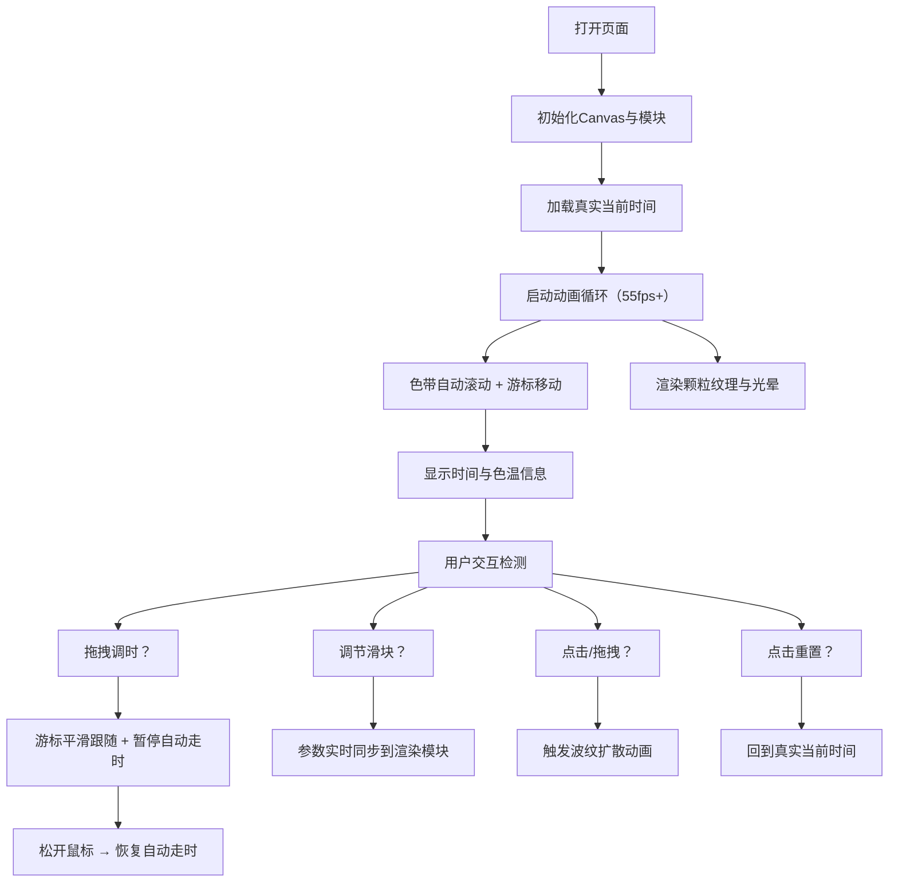

## 1. 产品概述
「织色时序」是一个基于浏览器的交互式色温时钟，以长方形渐变色带替代传统指针，通过视觉化方式展现时间流动与色温变化。
- 面向追求美学体验的用户，提供宁静、极简的时间感知方式
- 创新地将时间、色温、色彩三者融合，打造数据感与艺术感兼备的时钟体验

## 2. 核心功能

### 2.1 用户角色
| 角色 | 注册方式 | 核心权限 |
|------|----------|----------|
| 访客用户 | 无需注册 | 浏览时钟、拖拽调时、调整控制面板参数 |

### 2.2 功能模块
1. **主画布**：全屏Canvas，极暗蓝渐变背景，中央色带显示
2. **色带系统**：24小时色温渐变色带，含颗粒纹理，自动平滑滚动
3. **游标系统**：时间指示游标，带发光效果与弹性缓动
4. **交互系统**：鼠标拖拽调时、点击波纹反馈、重置按钮
5. **信息显示**：当前时刻、色温值（K）、十六进制颜色码
6. **控制面板**：光晕强度、色带流动速度、颗粒密度三个可调节滑块

### 2.3 页面详情
| 页面名称 | 模块名称 | 功能描述 |
|----------|----------|----------|
| 主页面 | 背景画布 | 全屏Canvas，#0f172a到#1e293b极暗蓝渐变 |
| 主页面 | 色带显示 | 占80%宽度、8%高度的渐变色带，左#4a90d9→中#fffbe6→右#7c3aed |
| 主页面 | 颗粒纹理 | 色带表面随机半透明像素（alpha 0.02-0.08），密度可调 |
| 主页面 | 时间游标 | 2px宽垂直白线，带上下光晕，弹性缓动移动 |
| 主页面 | 时间文本 | HH:mm:ss格式，色带上方24px字号，发光效果 |
| 主页面 | 色温信息 | 开尔文值+十六进制色码，色带下方显示 |
| 主页面 | 拖拽交互 | 鼠标拖动画布调整时间，游标平滑跟随 |
| 主页面 | 波纹反馈 | 点击/拖拽时从位置扩散环形波纹，1秒动画 |
| 主页面 | 控制面板 | 左上角可折叠磨砂玻璃面板，含3个滑块+重置按钮 |

## 3. 核心流程
用户打开页面后，时钟自动从当前时间开始运行，色带随时间平滑滚动。用户可拖拽色带手动调整时间，或通过控制面板调整视觉参数。点击重置按钮回到真实时间。

## 4. 用户界面设计

### 4.1 设计风格
- **主色调**：极暗蓝背景（#0f172a → #1e293b）
- **强调色**：冷蓝#4a90d9、暖白#fffbe6、深紫#7c3aed组成24小时色温渐变
- **文字色**：主文本#e2e8f0，次要文本#94a3b8
- **控制面板**：磨砂玻璃效果（backdrop-filter: blur(8px)，rgba(15,23,42,0.7)），圆角16px，边框1px rgba(255,255,255,0.1)
- **整体风格**：宁静、极简、数据感，深色背景衬托色带渐变光感

### 4.2 页面设计概述
| 页面名称 | 模块名称 | UI元素 |
|----------|----------|--------|
| 主页面 | 背景 | 全屏Canvas，垂直渐变填充，无额外装饰 |
| 主页面 | 色带 | 水平居中长方形，圆角柔和，线性渐变，表面颗粒纹理覆盖 |
| 主页面 | 游标 | 垂直白线，box-shadow发光，上下径向渐变光晕，弹性缓动 |
| 主页面 | 信息文本 | 色带正上方时间（24px，发光），下方色温与色码（14px，等宽字体） |
| 主页面 | 波纹 | 点击位置环形扩散，颜色取该时刻色温，1秒渐隐 |
| 主页面 | 控制面板 | 左上角折叠/展开，三个滑块带数值显示，重置按钮，磨砂玻璃 |

### 4.3 响应式
- 桌面优先设计，适配1920x1080和1440x900等常见分辨率
- 色带长宽、游标大小、文字字号使用vw单位等比缩放
- 所有元素自动居中布局
