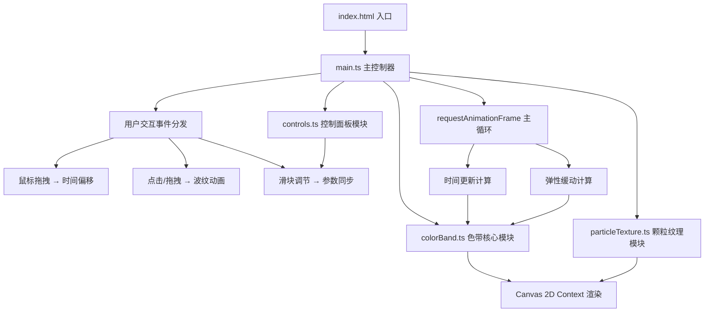

## 1. 架构设计



## 2. 技术描述
- **前端框架**：纯TypeScript + HTML5 Canvas API，无额外UI框架
- **构建工具**：Vite 5.x（端口5173，开启HMR）
- **语言版本**：TypeScript严格模式，target ES2020，module ESNext
- **样式方案**：内联CSS + CSS变量，backdrop-filter实现磨砂玻璃
- **动画方案**：requestAnimationFrame主循环，Canvas 2D直接绘制
- **性能目标**：稳定55fps+，拖拽与波纹动画并行无卡顿

## 3. 项目文件结构
| 文件路径 | 作用说明 |
|----------|----------|
| `package.json` | 依赖：typescript、vite；脚本：npm run dev |
| `vite.config.js` | Vite基础配置，端口5173，开启HMR |
| `tsconfig.json` | 严格模式，target ES2020，module ESNext |
| `index.html` | 入口页面，Canvas画布 + 控制面板HTML骨架 |
| `src/main.ts` | 入口文件：初始化Canvas、启动动画循环、事件分发 |
| `src/colorBand.ts` | 核心模块：色带渐变、时间映射、游标位置、光晕渲染 |
| `src/particleTexture.ts` | 颗粒纹理模块：纹理生成、随机刷新、密度控制 |
| `src/controls.ts` | 控制面板模块：折叠状态、滑块DOM绑定、参数同步 |

## 4. 核心模块接口定义

### 4.1 colorBand.ts
```typescript
// 色温关键点
interface ColorStop {
  hour: number;      // 0-24小时
  color: string;     // 十六进制颜色
  kelvin: number;    // 开尔文色温值
}

// 渲染参数
interface RenderParams {
  haloIntensity: number;    // 光晕强度 1-10
  flowSpeed: number;        // 流动速度 0.5-3x
}

// 色带位置信息
interface BandPosition {
  x: number;
  y: number;
  width: number;
  height: number;
}

export class ColorBand {
  constructor(ctx: CanvasRenderingContext2D);
  setParams(params: Partial<RenderParams>): void;
  setDragOffset(offsetHours: number): void;
  update(deltaTime: number): void;
  render(bandPos: BandPosition): void;
  getCurrentTime(): { hours: number; minutes: number; seconds: number };
  getColorAtHour(hour: number): { hex: string; kelvin: number };
  getCursorX(): number;
  resetToRealTime(): void;
}
```

### 4.2 particleTexture.ts
```typescript
export class ParticleTexture {
  constructor(ctx: CanvasRenderingContext2D);
  setDensity(densityPercent: number): void;
  regenerate(): void;
  render(bandPos: BandPosition): void;
}
```

### 4.3 controls.ts
```typescript
export interface ControlValues {
  haloIntensity: number;
  flowSpeed: number;
  particleDensity: number;
}

export type ControlChangeCallback = (values: ControlValues) => void;
export type ResetCallback = () => void;

export class Controls {
  constructor(container: HTMLElement);
  onChange(callback: ControlChangeCallback): void;
  onReset(callback: ResetCallback): void;
  getValues(): ControlValues;
}
```

### 4.4 main.ts 主循环
```typescript
// 波纹动画对象
interface Ripple {
  x: number;
  y: number;
  startTime: number;
  color: string;
}
```

## 5. 关键技术决策

### 5.1 色温映射算法
- 24小时分为多个色温关键点（凌晨冷蓝2000K → 正午暖白6500K → 黄昏橙红3500K → 深夜深紫1500K）
- 使用线性插值计算任意时刻的RGB值与开尔文值
- 颜色渐变采用Canvas LinearGradient实现平滑过渡

### 5.2 弹性缓动动画
- 游标位置采用spring物理模型：targetX为目标位置，currentX带阻尼逼近
- 公式：velocity += (targetX - currentX) * stiffness; velocity *= damping; currentX += velocity
- 参数：stiffness=0.08，damping=0.82

### 5.3 性能优化策略
- 颗粒纹理预渲染到离屏Canvas，避免每帧随机生成
- 波纹动画使用对象池复用，减少GC压力
- 主循环内避免创建临时对象，复用计算变量
- 使用devicePixelRatio适配高清屏，但限制最大2x避免性能下降

### 5.4 拖拽交互
- 记录mousedown起始X与对应小时值
- mousemove时根据像素偏移换算小时偏移（色带总宽度对应24小时）
- mouseup后保留偏移，自动走时基于偏移后的虚拟时间

## 6. 响应式适配
- 色带尺寸：width=80vw, height=8vh，水平垂直居中
- 文字：时间用1.5vw，色温信息用0.9vw，等宽字体
- 控制面板：固定左上角，内边距用rem单位
- Canvas分辨率：监听resize事件，canvas.width/height设为clientWidth/Height * dpr
