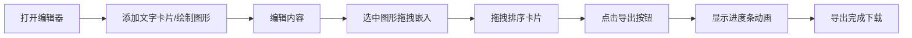

## 1. 产品概述

图文混合笔记编辑器是一款面向内容创作者的浏览器端应用，支持文字与手绘草图的自由混合排版，并可批量导出为 PDF 或图片格式。

- 主要目的：提供一体化的图文创作体验，解决文字笔记与手绘草图分离的痛点
- 目标用户：设计师、产品经理、学生、讲师等需要图文结合记录的内容创作者
- 产品价值：无需安装软件，浏览器即开即用，支持混合创作与多格式导出

## 2. 核心功能

### 2.1 用户角色

| 角色 | 注册方式 | 核心权限 |
|------|----------|----------|
| 内容创作者 | 无需注册，浏览器直接使用 | 创建笔记、绘制图形、导出文件 |

### 2.2 功能模块

1. **编辑器主界面**：双栏布局（笔记区 + 画布区）、顶部工具栏、状态指示
2. **笔记面板**：文字卡片管理、Markdown 渲染、拖拽排序、双击编辑
3. **画布组件**：多笔刷绘制、颜色选择、图形选中/移动/缩放、嵌入笔记
4. **导出系统**：PDF 导出（A4 竖版）、PNG 导出（1920x1080）、进度动画
5. **历史管理**：无限撤销/重做、堆栈管理（最大 200 步）

### 2.3 页面详情

| 页面名称 | 模块名称 | 功能描述 |
|----------|----------|----------|
| 主编辑器 | 工具栏 | 工具切换、颜色选择、导出按钮、撤销/重做 |
| 主编辑器 | 笔记面板 | 文字卡片列表、添加/删除卡片、拖拽排序、双击编辑、嵌入图形 |
| 主编辑器 | 画布区域 | 自由绘制、图形选择、resize 手柄、拖拽嵌入笔记 |
| 主编辑器 | 导出进度层 | 进度条显示、蓝色波纹填充动画、0%-100% 进度指示 |

## 3. 核心流程

用户打开应用 → 在笔记区域添加文字卡片或在画布区域绘制图形 → 编辑文字内容（双击卡片）→ 选中画布图形拖拽嵌入笔记 → 调整卡片顺序（拖拽排序）→ 点击导出按钮（PDF/PNG）→ 查看导出进度 → 完成导出下载。

## 4. 用户界面设计

### 4.1 设计风格

- **主色调**：蓝紫色渐变（#7C5CFC → #48C6EF）
- **背景色**：浅灰蓝（#F5F7FA）
- **编辑态背景**：柔和渐变（#F0E6FF → #E6F2FF）
- **玻璃质感**：工具栏使用 backdrop-filter: blur(12px) 半透明磨砂效果
- **按钮样式**：悬停时扩大阴影并上移 2px，点击时缩小为 0.95 倍，圆角设计
- **字体**：现代无衬线字体，清晰易读
- **布局风格**：左右双栏（桌面）/ 上下布局（移动端）
- **动画**：卡片操作 0.3s ease-in-out 过渡，导出时蓝色波纹填充

### 4.2 页面设计概述

| 页面名称 | 模块名称 | UI 元素 |
|----------|----------|---------|
| 主编辑器 | 工具栏 | 毛玻璃背景、渐变主色按钮、24 色盘、工具图标 |
| 主编辑器 | 笔记面板 | 左侧 2px 内阴影、卡片间浅灰虚线分隔、渐变编辑态 |
| 主编辑器 | 画布区域 | 白色画布、选中 resize 手柄、拖拽视觉反馈 |
| 主编辑器 | 导出层 | 全屏遮罩、居中进度条、蓝色波纹动画、百分比文字 |

### 4.3 响应式

- **桌面端（≥768px）**：左右双栏布局，笔记区在左，画布区在右，工具栏固定右上角
- **移动端（<768px）**：上下布局，画布在上占 50% 高度，笔记在下占 50% 高度，工具栏悬浮左下角
- **触控优化**：画布支持触摸事件，拖拽区域增加触控反馈
