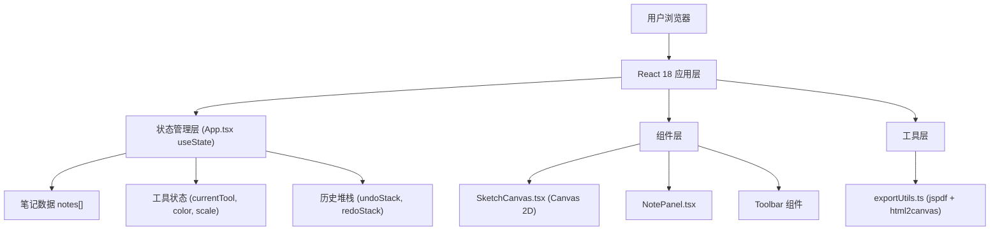

## 1. 架构设计



## 2. 技术说明

- **前端框架**：React 18 + TypeScript
- **构建工具**：Vite 5.x + @vitejs/plugin-react
- **绘图引擎**：原生 Canvas 2D API
- **导出库**：jspdf（PDF生成）、html2canvas（截图）
- **状态管理**：React useState/useReducer（App.tsx 集中管理）
- **样式方案**：原生 CSS + CSS Variables（不使用 Tailwind，满足定制动画需求）
- **初始化工具**：Vite init 脚手架

## 3. 模块调用关系与数据流向

### 文件结构与职责

```
src/
├── App.tsx                    # 主组件，状态管理中心
│   ├── 维护: notes[], currentTool, currentColor, canvasScale
│   ├── 维护: undoStack[], redoStack[] (最大200步)
│   ├── 传递: props → SketchCanvas, NotePanel
│   └── 调用: exportUtils.ts
├── components/
│   ├── SketchCanvas.tsx       # 画布组件
│   │   ├── 接收: tool, color, onShapeDropToNote
│   │   ├── 内部: canvasRef, shapes[], selectedShape, isDrawing
│   │   └── 输出: 截图 Base64 → App → NotePanel
│   └── NotePanel.tsx          # 笔记侧边栏
│       ├── 接收: notes, setNotes, onEmbedImage
│       ├── 内部: editingId, draggedIndex
│       └── 输出: 更新后的 notes → App
└── utils/
    └── exportUtils.ts         # 导出工具
        ├── exportToPDF()      # jspdf + html2canvas → A4竖版
        └── exportToPNG()      # html2canvas → 1920x1080
```

### 数据流向

1. **绘图数据流**：鼠标/触控事件 → SketchCanvas 捕获坐标 → 生成 Shape 对象 → 存入 shapes[] → Canvas 重绘
2. **嵌入数据流**：选中 Shape → 拖拽到 NotePanel → SketchCanvas 截图为 Base64 → 触发 onShapeDropToNote → App 更新对应 note 的 embeddedImages[]
3. **笔记数据流**：添加/编辑/删除卡片 → NotePanel 调用 setNotes → App 更新 notes 状态 → 重新渲染
4. **撤销数据流**：Ctrl+Z → App 弹出 undoStack → 恢复前一状态 → 推入 redoStack → 触发重渲染
5. **导出数据流**：点击导出 → App 调用 exportUtils → 渲染整个笔记容器 → html2canvas 截图 → jspdf 组装或直接下载 PNG

## 4. 数据模型定义

```typescript
// 图形类型
type ToolType = 'pencil' | 'line' | 'rectangle' | 'circle' | 'select';

interface Point {
  x: number;
  y: number;
}

interface BaseShape {
  id: string;
  type: 'pencil' | 'line' | 'rectangle' | 'circle';
  color: string;
  strokeWidth: number;
}

interface PencilShape extends BaseShape {
  type: 'pencil';
  points: Point[];
}

interface LineShape extends BaseShape {
  type: 'line';
  start: Point;
  end: Point;
}

interface RectangleShape extends BaseShape {
  type: 'rectangle';
  x: number;
  y: number;
  width: number;
  height: number;
}

interface CircleShape extends BaseShape {
  type: 'circle';
  cx: number;
  cy: number;
  radius: number;
}

type Shape = PencilShape | LineShape | RectangleShape | CircleShape;

// 笔记卡片
interface NoteCard {
  id: string;
  content: string;           // Markdown 文本
  embeddedImages: string[];  // Base64 图片数组
  isEditing?: boolean;
}

// 历史快照
interface HistorySnapshot {
  notes: NoteCard[];
  shapes: Shape[];
}
```

## 5. 性能优化策略

1. **Canvas 渲染优化**：
   - 使用 requestAnimationFrame 批量重绘
   - 离屏 Canvas 缓存已完成图形
   - 密集曲线点抽稀（距离阈值简化）

2. **撤销栈优化**：
   - 浅拷贝 + 引用共享（仅记录变更部分）
   - 最大 200 步自动 FIFO 淘汰
   - 防抖合并连续操作（如连续输入文字）

3. **响应式优化**：
   - ResizeObserver 监听容器尺寸
   - Canvas DPR 适配（devicePixelRatio）
   - 触摸事件 passive 模式
