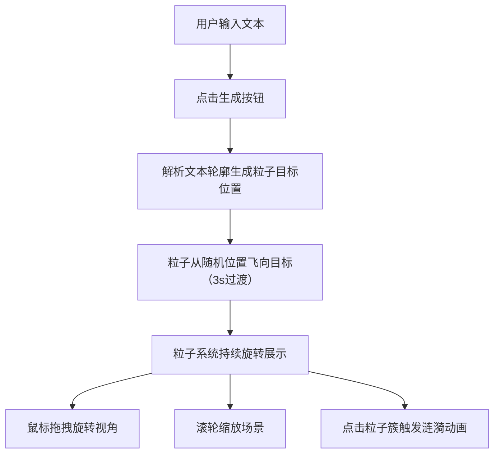

## 1. 产品概述

「星尘书卷」是一款交互式3D粒子文本可视化应用，用户可输入英文单词或短句，系统自动将其转换为由数千个发光粒子构成的3D立体文字，提供沉浸式的深空视觉体验。

- 面向用户：设计爱好者、创作者、教育演示场景
- 核心价值：将普通文字转化为富有科技感和艺术感的3D粒子艺术作品

## 2. 核心功能

### 2.1 功能模块

1. **主场景页面**：3D粒子文本渲染、输入控制、背景星空

### 2.2 页面详情

| 页面名称 | 模块名称 | 功能描述 |
|-----------|-------------|---------------------|
| 主场景 | 文本输入控件 | 左上角输入框，支持英文/数字/空格，最多20字符，生成按钮 |
| 主场景 | 3D粒子文本 | 粒子沿字符轮廓分布，颜色渐变，整体旋转，支持鼠标交互 |
| 主场景 | 星空背景 | 500颗闪烁白点，径向渐变深色背景 |
| 主场景 | 涟漪动画 | 点击粒子簇触发扩散涟漪、颜色变化、光晕环效果 |

## 3. 核心流程

用户输入文本 → 点击生成按钮 → 粒子从随机位置飞向目标轮廓（3秒过渡）→ 粒子持续旋转 → 用户拖拽/缩放视角 → 点击粒子触发涟漪动画

## 4. 用户界面设计

### 4.1 设计风格
- 主色调：深空蓝 `#0a0e27` → `#1a1f3a` 径向渐变
- 强调色：冷蓝 `#3b82f6`、暖橙 `#f59e0b`、按钮紫 `#6366f1` → `#8b5cf6`
- 文字色：`#e2e8f0`
- 字体：monospace
- 按钮：圆角8px，渐变背景，悬停亮度+20%，点击缩放0.95
- 输入框：半透明毛玻璃 rgba(255,255,255,0.08)，边框1px rgba(255,255,255,0.15)，圆角8px

### 4.2 页面设计概览

| 页面名称 | 模块名称 | UI元素 |
|-----------|-------------|-------------|
| 主场景 | 输入控件 | 左上角紧凑布局，输入框+按钮，毛玻璃风格，不遮挡主场景 |
| 主场景 | 3D粒子文本 | 居中展示，粒子半径3px，颜色从底部冷蓝到顶部暖橙渐变 |
| 主场景 | 星空背景 | 径向渐变+500颗闪烁白点 |
| 主场景 | 涟漪效果 | 粒子外扩+颜色变白+淡蓝光晕环扩散 |

### 4.3 响应性
- 桌面端优先，全屏渲染
- 输入控件固定左上角
- 画布自适应窗口尺寸

### 4.4 3D场景指南
- 环境：深空主题，径向渐变背景 + 闪烁星点
- 光照：粒子自发光，无需额外光源
- 相机：PerspectiveCamera，距离范围2-30单位
- 动画：整体绕Y轴0.3rad/s旋转，支持鼠标阻尼旋转
- 交互：鼠标拖拽旋转（阻尼0.85）、滚轮缩放、射线点击检测
- 性能预算：粒子数≤12000，帧率≥60fps，单帧计算≤16ms
