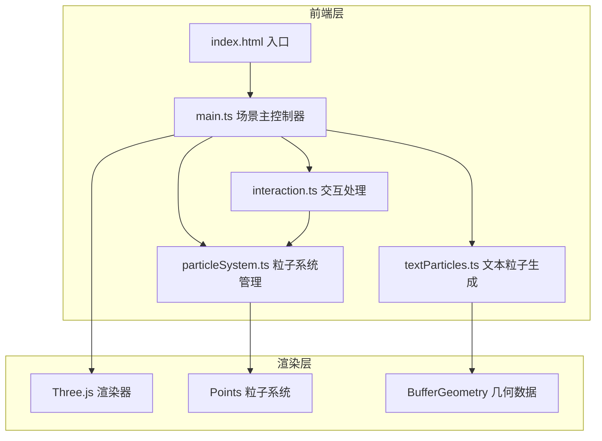

## 1. 架构设计



## 2. 技术描述
- 前端框架：无（纯 TypeScript）
- 3D引擎：three@0.160.0
- 类型定义：@types/three
- 构建工具：vite@5
- 语言：TypeScript（严格模式，target ES2020，module ESNext）
- 无外部动画库，使用 requestAnimationFrame 手动驱动

## 3. 文件结构

| 文件 | 作用 |
|-------|------|
| package.json | 项目依赖与脚本（npm run dev） |
| vite.config.js | Vite配置（端口5173，HMR） |
| tsconfig.json | TypeScript严格模式配置 |
| index.html | 入口HTML，全屏容器 |
| src/main.ts | 场景初始化、渲染器、相机、轨道控制器、动画循环、用户输入 |
| src/textParticles.ts | 文本轮廓解析、粒子位置生成、颜色渐变分配 |
| src/particleSystem.ts | Points创建、粒子动画（旋转/过渡/涟漪） |
| src/interaction.ts | 鼠标拖拽、滚轮缩放、射线点击检测 |

## 4. 核心数据结构

```typescript
// 粒子数据
interface ParticleData {
  positions: Float32Array;      // 目标位置 [x,y,z, x,y,z, ...]
  colors: Float32Array;         // 目标颜色 [r,g,b, ...]
  startPositions: Float32Array; // 过渡起始位置
  sizes: Float32Array;          // 粒子大小
  charIndices: Int32Array;      // 所属字符索引
}

// 涟漪效果状态
interface RippleState {
  active: boolean;
  centerIndex: number;
  startTime: number;
  affectedIndices: number[];
  normals: Float32Array;
}
```

## 5. 性能优化策略
- 使用 BufferGeometry + Float32Array 存储粒子数据
- 单次 draw call 渲染所有粒子（Points）
- 涟漪效果使用粒子索引子集更新，避免全量遍历
- 星空背景使用独立 Points，低频率更新（仅正弦alpha波动）
- 粒子大小根据相机距离动态补偿
