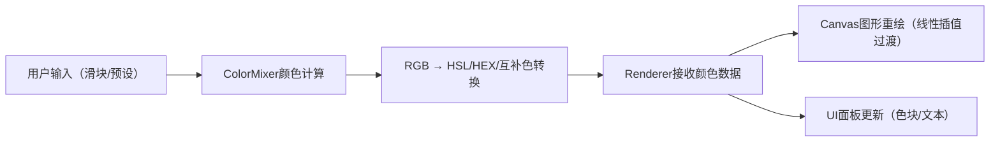

## 1. 产品概述
「色阶调合」是一款面向插画师和设计师的交互式颜色混合工具，通过RGB三原色滑块实时调配颜色，并在抽象几何图形上动态预览配色效果。

- 主要用途：帮助用户直观理解RGB颜色混合原理，快速生成和预览配色方案
- 目标用户：插画师、平面设计师、前端开发者、色彩爱好者
- 产品价值：提供即时视觉反馈的颜色探索体验，简化配色方案的设计与调试流程

## 2. 核心功能

### 2.1 功能模块
1. **控件面板**：RGB三原色垂直滑块、实时数值显示、颜色预览色块、颜色信息文本
2. **Canvas画布**：6种抽象几何图形（正六边形、星形、螺旋线、同心圆、波浪线、随机点阵）
3. **预设色卡**：4种预设配色按钮（暖阳橙、海洋蓝、森林绿、玫瑰粉）
4. **动态过渡**：平滑颜色插值动画、滑块缓动动画、图形渐变效果

### 2.3 页面详情
| 页面名称 | 模块名称 | 功能描述 |
|---------|---------|---------|
| 主页面 | 控件面板（左栏300px） | 深色背景#1e293b，包含RGB滑块、数值标签、颜色预览色块、HEX/HSL信息、预设色卡按钮 |
| 主页面 | Canvas画布（右栏自适应） | 淡色背景#f8fafc，6个抽象几何图形均匀分布，填充色随混合色实时更新，边框为互补色 |

## 3. 核心流程
用户通过拖动RGB滑块或点击预设色卡来调整颜色 → 颜色混合模块计算HSL、HEX和互补色 → 渲染模块通过requestAnimationFrame实现平滑过渡 → 所有图形和色块同步更新

## 4. 用户界面设计

### 4.1 设计风格
- **主色调**：左栏深色#1e293b，右栏淡色#f8fafc，高对比度分区
- **滑块颜色**：红色#ef4444、绿色#22c55e、蓝色#3b82f6
- **按钮样式**：圆角矩形，按压下沉效果（translateY 1px + shadow减小）
- **字体**：数值显示使用monospace等宽字体，14px
- **布局方式**：Flex左右分栏，最小高度100vh
- **交互反馈**：所有交互元素0.2s hover动画，色块0.3s脉冲缩放，滑块手柄0.15s缩放

### 4.2 页面设计概述
| 页面名称 | 模块名称 | UI元素 |
|---------|---------|--------|
| 主页面 | 控件面板 | 深色背景、3个垂直滑块（200px轨道高度）、数值标签（右对齐）、60px直径圆形色块、HEX/HSL文本区、4个色卡按钮 |
| 主页面 | Canvas画布 | 6种抽象几何图形（正六边形、星形、螺旋线、同心圆、波浪线、随机点阵）、2px边框线宽、0.8透明度填充、动态背景渐变 |

### 4.3 响应性
- Desktop-first设计，主界面左右分栏
- Canvas自适应右栏宽度
- 最小窗口宽度800px保证可用性

### 4.4 性能约束
- 画布重绘频率不低于60fps
- 单次重绘计算量不超过8ms
- 使用requestAnimationFrame循环优化渲染
