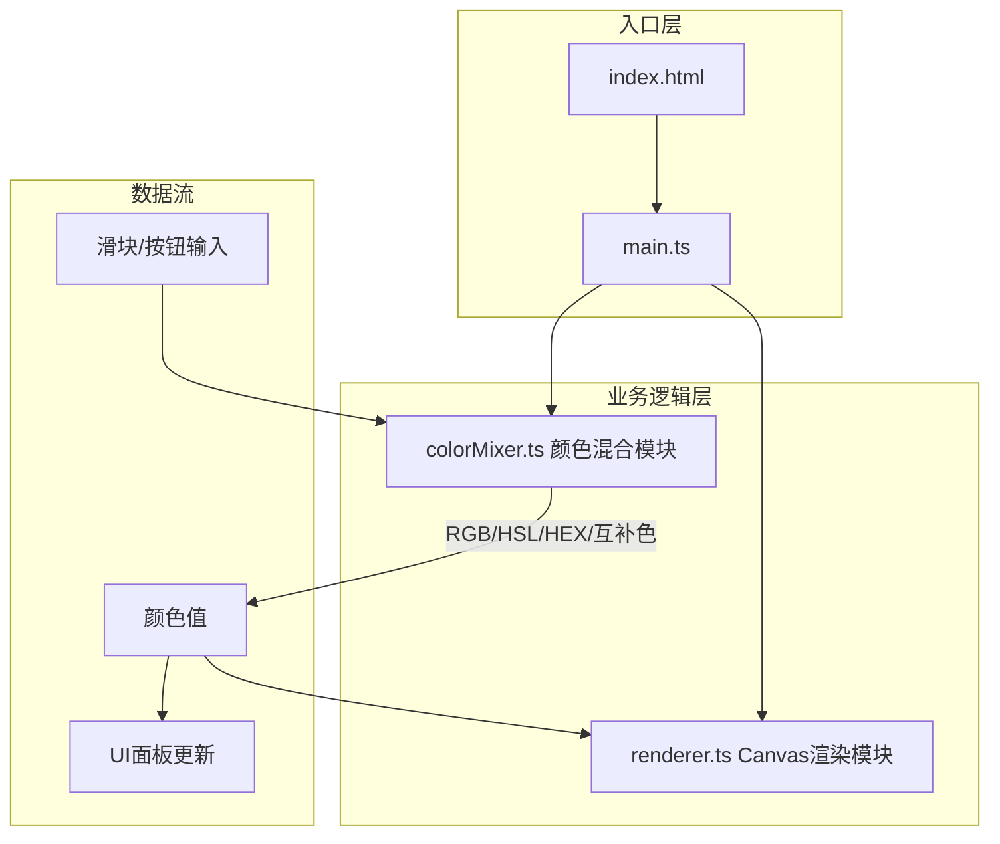

## 1. 架构设计



## 2. 技术描述
- **前端框架**：无（原生TypeScript + Canvas API）
- **构建工具**：Vite 5.x
- **编程语言**：TypeScript（严格模式，target ES2020，module ESNext）
- **后端**：无
- **数据库**：无

## 3. 文件结构与职责
| 文件路径 | 职责 | 调用关系 |
|---------|------|---------|
| package.json | 项目依赖配置（typescript, vite） | - |
| vite.config.js | Vite构建配置（端口5173，HMR开启） | - |
| tsconfig.json | TypeScript编译配置（严格模式） | - |
| index.html | 页面入口，引入主脚本 | - |
| src/main.ts | 应用初始化，创建DOM结构、绑定事件、协调模块调用 | 调用colorMixer和renderer |
| src/colorMixer.ts | 颜色转换逻辑（RGB↔HSL↔HEX、互补色计算、缓动动画） | 被main.ts调用，输出颜色值 |
| src/renderer.ts | Canvas渲染（6种几何图形、背景渐变、requestAnimationFrame动画） | 被main.ts调用，接收颜色值 |

## 4. 核心数据结构与类型
```typescript
// 颜色数据结构
interface ColorData {
    r: number;      // 0-255
    g: number;      // 0-255
    b: number;      // 0-255
    h: number;      // 0-360
    s: number;      // 0-100
    l: number;      // 0-100
    hex: string;    // #rrggbb
    complementHex: string; // 互补色
}

// 预设颜色
interface PresetColor {
    name: string;
    hex: string;
}
```

## 5. 关键算法
1. **RGB转HSL**：标准颜色空间转换公式
2. **HSL转RGB**：标准颜色空间转换公式  
3. **RGB转HEX**：十六进制字符串格式化
4. **互补色计算**：色相值+180°后转回RGB
5. **线性插值（lerp）**：`start + (end - start) * t`，用于颜色平滑过渡
6. **立方缓动（cubic ease）**：`t = t * t * (3 - 2 * t)`，用于预设色卡过渡动画
