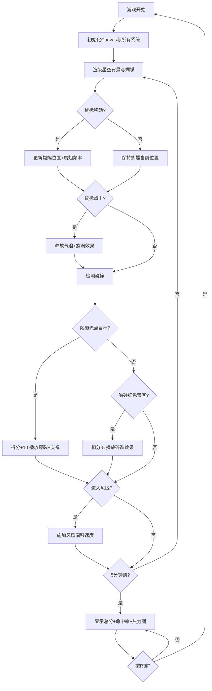

## 1. 产品概述

「飓风蝶影」是一款基于Canvas 2D的天气粒子模拟游戏，玩家通过鼠标控制一只由彩色粒子构成的蝴蝶在星空背景中飞舞，引导蝴蝶穿越风区到达光点目标得分，避开红色禁区，5分钟内获得尽可能高的分数。

- **核心问题**：通过鼠标交互控制粒子蝴蝶群飞舞并引发局部风暴效果的沉浸式体验
- **目标用户**：喜欢休闲粒子游戏、追求视觉美感的玩家
- **产品价值**：提供流畅、精美的粒子动画体验，结合简单易懂的游戏玩法

## 2. 核心功能

### 2.1 用户角色
| 角色 | 注册方式 | 核心权限 |
|------|----------|----------|
| 普通玩家 | 无需注册，直接游玩 | 完整游戏体验，查看得分与热力图 |

### 2.2 功能模块
1. **主场景模块**：深蓝渐变星空背景、闪烁星星、浮动明月
2. **蝴蝶系统**：120粒子蝴蝶跟随鼠标、翅膀扇动（频率随鼠标速度）、颜色渐变
3. **粒子尾迹系统**：40帧位置历史、散射粒子、重力效果、生命周期管理
4. **风场系统**：光点目标（每5秒）、风力粒子流（边缘随机生成）、红色禁区（每30秒）
5. **特效系统**：点击气浪扩散+旋涡、目标爆裂粒子、禁区碎裂、金色边框庆祝
6. **游戏状态**：计分、倒计时5分钟、命中率统计、轨迹热力图、R键重开

### 2.3 页面详情
| 页面名称 | 模块名称 | 功能描述 |
|----------|----------|----------|
| 游戏主界面 | 背景渲染 | 深蓝渐变、200颗闪烁星星旋转、半透明明月浮动 |
| 游戏主界面 | 蝴蝶渲染 | 120粒子分布、翅膀振动扇翅、三色正弦渐变 |
| 游戏主界面 | 尾迹渲染 | 位置历史、散射粒子、重力衰减、2秒生命周期 |
| 游戏主界面 | 风场渲染 | 金色光点目标呼吸闪烁、浅蓝风力粒子流、红色禁区闪烁 |
| 游戏主界面 | 特效渲染 | 点击气浪白环扩散、目标爆裂、禁区碎裂、金边庆祝游走 |
| 游戏主界面 | HUD | 左上角实时分数、右上角倒计时、游戏结束界面 |
| 游戏结束界面 | 结果展示 | 总分、命中率、蝴蝶飞行轨迹热力图 |

## 3. 核心流程

玩家打开游戏页面 → 全屏Canvas显示星空背景与蝴蝶 → 移动鼠标控制蝴蝶飞行 → 点击释放气浪推开粒子 → 引导蝴蝶穿越风区到达金色光点 → 触碰光点得分+10并播放庆祝动画 → 触碰红色禁区扣5分 → 5分钟后显示总分、命中率与轨迹热力图 → 按R键重新开始。

## 4. 用户界面设计

### 4.1 设计风格
- **主色调**：深蓝渐变 `#0d1b2a` → `#1b2a4a`
- **点缀色**：蝴蝶红 `#ff6b6b`、黄 `#feca57`、蓝 `#48dbfb`；光点金 `#ffd700`；风区浅蓝 `#a0c4ff`；禁区红 `#ff0000`
- **字体**：无衬线字体（sans-serif），白色22px，带轻微投影
- **布局**：全屏Canvas，无滚动条，HUD位于四角
- **动效风格**：流畅60FPS粒子动画，呼吸式闪烁，正弦波动，渐变透明

### 4.2 页面设计概览
| 页面名称 | 模块名称 | UI元素 |
|----------|----------|--------|
| 游戏主界面 | 背景层 | 深蓝径向渐变、旋转星星、浮动明月 |
| 游戏主界面 | 蝴蝶层 | 120个圆形粒子、翅膀形状、扇翅振动、三色渐变 |
| 游戏主界面 | 尾迹层 | 散射粒子、重力下落、alpha衰减 |
| 游戏主界面 | 风场层 | 金色呼吸光点、浅蓝风带粒子、红色禁区圆 |
| 游戏主界面 | 特效层 | 白色扩散气浪、爆裂粒子、金边游走 |
| 游戏主界面 | HUD层 | 左上分数、右上倒计时、结束界面居中 |

### 4.3 响应性
- Desktop-first全屏设计
- Canvas自适应窗口大小（resize事件监听）
- 鼠标坐标正确映射到Canvas坐标系
- 不考虑移动端触摸操作

### 4.4 性能优化
- 粒子总数≤1000，超出自动回收最旧粒子
- 尾迹粒子2秒后自动回收
- 颜色渐变预计算调色板，每帧仅计算一次
- 使用requestAnimationFrame维持60FPS
- dirty矩形优化重绘区域
