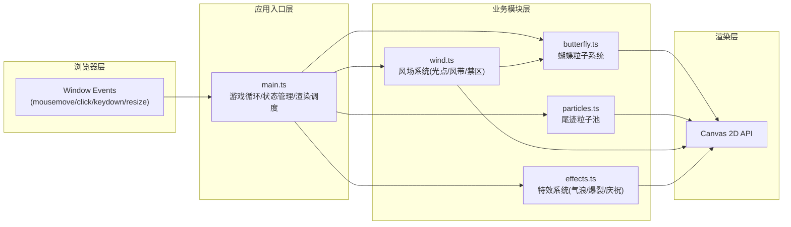

## 1. 架构设计



## 2. 技术说明

- **前端框架**：纯TypeScript + Canvas 2D API（无React/Vue等UI框架）
- **构建工具**：Vite 5.x，端口5173，开启HMR
- **语言**：TypeScript 5.x，严格模式，target ES2020，module ESNext
- **无外部依赖**：不使用任何动画库、物理引擎、UI组件库，全部自研实现
- **初始化方式**：手动创建文件结构（非模板），用户明确指定纯Canvas 2D实现

## 3. 文件结构

```
auto249/
├── package.json          # 依赖: typescript, vite; 脚本: npm run dev
├── index.html            # 基础HTML，仅含全屏Canvas和<script type="module" src="/src/main.ts">
├── vite.config.js        # Vite配置，端口5173，开启HMR
├── tsconfig.json         # 严格模式，target ES2020，module ESNext
└── src/
    ├── main.ts           # 入口：初始化画布、游戏循环、状态管理、碰撞检测、HUD
    ├── butterfly.ts      # 主蝴蝶类：120粒子生成、位置跟随、扇翅动画、风场影响
    ├── particles.ts      # 尾迹粒子管理：粒子池、生命周期、散射、重力
    ├── wind.ts           # 风场系统：光点目标、风力流、红色禁区
    └── effects.ts        # 特殊效果：气浪、目标爆裂、禁区碎裂、庆祝金边
```

## 4. 核心数据结构

### 4.1 Butterfly 类
```typescript
interface ButterflyParticle {
    offsetX: number;       // 相对中心x偏移
    offsetY: number;       // 相对中心y偏移
    baseY: number;         // 基础y位置（用于扇翅振动）
    wing: 'left' | 'right' | 'body';
    radius: number;
}

class Butterfly {
    x: number;
    y: number;
    targetX: number;
    targetY: number;
    velocityX: number;
    velocityY: number;
    particles: ButterflyParticle[];  // 120个粒子
    wingPhase: number;                // 扇翅相位 0-2π
    wingFrequency: number;            // 扇翅频率 Hz (0.5-3)
    colorPalette: string[];           // 预计算颜色调色板
    colorIndex: number;
    trailHistory: {x:number; y:number}[];  // 最近40帧位置
}
```

### 4.2 Particles 系统
```typescript
interface TrailParticle {
    x: number;
    y: number;
    vx: number;
    vy: number;
    radius: number;
    initialRadius: number;
    alpha: number;
    color: string;
    life: number;        // 剩余帧数 (~120帧=2秒)
    maxLife: number;
    active: boolean;
}

class ParticleSystem {
    pool: TrailParticle[];  // 对象池，上限1000
    emit(position: {x:number; y:number}, color: string): void;
    update(): void;
    render(ctx: CanvasRenderingContext2D): void;
}
```

### 4.3 Wind 风场系统
```typescript
interface LightTarget {
    x: number;
    y: number;
    radius: number;
    phase: number;       // 呼吸闪烁相位
    active: boolean;
}

interface WindBand {
    particles: {x:number; y:number; vx:number; vy:number}[];
    centerX: number;
    centerY: number;
    dirX: number;
    dirY: number;
    strength: number;    // 0.5-1.5
    life: number;        // ~180帧=3秒
    active: boolean;
}

interface DangerZone {
    x: number;
    y: number;
    radius: number;
    life: number;        // ~600帧=10秒
    phase: number;
    active: boolean;
}

class WindSystem {
    lightTargets: LightTarget[];
    windBands: WindBand[];
    dangerZones: DangerZone[];
    getWindInfluence(x: number, y: number): {vx:number; vy:number};
    checkLightHit(x: number, y: number): LightTarget | null;
    checkDangerHit(x: number, y: number): DangerZone | null;
}
```

### 4.4 Effects 特效系统
```typescript
interface Shockwave {
    x: number;
    y: number;
    radius: number;
    maxRadius: number;
    alpha: number;
    active: boolean;
}

interface BurstParticle {
    x: number;
    y: number;
    vx: number;
    vy: number;
    radius: number;
    color: string;
    life: number;
    active: boolean;
}

interface CelebrationLight {
    position: number;     // 沿边框的位置 0-1
    speed: number;
    side: 'top' | 'right' | 'bottom' | 'left';
    life: number;
    active: boolean;
}

class EffectSystem {
    shockwaves: Shockwave[];
    burstParticles: BurstParticle[];
    celebrationLights: CelebrationLight[];
    createShockwave(x: number, y: number): void;
    createBurst(x: number, y: number, color: string, count: number): void;
    createCelebration(): void;
    applyShockwavePush(particles: any[]): void;  // 对粒子施加推力+旋涡
}
```

### 4.5 GameState 游戏状态
```typescript
interface GameState {
    score: number;
    timeLeft: number;       // 秒，初始300
    totalLights: number;    // 总光点出现数
    hitLights: number;      // 成功穿越数
    running: boolean;
    ended: boolean;
    trailPoints: {x:number; y:number; count:number}[];  // 热力图数据
}
```

## 5. 游戏循环时序（60FPS）

每帧 `requestAnimationFrame` 回调执行顺序：
1. 计算 deltaTime（帧间隔，目标16.67ms）
2. 更新蝴蝶位置（跟随鼠标+风场偏移+平滑插值）
3. 更新扇翅相位（wingPhase += 2π * frequency * deltaTime）
4. 尾迹粒子发射（每帧从蝴蝶位置释放3-5个）
5. 更新所有粒子系统（位置+速度+生命周期回收）
6. 更新风场系统（光点闪烁、风带粒子移动、禁区倒计时）
7. 碰撞检测（光点命中→得分+爆裂+庆祝；禁区触碰→扣分+碎裂）
8. 更新特效系统（气浪扩散、爆裂粒子飞散、金边游走）
9. 记录轨迹热力图数据
10. 渲染（背景→星星→明月→尾迹→风场→蝴蝶→特效→HUD）
11. 倒计时更新，时间归零则结束游戏

## 6. 性能优化策略

1. **对象池模式**：尾迹粒子和爆裂粒子使用预分配对象池，避免GC
2. **粒子上限**：总数控制在1000以内，超出时FIFO回收最旧粒子
3. **预计算调色板**：蝴蝶三色渐变预计算360色数组，每帧仅取索引
4. **生命周期管理**：尾迹2秒（120帧）后自动回收，风带3秒，禁区10秒
5. **脏矩形渲染**：记录粒子位置包围盒，仅清除和重绘变化区域
6. **批量绘制**：同类型粒子使用 beginPath + 批量 arc + 一次 fill
