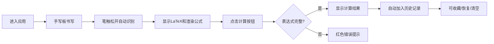

## 1. 产品概述
交互式手写数学公式识别与计算教学工具，支持用户在Canvas上手写数学表达式，实时识别为LaTeX格式并动态计算结果。
- 解决学生在平板/电脑上输入复杂数学表达式不便、缺乏即时视觉反馈的问题
- 面向K12及大学阶段学生，提供从手写识别、公式渲染到符号计算的一站式教学辅助

## 2. 核心功能

### 2.1 功能模块
1. **手写识别区**：Canvas手写板，支持鼠标和触控笔，自动识别笔画分组并转为LaTeX
2. **公式预览区**：实时显示LaTeX文本及MathJax渲染结果，支持30+常见数学符号
3. **计算引擎**：内建轻量级符号计算，支持四则运算、幂运算、三角函数、数值积分（辛普森法则）
4. **历史记录面板**：最近20条公式倒序展示，支持恢复、收藏、清空
5. **收藏夹**：置顶展示收藏公式，支持拖拽排序、弹性动画效果

### 2.2 页面详情
| 页面名称 | 模块名称 | 功能描述 |
|---------|---------|---------|
| 主页面 | 手写识别区 | Canvas绘制、60fps笔迹采集、网格辅助线、支持鼠标/触控 |
| 主页面 | 公式预览区 | LaTeX文本显示、MathJax渲染、计算按钮、结果展示 |
| 主页面 | 收藏夹区域 | 置顶收藏卡片、拖拽排序、阴影和弹性缩放动画 |
| 主页面 | 历史记录面板 | 瀑布流卡片、悬停上浮、恢复/收藏/删除/清空操作 |

## 3. 核心流程
用户进入应用 → 在左侧手写板书写数学符号 → 松开笔触自动识别 → 右侧显示LaTeX文本和渲染公式 → 点击"计算结果"按钮求值 → 结果展示，同时自动加入历史记录 → 可收藏公式、从历史恢复

## 4. 用户界面设计
### 4.1 设计风格
- 主色调：极简白 + 浅灰(#F5F5F5)背景
- 手写板：米色(#FFFFF0) + 20px间隔灰色(#DDD)网格辅助线
- 右侧区域：毛玻璃效果(backdrop-filter: blur(8px))悬浮
- 按钮：圆角(border-radius: 12px) + 涟漪扩散动画(CSS伪元素)
- 卡片：瀑布流布局，悬停上浮3px + 加深阴影过渡0.2s
- 收藏卡片：淡金色底色(#FFF8DC)
- 字体：标题使用思源黑体/Noto Sans SC，正文使用系统无衬线字体

### 4.2 页面设计概览
| 页面名称 | 模块名称 | UI元素 |
|---------|---------|---------|
| 主页面 | 手写识别区 | 米色背景、网格线、Canvas画布、清空按钮 |
| 主页面 | 公式预览区 | 毛玻璃卡片、LaTeX文本、MathJax渲染区、计算按钮、结果展示区(红色错误提示) |
| 主页面 | 收藏夹区域 | 水平可滚动卡片组、拖拽排序、弹性动画、淡金色底色 |
| 主页面 | 历史记录面板 | 瀑布流网格、卡片(LaTeX缩略图+结果+星标+删除)、清空按钮、淡出动画 |

### 4.3 响应式设计
- 桌面端(768px-1920px)：左右两栏布局，左侧手写板，右侧预览+历史
- 小屏幕(<768px)：上下结构，手写板在上，预览和历史在下
- 触控优化：手写区域支持触控笔和手指书写，按钮尺寸≥44px
