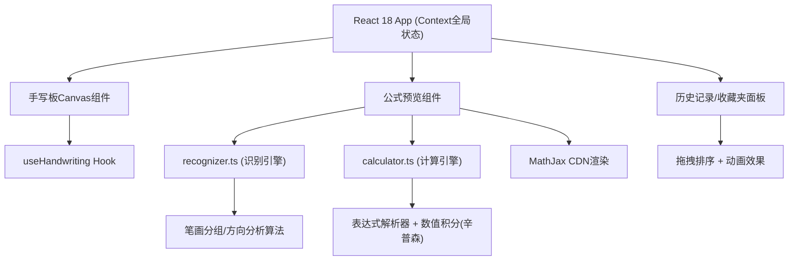

## 1. 架构设计


## 2. 技术描述
- **前端框架**：React@18 + TypeScript@5 + Vite@5
- **构建工具**：Vite，配置路径别名@指向src
- **公式渲染**：MathJax 3.x (CDN加载)
- **手写处理**：HTML5 Canvas API，自定义事件Hook
- **识别算法**：邻域笔画方向分析(不依赖OCR库)，支持30+数学符号
- **计算引擎**：自研表达式解析器 + 辛普森数值积分
- **状态管理**：React Context + useReducer
- **UI样式**：原生CSS (CSS变量、毛玻璃、涟漪动画、弹性过渡)
- **图标**：lucide-react
- **后端**：无，纯前端应用

## 3. 目录结构
```
.
├── index.html              # 入口页面(含MathJax CDN)
├── package.json            # 依赖与脚本
├── vite.config.js          # Vite配置(React插件+@别名)
├── tsconfig.json           # TS配置(严格模式、ES2020)
└── src/
    ├── App.tsx             # 主应用+Context
    ├── hooks/
    │   └── useHandwriting.ts  # Canvas手写Hook
    ├── utils/
    │   ├── recognizer.ts   # 公式识别(笔画→LaTeX)
    │   └── calculator.ts   # 计算引擎(LaTeX→结果)
    └── components/
        └── HistoryPanel.tsx # 历史+收藏夹面板
```

## 4. 核心数据模型
### 4.1 类型定义
```typescript
interface Point { x: number; y: number; t: number }
interface Stroke { id: string; points: Point[] }
interface FormulaItem {
  id: string
  latex: string
  result: string | null
  timestamp: number
  isFavorite: boolean
}
interface AppState {
  currentLatex: string
  currentResult: string | null
  history: FormulaItem[]
  favorites: FormulaItem[]
}
```

## 5. 关键算法说明
### 5.1 公式识别 (recognizer.ts)
- **笔画分组**：基于时空距离聚类连续笔画
- **方向分析**：将笔画归一化后计算8方向直方图
- **符号匹配**：与内置30+符号模板进行特征距离比对
- **结构分析**：上下标、分数、根号等嵌套结构识别

### 5.2 计算引擎 (calculator.ts)
- **LaTeX解析**：词法分析→语法树构建
- **运算符支持**：+ - * / ^ sin cos tan log sqrt abs
- **数值积分**：辛普森法则 ∫f(x)dx [a,b]，自适应步长
- **错误检测**：未定义变量、缺少操作数、语法错误

### 5.3 性能指标
- 笔迹采集：≥60fps (requestAnimationFrame)
- 识别响应：≤300ms (不含渲染)
- 符号识别准确率：≥85%

## 6. 文件清单与职责
| 文件 | 职责 | 行数预估 |
|-----|-----|---------|
| index.html | 入口，MathJax CDN引入 | 30 |
| vite.config.js | Vite + React + @别名配置 | 30 |
| tsconfig.json | 严格模式TS配置 | 40 |
| package.json | 依赖声明(npm run dev) | 30 |
| src/App.tsx | 全局Context、布局、状态管理 | 250 |
| src/hooks/useHandwriting.ts | Canvas事件、笔画采集、网格线 | 180 |
| src/utils/recognizer.ts | 笔画→LaTeX识别算法 | 400 |
| src/utils/calculator.ts | LaTeX解析、求值、积分 | 350 |
| src/components/HistoryPanel.tsx | 历史+收藏、拖拽、卡片、动画 | 300 |
