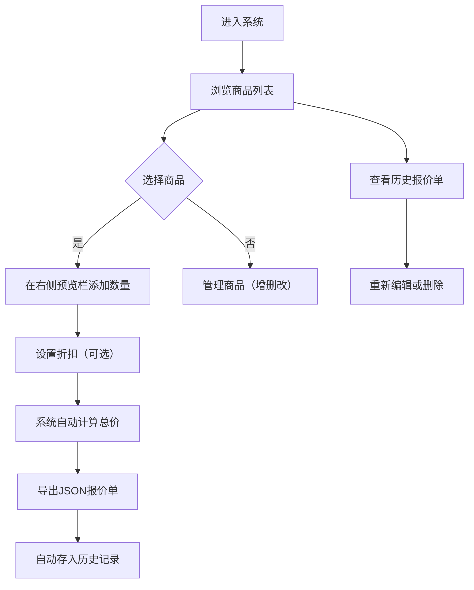

## 1. 产品概述

散装零食批发商库存管理与报价单生成系统，解决线下小店采购时手写报价单效率低、易出错的问题。
- 目标用户：散装零食批发商及其业务员
- 核心价值：快速生成专业报价单、实时库存预警、历史报价追溯

## 2. 核心功能

### 2.1 用户角色
本系统为单用户工具，无需注册登录，数据存储在本地浏览器 localStorage 中。

### 2.2 功能模块
1. **商品管理模块**：商品列表展示、添加、编辑、删除
2. **报价单生成模块**：商品选择、数量输入、折扣设置、价格计算、JSON导出
3. **库存预警模块**：低库存商品高亮显示、导航栏徽章提示
4. **历史记录模块**：报价单历史列表、查看详情、删除、重新编辑

### 2.3 页面详情

| 页面/区域 | 模块名称 | 功能描述 |
|-----------|-------------|---------------------|
| 主界面 | 左侧导航栏 | 功能切换（商品管理/报价单/历史记录）、库存预警徽章 |
| 主界面 | 商品列表区 | 卡片式商品展示（180×240px）、选中状态、低库存高亮、悬停上浮效果 |
| 主界面 | 右侧报价单预览栏 | 选中商品列表、数量调整、折扣设置、小计/总价计算、导出JSON、滑入动画 |
| 商品管理 | 商品表单弹窗 | 添加/编辑商品信息（名称、规格、单位、进货价、零售价、库存、阈值） |
| 历史记录 | 历史列表 | 按时间倒序排列、查看/删除/重新编辑操作 |

## 3. 核心流程

## 4. 用户界面设计

### 4.1 设计风格
- **主色调**：浅灰背景 #f0f2f5，白色卡片，低库存红色高亮
- **强调色**：渐变色占位符 #e3e8ef → #c4cdd5，柔和阴影 rgba(0,0,0,0.15)
- **按钮样式**：圆角按钮，主操作采用蓝色系
- **字体**：使用系统无衬线字体，保证可读性
- **布局风格**：卡片式布局，主操作区居中960px，右侧侧边栏400px
- **动画风格**：0.3s ease 过渡，0.4s cubic-bezier 弹性滑入，脉冲红点预警

### 4.2 页面设计概览

| 页面/区域 | 模块名称 | UI元素 |
|-----------|-------------|----------|
| 主界面 | 导航栏 | 垂直导航、脉冲红点徽章、切换按钮 |
| 主界面 | 商品卡片 | 渐变占位图、商品名称、规格、价格、库存标签、选中边框 |
| 主界面 | 报价单预览 | 白色圆角卡片、商品条目、数量加减器、折扣输入、总价展示、导出按钮 |
| 弹窗 | 商品表单 | 表单输入框、保存/取消按钮 |
| 历史记录 | 时间线列表 | 时间戳、客户信息、操作按钮组 |

### 4.3 响应式适配
- **桌面端（>768px）**：商品列表多列网格，右侧固定400px预览栏
- **移动端（≤768px）**：商品卡片变为两列，侧边栏移至底部，导航栏改为顶部水平布局

### 4.4 性能要求
- 商品列表渲染超过50项时保持60fps滚动帧率
- 报价单预览总价计算耗时不超过10ms
