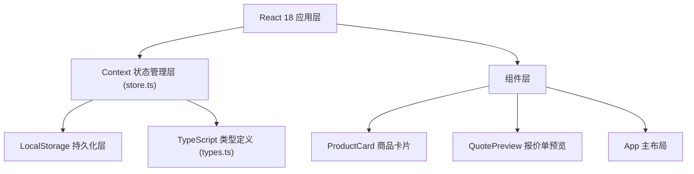
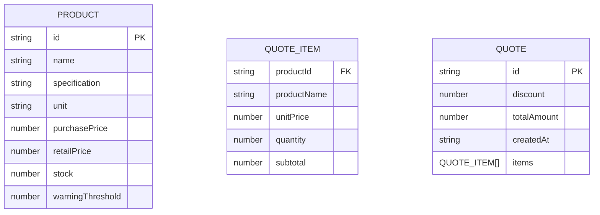

## 1. 架构设计



## 2. 技术描述

- **前端框架**：React@18 + TypeScript + Vite
- **构建工具**：Vite（端口5173，开启HMR热更新）
- **状态管理**：React Context API（无需引入额外库）
- **数据持久化**：浏览器 localStorage
- **样式方案**：原生 CSS + CSS 变量（避免引入CSS-in-JS或UI库，保持轻量）
- **后端服务**：无（纯前端应用）
- **数据库**：localStorage（模拟数据持久化）

## 3. 路由定义

本项目为单页应用，无路由切换，通过组件状态管理不同视图。

| 视图模式 | 展示内容 |
|----------|---------|
| products | 商品管理列表 |
| history | 历史报价单列表 |

## 4. 数据模型

### 4.1 数据模型定义



### 4.2 类型定义（TypeScript 接口）

```typescript
// 商品
interface Product {
  id: string;
  name: string;
  specification: string;
  unit: string;
  purchasePrice: number;
  retailPrice: number;
  stock: number;
  warningThreshold: number;
}

// 报价单项
interface QuoteItem {
  productId: string;
  productName: string;
  unitPrice: number;
  quantity: number;
  subtotal: number;
}

// 报价单
interface Quote {
  id: string;
  items: QuoteItem[];
  discount: number;
  totalAmount: number;
  createdAt: string;
}

// 应用状态
interface AppState {
  products: Product[];
  currentQuote: QuoteItem[];
  discount: number;
  history: Quote[];
}
```

## 5. 项目文件结构

```
auto252/
├── package.json
├── vite.config.js
├── tsconfig.json
├── index.html
├── src/
│   ├── main.tsx          # 应用入口
│   ├── App.tsx           # 主应用组件
│   ├── types.ts          # TypeScript 类型定义
│   ├── store.ts          # Context 状态管理
│   ├── index.css         # 全局样式
│   └── components/
│       ├── ProductCard.tsx    # 商品卡片组件
│       └── QuotePreview.tsx   # 报价单预览组件
```

## 6. 性能优化策略

1. **商品列表性能**：使用 `React.memo` 包装 ProductCard 组件，避免不必要的重渲染
2. **滚动性能**：商品列表使用 CSS `will-change: transform` 优化合成层
3. **计算性能**：报价单总价计算使用 `useMemo` 缓存，确保计算耗时 < 10ms
4. **localStorage 读写**：使用节流（throttle）优化频繁写入操作
